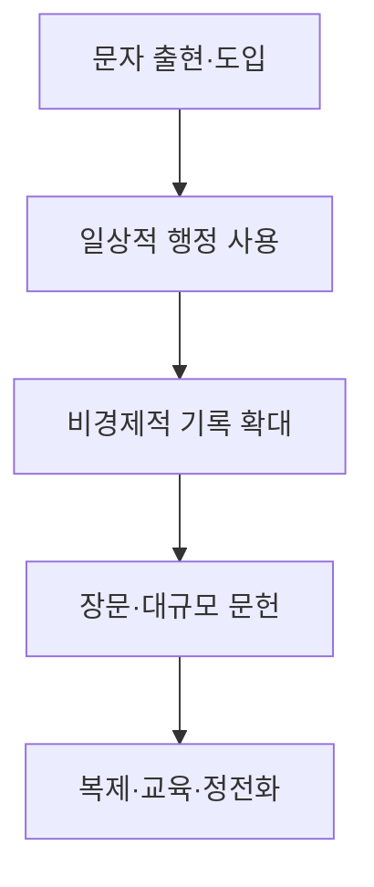

# 장부 이후 — 고대 문자문화 비교 연구 웹사이트 구현계획

> **가제:** 장부 이후 — 고대 문명은 무엇을 기록하기 시작했는가?  
> **부제:** 문자·권력·기억·종교·문학의 탄생을 비교하는 연구 아틀라스

## 프로젝트 개요

이 프로젝트는 다음 질문을 중심으로 고대 문자문화를 비교하는 연구형 웹사이트를 구축한다.

> 고대 문명에서 문자가 등장하거나 새로운 문자체계가 도입된 뒤, 인간은 경제·행정 기록을 넘어 무엇을 대규모로 기록하기 시작했으며, 그 선택은 각 사회의 문자문화와 지식체계에 대해 무엇을 보여주는가?

웹사이트는 긴 설명문 한 장이 아니라 사용자가 직접 기준을 바꾸며 비교할 수 있는 **고대 문자문화 비교 연구 아틀라스**로 설계한다. 핵심 화면은 네 문명의 시간축, 텍스트 유형, 기록 매체, 기록 주체를 나란히 비교하는 인터랙티브 타임라인이다.

---

## 1. 연구상의 핵심 보완

### 1.1 “최초”를 “현존하는 최초”로 바꾼다

웹사이트 전체에서 다음 표현을 구별한다.

| 피해야 할 표현 | 사용할 표현 |
|---|---|
| 최초의 문학 | 현재까지 확인된 가장 이른 문학 자료 |
| 당시 가장 많이 쓴 텍스트 | 현재 가장 많이 출토된 텍스트 |
| 호메로스가 처음 기록되었다 | 호메로스 서사시가 문자화되기 시작한 시점에 관한 가설 |
| 최초의 성서 | 성서 작품의 성립, 편집, 현존 사본, 정경화를 각각 구분 |

각 주장 옆에는 `확실`, `유력`, `논쟁 중`, `알 수 없음` 중 하나의 상태를 표시한다.

### 1.2 비교 단위를 네 단계로 고정한다

“거대한 텍스트”를 하나의 수치로 정의하지 않고 다음 네 범주로 나눈다.

1. **단일 작품:** 《일리아스》처럼 하나의 작품으로 인식되는 텍스트
2. **문헌 집성체:** 피라미드 텍스트처럼 여러 단위가 모인 집합
3. **문서군·코퍼스:** 특정 장소·시대·장르의 출토문서 전체
4. **전승 전통:** 여러 세대의 복사·편집을 거친 문헌문화

텍스트 규모도 단어 수 하나가 아니라 다음과 같은 벡터로 표시한다.

- 현존 행·단어·문자 수
- 하나의 물리적 유물에 기록된 분량
- 동일 작품의 사본 수
- 전체 코퍼스의 유물 수
- 제작에 필요한 노동량
- 전승 기간과 지리적 확산

### 1.3 네 문명을 동일한 발전단계로 비교한다

절대연대만 나란히 놓으면 메소포타미아가 늘 “먼저”인 것처럼 보이므로 두 가지 시간축을 제공한다.

- **절대 시간축:** 기원전 3400년부터 기원전 300년까지
- **상대 시간축:** 각 문자체계의 출현·도입을 0년으로 놓은 뒤 경과시간 비교

각 문명은 다음 다섯 단계로 정리한다.

이 단계는 보편적인 필연 법칙이 아니라 비교를 위한 분석틀로만 사용한다.

---

## 2. 문명별 내용 보강 방향

### 2.1 메소포타미아: 회계와 분류는 사실상 함께 등장한다

“회계가 끝난 뒤 어휘목록이 출현했다”는 단순 서사는 수정해야 한다. 후기 우루크기의 고대 어휘목록은 초기 문자 단계부터 행정문서와 병존했으며, DCCLT는 이를 가장 이른 문자 지적 활동의 증거로 설명한다. 따라서 핵심 질문은 “장부 다음에는 무엇이 나왔는가?”뿐 아니라 “왜 회계와 분류가 같은 서기관 환경에서 함께 발전했는가?”가 된다.

참고: [ORACC/DCCLT 고대 어휘목록 개요](https://oracc.museum.upenn.edu/dcclt/intro/lexical_intro.html)

세부 장:

- 수량·배급·노동관리 문서
- 직업목록과 사물목록
- 목록의 행정·교육·지식분류 기능
- 초기왕조기 문학과 찬가
- 목록 전통이 수천 년간 서기관 교육으로 이어진 과정

### 2.2 이집트: 왕권·행정·제의를 분리하지 않는다

초기 이집트 문자는 단순한 회계도, 순수한 종교문자도 아니다. 소유·내용물 표시, 왕권 표상, 제의적 명명이 중첩되어 나타난다.

피라미드 텍스트는 하나의 책이 아니라 주문들의 코퍼스이며, 현존하는 가장 이른 사례는 우나스 피라미드이다. 이후 일부 주문은 관 텍스트와 후기 장례문헌으로 전승된다.

참고: [UCL Digital Egypt의 피라미드 텍스트 개요](https://www.ucl.ac.uk/museums-static/digitalegypt/literature/religious/pyramid.html)

세부 장:

- 초기 왕묘의 표찰과 명칭
- 기념비 문자의 공개성과 무덤 문자의 비공개성
- 말·의례·문자가 결합해 효력을 만든다는 관념
- 피라미드 텍스트 → 관 텍스트 → 사자의 서
- 돌과 파피루스가 만들어낸 서로 다른 보존 양상

### 2.3 그리스: 두 번의 문자문화로 구성한다

그리스 편은 하나의 연속선이 아니라 다음 두 체제로 나눈다.

- 미케네 궁전의 Linear B 문자문화
- 문자 공백 이후의 알파벳 문자문화

Linear B는 대략 기원전 1400–1200년에 미케네 그리스어를 기록한 문자로 연구되고 있다.

참고: [케임브리지 Mycenaean Epigraphy Group](https://www.classics.cam.ac.uk/research/projects/mycep)

알파벳 편에서는 다음 세 설명을 경쟁가설로 배치한다.

1. 교역과 실용적 기록을 위해 도입되었다.
2. 시와 운율 기록이 초기 확산에 중요한 역할을 했다.
3. 여러 목적이 항구·교역 네트워크에서 함께 발전했다.

메토네와 에레트리아 자료를 검토한 연구는 기원전 9세기의 희박한 증거에서 기원전 725년경의 일상적·유희적 사용까지 빠른 확산을 지적한다. 그러나 “호메로스를 기록하기 위해 알파벳이 발명되었다”는 주장은 별도의 논쟁적 가설로 표시한다.

참고: [Papadopoulos의 초기 그리스 알파벳 연구](https://www.cambridge.org/core/journals/antiquity/article/abs/early-history-of-the-greek-alphabet-new-evidence-fromeretria-and-methone/DBFA7B52DBCDB48AA5B47D05FC4FB03A)

### 2.4 이스라엘·유다: 텍스트의 네 가지 연대를 분리한다

각 성서 작품에는 최소 네 종류의 날짜가 필요하다.

- 서술하는 사건의 추정 시대
- 구전·초기 구성의 추정 시기
- 편집·재편집 시기
- 현존 사본의 제작 시기

케테프 힌놈의 은제 두루마리는 기원전 6세기경의 고대 히브리 문자와 제사장 축복문을 보여주지만, 이것을 “성서 전체의 현존 사본”으로 표현해서는 안 된다.

참고: [이스라엘박물관 케테프 힌놈 유물](https://www.imj.org.il/en/collections/198069-0)

사해문서는 오늘날 히브리 성서에 속하는 작품의 사본 약 230점을 포함하지만, 당시 공동체들에 하나의 폐쇄된 정경 개념이 있었다고 단정할 수 없고 사본 사이의 차이도 확인된다.

참고: [이스라엘 고대유물청 사해문서 소개](https://www.deadseascrolls.org.il/learn-about-the-scrolls/introduction)

### 2.5 통제 사례로 우가리트를 추가한다

우가리트는 본 비교의 결론을 검증하는 좋은 통제 사례이다.

우가리트에서는 알파벳형 쐐기문자와 음절·표어형 쐐기문자가 같은 점토 매체에서 공존했다. 현지 알파벳 문자는 문학·제의·행정에, 아카드어는 국제 외교에 많이 사용되었다. 이는 장르를 결정하는 것이 문자 구조만이 아니라 언어, 제도, 외교 관계, 서기관 전통이라는 점을 보여준다.

참고: [케임브리지 연구 저장소의 우가리트 문자문화 분석](https://www.repository.cam.ac.uk/bitstreams/a37a47cb-6e5b-419b-9e9a-6e1bcf78b88d/download)

우가리트는 MVP에서는 짧은 “반례 카드”로 넣고, 2단계에서 독립 문명 페이지로 확장한다.

---

## 3. 웹사이트 정보 구조

다음과 같은 다중 페이지 구조로 제작한다.

| 경로 | 역할 |
|---|---|
| `/` | 중심 질문, 핵심 발견, 네 문명 개관 |
| `/compare` | 동기화된 타임라인과 비교표 |
| `/civilizations/[name]` | 문명별 문자문화 서사 |
| `/texts/[id]` | 개별 텍스트·유물 상세 페이지 |
| `/themes/[name]` | 구전, 권력, 매체, 문자구조 등 주제 비교 |
| `/language/greek` | 호메로스어–아티카어–코이네 비교 |
| `/method` | 정의, 비교법, 보존 편향, 한계 |
| `/sources` | 참고문헌, 데이터 출처, 이미지 권리 |
| `/glossary` | abjad, corpus, textualization 등 용어집 |

### 3.1 첫 화면 구성

첫 화면에는 일반적인 메뉴나 거대한 장식 이미지보다 연구 질문을 바로 보여준다.

1. 제목과 중심 질문
2. 네 문명의 한 문장 요약
3. “문자 도입 후 대규모 비경제 기록까지 걸린 시간” 비교
4. `절대연대 / 문자 도입 후 경과연대` 전환
5. “최초라는 말은 무엇을 뜻하는가?” 방법론 안내

---

## 4. 핵심 인터랙션

### 4.1 동기화 타임라인

네 문명의 사건을 한 화면에 배치한다.

필터:

- 경제·행정
- 지식·교육
- 왕권·기념
- 종교·장례
- 법
- 서사·시
- 편지·개인 기록

표시 방식:

- 점: 개별 유물
- 막대: 작품의 성립·편집 추정 범위
- 띠: 문자체계의 사용 기간
- 점선: 구전 또는 소실된 전승에 대한 추정
- 색 테두리: 확실성 수준

### 4.2 “거대 텍스트” 정의 전환기

사용자가 기준을 선택하면 비교 결과가 달라지게 한다.

- 단일 작품
- 문헌 집성체
- 한 장소의 코퍼스
- 전체 전승 전통
- 현존 분량
- 사본 수
- 문자 노동량

이를 통해 “무엇이 최초인가?”라는 질문 자체가 기준 의존적이라는 점을 체험하게 한다.

### 4.3 보존 편향 레이어

임의의 생존율을 숫자로 시뮬레이션하지 않는다. 대신 다음을 질적으로 보여준다.

- 점토·석재: 직접 보존 가능성이 상대적으로 높음
- 파피루스·가죽·목재·밀랍판: 기후와 매장 조건에 크게 의존
- 화재로 구워진 점토판처럼 파괴 사건이 역설적으로 보존을 돕는 사례
- “현존 자료 없음”과 “당시 존재하지 않음”을 명확히 구분

### 4.4 주장 카드

중요 주장마다 다음 정보를 표시한다.

> 예: “그리스 알파벳은 서사시 기록을 위해 고안되었는가?”

- 상태: 논쟁 중
- 지지 증거
- 반대 증거
- 대안 설명
- 핵심 연구자
- 1차 자료
- 최종 검토일

---

## 5. 콘텐츠 데이터 구조

본문에 사실을 직접 박아 넣기보다 구조화된 데이터로 관리한다.

### 5.1 텍스트·유물 레코드

| 필드 | 예시 |
|---|---|
| `id` | `unas-pyramid-texts` |
| `title_ko` | 우나스 피라미드 텍스트 |
| `civilization` | Egypt |
| `script` | Egyptian hieroglyphs |
| `language` | Old Egyptian |
| `date_start/end` | 연대 범위 |
| `date_basis` | 고고학적 층위·왕대·고문서학 |
| `material` | 석회암 벽면 |
| `genre` | 장례·제의 |
| `text_unit` | 집성체 |
| `extent` | 현존 행·주문·표면 수 |
| `actors` | 왕실·사제·서기관 |
| `context` | 피라미드 내부 |
| `composition_date` | 추정 구성 연대 |
| `witness_date` | 해당 유물 제작 연대 |
| `confidence` | 확실/유력/논쟁/불명 |
| `source_ids` | 출처 연결 |
| `image_rights` | 권리·크레디트 |

### 5.2 주장 레코드

- 주장 문장
- 주장 유형: 사실·추론·가설
- 지지 자료
- 반례
- 학계의 합의 수준
- 인용 출처
- 해당 문명과 시대
- 마지막 검토일

이 구조를 사용하면 나중에 연구 결과를 수정해도 모든 페이지에 자동 반영할 수 있다.

---

## 6. 초기 콘텐츠 범위

MVP는 지나치게 커지지 않도록 다음 정도로 제한한다.

### 6.1 핵심 유물·문헌 24–30건

- 메소포타미아 7건
- 이집트 6건
- 그리스 8건
- 이스라엘·유다 7건
- 우가리트 반례 2건

예시:

- 우루크 행정 점토판
- 직업목록
- 초기왕조기 찬가·문학판
- 우나스 피라미드 텍스트
- 관 텍스트
- Linear B 필로스 문서
- 디필론 비문
- 네스토르의 잔
- 《일리아스》와 《오디세이아》의 문자화
- 게제르 달력
- 실로암 비문
- 라기스 오스트라카
- 케테프 힌놈
- 사해문서

### 6.2 비교 에세이 8편

1. 장부가 먼저였는가?
2. 목록은 최초의 지식체계인가?
3. 왕의 무덤에서 문자는 무엇을 하는가?
4. 호메로스는 언제 텍스트가 되었는가?
5. 성서의 “원본”은 존재하는가?
6. 구전은 문자화 뒤에도 계속되는가?
7. 무엇이 보존되고 무엇이 사라졌는가?
8. 문자 구조보다 제도가 더 중요했는가?

호메로스어–아티카어–코이네 비교는 독립적인 부록형 콘텐츠로 제작한다. 중심 비교 연구와 연결되지만 첫 버전의 주축으로 만들 필요는 없다.

---

## 7. 연구 절차

### 7.1 주장 목록 작성

현재 원고의 모든 중요한 문장을 다음으로 분해한다.

- 검증 가능한 사실
- 연구자의 해석
- 프로젝트의 비교가설
- 아직 검증하지 않은 추정

### 7.2 출처 등급화

- **A:** 유물 소장기관, 정식 코퍼스, 비문·문헌 판본
- **B:** 동료평가 논문과 학술 단행본
- **C:** 대학·박물관의 학술 해설
- **D:** 일반 대중용 참고자료

연대·분량·출토 맥락은 가급적 A급 출처로 검증하고, 인과관계와 사회적 의미는 복수의 B급 연구를 대조한다.

### 7.3 문명별 증거표 작성

각 문명에 대해 다음 표를 완성한다.

- 가장 이른 문자 자료
- 최초의 반복적 행정 코퍼스
- 가장 이른 비경제 자료
- 가장 이른 장문 자료
- 최초의 대규모 사본 전통
- 주요 기록 매체
- 기록 생산자
- 주요 소실 가능성
- 학계의 핵심 논쟁

### 7.4 교차검증

최소한 다음 주장은 서로 반대되는 연구를 함께 검토한다.

- 문자는 경제적 필요 때문에 발명되었는가?
- 알파벳은 문해력을 자동으로 확산시켰는가?
- 그리스 알파벳은 시를 기록하기 위해 만들어졌는가?
- 성서 문헌은 왕국 시대에 어느 정도 규모로 존재했는가?
- 피라미드 텍스트는 기존 구전 의례의 문자화인가?

### 7.5 이미지 권리 검토

사실성이 중요한 프로젝트이므로 AI로 유물을 재현하지 않는다.

- 박물관의 공개 이미지
- 권리가 명시된 IIIF 이미지
- 유물 도면과 지도
- 직접 제작한 정확한 타임라인·계통도

모든 이미지에 소장처, 유물번호, 촬영자, 사용조건을 표시한다.

---

## 8. 기술 구현

Sites 기반의 다중 페이지 사이트로 구현하며 첫 버전에는 서버 데이터베이스가 필요하지 않다.

- React·TypeScript 기반
- 콘텐츠: 구조화된 JSON/TypeScript + 장문 해설 MDX
- 비교 상태를 URL에 저장  
  예: `/compare?scale=relative&genre=religion,literature`
- 타임라인: 접근 가능한 HTML 목록 + SVG 시각화
- 클라이언트 검색: 제목, 문자, 언어, 장르, 장소
- 이미지 지연 로딩
- 한국어 본문과 원어 표기를 함께 지원
- 모든 필터를 키보드로 조작 가능
- 모바일에서는 네 열 비교를 세로 카드와 고정 비교바로 전환
- 인용은 각주와 출처 서랍 양쪽에서 접근 가능

주요 컴포넌트:

- `ComparativeTimeline`
- `CivilizationLane`
- `EvidenceCard`
- `ClaimStatus`
- `LargeTextDefinitionControl`
- `PreservationNotice`
- `SourceDrawer`
- `ScriptGenealogy`
- `ArtifactViewer`
- `GlossaryPopover`

---

## 9. 시각 디자인

방향은 **고고학 박물관 도록 + 연구 노트**로 잡는다.

- 바탕: 따뜻한 회백색
- 본문: 짙은 먹색
- 문명별 포인트색만 제한적으로 사용
- 메소포타미아: 점토색
- 이집트: 청록·사암색
- 그리스: 남청색
- 이스라엘·유다: 은색·자주색
- 장식용 가짜 상형문자나 파피루스 질감은 사용하지 않음
- 원문 문자는 실제 인용 부분에만 사용
- 연대의 불확실성은 흐릿한 경계와 범위 막대로 표현

---

## 10. 구현 순서와 완료 기준

### 10.1 1차: 연구 골격

- 용어 및 비교 기준 확정
- 24–30개 핵심 레코드 목록
- 문명별 연대표 초안
- 모든 중요 주장에 상태 부여

**완료 기준:** 출처 없이 단정된 핵심 연대와 “최초” 표현이 없음.

### 10.2 2차: 첫 가시적 버전

- 홈 화면
- 네 문명 요약
- 절대·상대연대 타임라인
- 대표 유물 8건
- 방법론 페이지

**완료 기준:** 사용자가 3분 안에 연구 질문과 네 문명의 차이를 이해할 수 있음.

### 10.3 3차: 완전한 MVP

- 문명별 페이지
- 유물·텍스트 상세 페이지
- 장르·매체·주체 필터
- 거대 텍스트 정의 전환기
- 보존 편향 설명
- 출처와 용어집

**완료 기준:** 모든 카드가 상세 페이지와 근거 출처로 연결됨.

### 10.4 4차: 학술·사용성 검증

- 연대와 명칭 재검토
- 모바일·키보드·스크린리더 점검
- 필터 조합과 URL 공유 테스트
- 이미지 권리 검토
- 성능과 검색 노출 점검

**완료 기준:** 사실, 추론, 논쟁적 가설이 시각적으로 혼동되지 않음.

---

## 11. 후속 확장

MVP 이후에만 추가한다.

- 우가리트 정식 비교 문명화
- 중국과 메소아메리카의 독립적 문자 발명 사례
- 텍스트 출토지 지도
- 호메로스어–아티카어–코이네 문장 비교기
- 문자체계 계통도
- 사용자 주석·연구 노트
- 영어판
- 코퍼스 수량의 정량 비교

---

## 최종 원칙

사이트는 “문명마다 최초로 선택한 가치”라는 매력적인 서사를 유지하되, 그 차이가 실제 문화적 선택인지 보존 매체와 출토 편향의 결과인지 사용자가 직접 판단할 수 있게 해야 한다.

이를 위해 다음 원칙을 전 과정에서 지킨다.

1. “최초”보다 “현존하는 가장 이른 증거”라고 표현한다.
2. 사실, 추론, 가설을 시각적으로 구분한다.
3. 텍스트의 성립일과 현존 사본의 제작일을 분리한다.
4. 단일 작품, 문헌 집성체, 코퍼스, 전승 전통을 혼동하지 않는다.
5. 문자체계의 구조만으로 장르와 문해력의 발전을 설명하지 않는다.
6. 보존 편향을 부록이 아니라 핵심 비교축으로 다룬다.
7. 모든 중요한 주장과 이미지가 검증 가능한 출처로 연결되게 한다.

