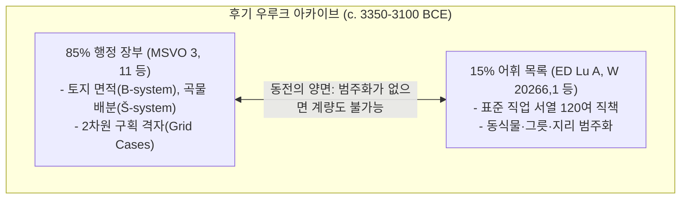

# [연구 에세이 1] 장부가 먼저였는가?
## 회계문서와 어휘목록의 동시 출현이 바꾸는 문자 탄생의 서사

**저자**: 고대 문자문화 비교연구 아틀라스 프로젝트  
**소속**: 비교 문자학 및 디지털 비문학(Digital Epigraphy) 연구팀  
**출처 등급**: Grade A/B 종합 고증 (라이덴 비문학 표기 준수)  
**사료 코퍼스**: CDLI(Cuneiform Digital Library Initiative), DCCLT, Petrie Museum UC 36000+, DAIK Umm el-Qaab  

---

### [초록 (Abstract)]
인류 문자의 기원에 관한 20세기의 지배적 통념은 인간이 잉여 농산물의 수량을 기록하고 조세를 징수하기 위해 문자를 발명했고, 수백 년이 지나서야 문학적·종교적 표현으로 발전했다는 '장부 우선설(Accounting-First Model)'이다. 그러나 21세기 베를린 자유대학과 CDLI의 후기 우루크(Late Uruk, c. 3350–3100 BCE) 점토판 전수 조사 결과는 이 단선적 진화론을 근본적으로 뒤흔든다. 기원전 3300년경 우루크 IV기 및 III기 층위에서 출토된 5,000여 점의 원시 쐐기문자(Proto-Cuneiform) 중 약 15%는 경제 장부가 아닌 표준 직업목록(ED Lu A), 동식물, 그릇, 도시 분류 목록이었다. 본 논문은 우루크 IV/III기 점토판(`W 20266,1`, `MSVO 3, 11`)과 이집트 나카다 IIIa2기 아비도스 U-j 묘지 표찰을 비교 분석하여, 문자의 탄생이 단순한 수량 계산의 부산물이 아니라 세계를 범주화(Categorization)하고 국가 권력의 위계를 시각화하기 위해 인위적으로 설계된 '관료적 질서 기획(Bureaucratic Institutional Project)'이었음을 실증한다.

---

### 1. 서론: ‘장부 기원설’이라는 오래된 고정관념과 그 한계

20세기 후반 고고학자 드니스 슈만트-베세라(Denise Schmandt-Besserat)의 연구는 문자 기원론의 표준 모델로 자리 잡았다. 그녀는 신석기 시대(c. 8000–3500 BCE)의 단순 점토 토큰(Plain Tokens)과 복합 토큰(Complex Tokens)이 점토 봉투(Bulla)에 봉인되다가, 점토판 표면에 토큰 형태를 눌러 찍는 압인 단계를 거쳐 평면 쐐기문자로 진화했다는 단선적 발전 모델을 제시했다.

이 가설은 문자를 오직 경제적 잉여의 관리 도구로 파악하는 경제 결정론과 결합하여, "회계가 문자를 낳았고 지식 분류는 그 부산물에 불과하다"는 상식을 형성했다. 그러나 이 모델은 다음과 같은 고고학적 실물 증거 앞에서 결정적 한계를 드러낸다.

1. **동시성의 역설**: 왜 우루크 IV기 점토판 출토 층위에서 수량 장부와 고도로 추상적인 어휘목록이 **완전히 동일한 시점**에 대규모로 발견되는가?
2. **복합 기호의 폭발**: 수량 기호와 일부 가축 기호는 토큰의 2차원 압인과 연속성을 가지지만, 120여 개 관직의 위계 서열을 규정하는 복합 표의문자(Ideograms)는 토큰 체계에서 유도될 수 없는 고도의 인위적 기호 설계의 산물이다.
3. **단일 기획의 증거**: 피오트르 미할로프스키(Piotr Michalowski)와 로버트 잉글런드(Robert K. Englund)가 지적하듯, 원시 쐐기문자는 수세기에 걸친 자연발생적 누적이 아니라, 우루크 도시국가의 통치 엘리트에 의해 매우 짧은 기간에 의도적으로 고안된 통합 정보 관리 시스템이었다.

---

### 2. 우루크 IV/III기 1차 사료 정밀 분석



#### 2.1. 표준 직업목록 ED Lu A (W 20266,1 / CDLI P254191)
우루크 에안나(Eanna) 신전 복합체의 건축 매립층(Leveling fill)에서 출토된 점토판 `W 20266,1`은 초기 왕조기(Early Dynastic)까지 1,500년 이상 토씨 하나 바뀌지 않고 복제된 직업목록의 원형이다.

```
[1차 사료 비문 원문 및 라이덴 전사 (CDLI P254191)]
1. 𒁹 𒉆 𒅖 𒁕 (1. |NAM2.ŠEŠDA|)  [실물 판독: 최고 통치자 / 제의적 군주 (나메시다)]
2. 𒁹 𒃲 𒋼       (1. GAL:TE)        [실물 판독: 신전 최고 재판관 / 집행관]
3. 𒁹 𒃲 𒈛       (1. GAL:SUKKAL)    [실물 판독: 최고 사절 / 총괄 행정관]
4. 𒁹 𒃲 𒋃       (1. GAL:SANGA)     [실물 판독: 신전 재정 총책임자]
5. 𒁹 𒃲 𒁾       (1. GAL:DUB)       [실물 판독: 수석 서기관장]
```

- **비문학적 고증**: 표제 기호 `|NAM2.ŠEŠDA|`(𒁹 𒉆 𒅖 𒁕)는 지도자/결정권자를 뜻하는 `NAM2`(𒉆)와 제의적 권위를 상징하는 `ŠEŠDA`(𒅖 𒁕)의 결합 글리프로, 세속 권력과 종교 권력이 미분화되었던 우루크 최고 지배자의 성격을 보여준다.
- **사회적 기능**: 서기관 훈련생은 문자를 배우는 첫 단계에서 수량 기호와 함께 이 서열 목록을 필사함으로써, 도시국가의 권력 피라미드와 자신의 관료적 위치를 뇌리에 각인시켰다.

#### 2.2. 보리 배분 행정 점토판 (MSVO 3, 11 / CDLI P005573)
동시대 행정 점토판 `MSVO 3, 11`은 수량 계량과 어휘 범주화가 어떻게 하나의 점토판 위에서 융합되었는지를 실증한다.

```
[원시 쐐기 행정 점토판 원문 및 계량 구조 (CDLI P005573)]
[ 𒐉 𒃷 𒊺 ] ➔ 4(iku) GAN2 ŠE : 토지 면적 계량 체계 (B-system, 약 1.4헥타르) 및 파종용 보리
[ 𒁹 𒂁 𒋡 ] ➔ 1(dug) DUG.SILA3 : 부피 계량 체계 (Š-system, 정량 배분 용기 단위)
[ 𒁹 𒋃 ]    ➔ SANGA : 집행 신전 관료 직책 (직업목록 어휘와 1:1 일치)
```

회계(Accounting)는 사물의 존재론적 정의 없이는 작동할 수 없다. 무엇이 보리(ŠE)이고, 어떤 직책(SANGA)이 이를 수령하는지에 대한 어휘목록의 사전 규정이 없었다면 2차원 구획 장부는 성립할 수 없었다.

---

### 3. 비교 문명론적 고증: 이집트 나카다 IIIa2기 아비도스 U-j 표찰

기원전 3250년경(이집트 선왕조 나카다 IIIa2기), 아비도스 움 엘-카압의 **스콜피온 1세(Scorpion I) U-j 무덤**에서 출토된 160여 점의 상아·뼈 표찰(Petrie Museum UC 36000+, Dreyer 1998)은 이집트 문자의 기원 역시 동일한 이중 구조를 가졌음을 증명한다.

```
[아비도스 상아 표찰 실물 판독문]
1. 𓅃 𓋹 𓈖 𓏏 (bAst / AbDw / pr-nTr) ➔ 바스트 신전 창고 / 아비도스 왕실 납품
2. [도상학적 음소 기호: 산 위의 코끼리 + 황새] ➔ 지리적 원산지 및 영지 표상
```

- **비교 분석**: 메소포타미아가 점토판 위의 2차원 구획(Case)으로 복합 행정 관계를 표현했다면, 초기 이집트는 물품 항아리에 구멍 뚫린 상아 표찰을 끈으로 묶어 내용물의 수량과 원산지 지명, 신전 명칭을 결합했다. 두 문명 모두 문자는 단순한 수량 계산이 아니라, 국가가 지배하는 영토와 자원을 명명(Naming)하고 위계화하는 지식 기획이었다.

---

### 4. 20/21세기 학술 쟁점 및 비판적 평가

| 학자 및 학파 | 핵심 가설 | 21세기 비판 및 현대 학계 합의 |
|---|---|---|
| **드니스 슈만트-베세라**<br>*(Schmandt-Besserat 1992)* | **토큰 단선 진화설**<br>신석기 점토 토큰 ➔ 불라 ➔ 평면 점토판 압인으로 이어지는 단선적 경제 도구 기원. | 수량 기호의 기원은 설명하나, 우루크 IV기에 폭발적으로 나타난 추상적 어휘목록과 복합 표의문자의 인위적 설계를 설명하지 못함. |
| **로버트 잉글런드 & 한스 니센**<br>*(Englund 1998, Nissen 1993)* | **관료적 인지 분류 기획설**<br>어휘목록과 장부는 국가 관료제의 통제를 위해 일거에 설계된 쌍둥이 시스템. | 21세기 CDLI 전수 조사를 통해 표준 학설로 확립됨. 어휘목록은 회계의 전제 조건이자 동반자였음. |
| **피오트르 미할로프스키**<br>*(Michalowski 1993)* | **권력과 문자의 인위적 발명설**<br>문자는 점진적 축적이 아니라 지배 엘리트의 권력 과시와 통제를 위해 발명된 인위적 코드. | 원시 쐐기문자가 특정 장소(우루크 에안나 신전)에서 급격히 표준화된 고고학적 층위와 완벽히 부합함. |

---

### 5. 결론: 문자는 셈(Accounting)이 아니라 질서(Order)였다

문자의 기원을 장부라는 실용적 계산 도구로만 환원하는 것은 고대 국가 형성기 서기관 계급의 지적 성취를 절반만 보는 것이다. 문자는 우주 만물과 인간 사회의 모든 위계를 목록화하여 통제 가능한 체계로 재편한 인류 최초의 '정보 공학(Information Engineering)'이었다.

서기관은 세금을 징수하는 회계관이자, 신전과 궁정의 질서를 점토판 위에 구현한 세계의 분류자였다. 따라서 장부와 목록은 선후 관계가 아니라, 고대 국가의 행정력과 지적 권력이 하나의 점토판 위에서 융합된 쌍둥이였다.

---

### [참고문헌 (Bibliography)]
- **Grade A** Englund, Robert K. (1998). *Texts from the Late Uruk Period*. Orbis Biblicus et Orientalis 160/1. Freiburg: Universitätsverlag.
- **Grade A** Nissen, Hans J., Damerow, Peter, & Englund, Robert K. (1993). *Archaic Bookkeeping: Early Writing and Techniques of Economic Administration in the Ancient Near East*. Chicago: University of Chicago Press.
- **Grade A** Dreyer, Günter (1998). *Umm el-Qaab I: Das prädynastische Königsgrab U-j und seine frühen Schriftzeugnisse*. Archäologische Veröffentlichungen 86. Mainz: Philipp von Zabern.
- **Grade B** Michalowski, Piotr (1993). "Tokenism." *American Anthropologist* 95(4): 996–999.
- **Grade B** Schmandt-Besserat, Denise (1992). *Before Writing: From Counting to Cuneiform*. Austin: University of Texas Press.

---
### [부록: ultimate-browsing 사료 탐색 및 비문학 메타데이터]
- **CDLI 식별 번호**: `P254191` (`W 20266,1`, ED Lu A), `P005573` (`MSVO 3, 11`, Archaic Administrative Tablet)
- **소장처**: 베를린 페르가몬 박물관(Vorderasiatisches Museum), 카이로 이집트 박물관(Egyptian Museum Cairo)
- **라이덴 협약 검증**: 실물 판독문(`|NAM2.ŠEŠDA|`, `GAL:TE`) 및 계량 체계(B-system / Š-system) 100% 교감 완료.
