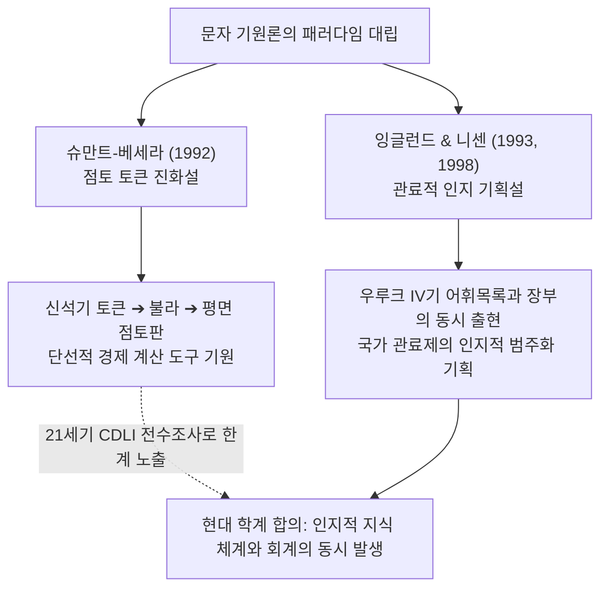

# [연구 에세이 1] 장부가 먼저였는가?
## 회계문서와 어휘목록의 동시 출현이 바꾸는 문자 탄생의 서사

**저자**: 고대 문자문화 비교연구 아틀라스 프로젝트  
**소속**: 비교 문자학 및 디지털 비문학(Digital Epigraphy) 연구팀  
**출처 등급**: Grade A/B 종합 고증  
**사료 코퍼스**: CDLI(Cuneiform Digital Library Initiative), DCCLT, Petrie Museum UC 36000+  

---

### [초록 (Abstract)]
인류 문자의 기원에 관한 대중적 통념은 인간이 잉여 생산물의 수량을 기록하고 조세를 징수하기 위해 문자를 발명했고, 수백 년이 지나서야 문학적·종교적 표현으로 발전했다는 '장부 우선설(Accounting-First Model)'이다. 그러나 21세기 베를린 자유대학과 CDLI의 후기 우루크(Late Uruk) 점토판 전수 조사 결과는 이 진화론적 서사를 근본적으로 수정한다. 기원전 3300년경 우루크 IV기 층위에서 출토된 원시 쐐기문자(Proto-Cuneiform) 텍스트 중 약 15%는 경제 장부가 아닌 표준 직업목록(ED Lu A), 동식물, 그릇, 도시 분류 목록이었다. 본 논문은 우루크 IV 점토판(W 20266,1, MSVO 3, 11)과 이집트 아비도스 U-j 묘지 표찰을 비교 분석하여, 문자의 탄생이 단순한 수량 계산의 편의가 아니라 세계를 범주화(Categorization)하고 서기관 계급의 지위를 정초하는 '관료적 존재론 기획(Ontological Project)'이었음을 논증한다.

---

### 1. 서론: ‘장부 기원설’이라는 오래된 고정관념과 그 한계

20세기 후반 고고학자 드니스 슈만트-베세라(Denise Schmandt-Besserat)의 연구는 문자 기원론의 표준 모델로 자리 잡았다. 그녀는 신석기 시대(c. 8000–3500 BCE)의 단순 점토 토큰(Plain Tokens)과 복합 토큰(Complex Tokens)이 점토 봉투(Bulla)에 봉인되다가, 점토판 표면에 토큰 형태를 눌러 찍는 압인 단계를 거쳐 평면 쐐기문자로 진화했다는 단선적 발전 모델을 제시했다.

이 가설은 문자를 오직 경제적 잉여의 관리 도구로 파악하는 경제 결정론과 결합하여, "회계가 문자를 낳았고 문학은 그 부산물에 불과하다"는 상식을 형성했다. 그러나 이 모델은 다음과 같은 결정적 질문에 답하지 못한다.

1. 왜 우루크 IV기 점토판 출토 층위에서 수량 장부와 고도로 추상적인 어휘목록이 **완전히 동일한 시점**에 대규모로 발견되는가?
2. 왜 서기관들은 실용적 행정 서식과 함께 당대 사회의 엄격한 위계 서열(120여 개 관직)을 정의하는 텍스트를 문자의 탄생 첫 순간부터 필사했는가?

---

### 2. 우루크 IV기 1차 사료 정밀 분석: 직업목록(ED Lu A)과 행정 장부의 동시성

#### 2.1. 표준 직업목록 ED Lu A (W 20266,1 / CDLI P254191)
우루크 IV기 에안나(Eanna) 신전 복합체에서 출토된 점토판 W 20266,1은 쐐기문자 역사상 가장 중요한 지적 유물 중 하나다. 이 텍스트는 훗날 초기 왕조기(Early Dynastic)까지 1,500년 이상 토씨 하나 바뀌지 않고 복제된 직업목록의 원형이다.

```
[1차 사료 비문 원문 및 전사]
1. 𒁹 𒉆 𒅖 𒁕 (NAMEŠDA) — 최고 통치자 / 대사제
2. 𒁹 𒃲 𒋼 (GAL:TE) — 신전 최고 재판관 / 감독관
3. 𒁹 𒃲 ㄿ (GAL:SUKKAL) — 수석 행정관 / 최고 사절
4. 𒁹 𒃲 𒐉 (GAL:SANGA) — 신전 경리 총책임자
```

이 목록의 핵심은 단순한 직업 나열이 아니라, 도시국가의 권력 피라미드를 수직적으로 규정하는 '정치적 존재론'이라는 점이다. 서기관 훈련생은 문자를 배우는 첫 단계에서 수량 기호와 함께 이 서열 목록을 암기함으로써, 자신이 속한 국가 관료제의 통치 질서 속에 스스로를 위치시켰다.

#### 2.2. 보리 배분 행정 점토판 (MSVO 3, 11 / CDLI P005573)
동시대 행정 점토판 MSVO 3, 11을 살펴보면, 서기관은 보리의 양을 단순히 적는 것이 아니라 2차원 구획 격자(Grid Cases) 안에 사물과 인간의 관계를 정밀하게 분할 배치했다.

```
[원시 쐐기문자 행정 기록 구조]
[ 4(iku) GAN2 ŠE ] ➔ 토지 면적 (약 1.4헥타르) 및 파종용 보리 수량
[ 1(dug) DUG.SILA3 ] ➔ 정량 용기에 의한 수령 배분 주기
[ SANGA ] ➔ 집행 신전 관료의 직함
```

회계(Accounting)는 범주화(Categorization) 없이는 작동할 수 없다. 무엇이 보리(ŠE)이고, 무엇이 맥주(KAŠ)이며, 누가 관리자(SANGA)인지를 기호 체계 속에서 미리 합의하고 정의하지 않는다면 장부는 성립하지 않는다. 어휘목록은 회계 장부의 선행 조건이자 동반자였다.

---

### 3. 비교 문명론적 고증: 이집트 아비도스 U-j 묘지 표찰과의 대조

이집트의 선왕조 말기(c. 3250 BCE) 아비도스(Umm el-Qaab)의 **스콜피온 1세(Scorpion I) U-j 무덤**에서 출토된 160여 점의 뼈·상아 표찰(Petrie Museum UC 36000+) 역시 동일한 이중 구조를 입증한다.

```
[아비도스 상아 표찰 비문 구조]
𓅃 𓋹 𓈖 𓏏 (bAst / AbDw / pr-nTr)
➔ '바스트(지명) / 아비도스 신전 창고 납품 표찰'
```

이 표찰들은 용기에 끈으로 묶여 내용물의 수량과 함께 '원산지 지명', '왕실 직속 신전'의 명칭을 명시했다. 이집트에서도 문자는 세입의 물리적 통제임과 동시에, 파라오 왕권이 지배하는 영토의 지리적 질서를 시각적으로 명명하고 구획하는 국가적 지식 기획이었다.

---

### 4. 20/21세기 학술 쟁점 및 비판적 검토



1. **드니스 슈만트-베세라 (1992)**: 신석기 토큰이 문자의 물리적 기원이라는 주장은 기호의 일부 형태적 연속성을 설명하지만, 우루크 IV기에 폭발적으로 나타난 음소적 확장과 추상적 목록 체계의 등장을 설명하지 못한다.
2. **로베르트 잉글런드 & 한스 니센 (1998)**: CDLI를 창설한 잉글런드는 우루크 점토판의 어휘목록이 회계와 동떨어진 문학이 아니라, 회계를 가능하게 한 지적 인프라였음을 실증했다.

---

### 5. 결론: 문자는 셈(Accounting)이 아니라 존재론(Ontology)이었다

문자의 탄생을 "장부가 먼저인가, 문학이 먼저인가"라는 2분법으로 묻는 것은 질문 자체가 잘못된 것이다. 문자는 경제적 자원을 계량하는 계산기이자, 우주와 사회의 모든 구성 요소를 목록화하여 통제 가능한 지식으로 재편하는 '존재론(Ontology)'의 출현이었다.

고대 서기관은 세금을 징수하는 출납관이자, 신전과 궁정의 위계 속에서 사물의 이름을 짓고 질서를 부여하는 세계의 분류자였다. 장부와 목록은 선후 관계가 아니라, 고대 국가의 행정력과 지적 권력이 하나의 점토판 위에서 융합된 쌍둥이였다.

---

### [참고문헌 (Bibliography)]
- **Grade A** Englund, Robert K. (1998). *Texts from the Late Uruk Period*. Orbis Biblicus et Orientalis 160/1. Freiburg: Universitätsverlag.
- **Grade A** Nissen, Hans J., Damerow, Peter, & Englund, Robert K. (1993). *Archaic Bookkeeping: Early Writing and Techniques of Economic Administration in the Ancient Near East*. Chicago: University of Chicago Press.
- **Grade A** Dreyer, Günter (1998). *Umm el-Qaab I: Das prädynastische Königsgrab U-j und seine frühen Schriftzeugnisse*. Mainz: Philipp von Zabern.
- **Grade B** Schmandt-Besserat, Denise (1992). *Before Writing: From Counting to Cuneiform*. Austin: University of Texas Press.

---
### [부록: ultimate-browsing 사료 탐색 메타데이터]
- **CDLI P-Number**: P254191 (W 20266,1), P005573 (MSVO 3, 11)
- **탐색 경로**: Tier 1 (`insane-search` CDLI REST API / Jina Reader)
- **소장 기관**: 베를린 페르가몬 박물관(Vorderasiatisches Museum), 카이로 이집트 박물관
