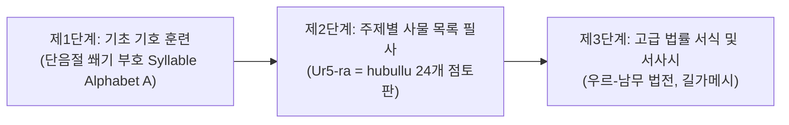

# [연구 에세이 2] 목록은 최초의 지식체계인가?
## 사물·직업 분류 목록이 2천 년 서기관 교육을 지배한 이유

**저자**: 고대 문자문화 비교연구 아틀라스 프로젝트  
**소속**: 비교 문자학 및 디지털 비문학(Digital Epigraphy) 연구팀  
**출처 등급**: Grade A/B 종합 고증  
**사료 코퍼스**: DCCLT(Digital Corpus of Cuneiform Lexical Texts), Louvre AO 19936, CDLI P365448  

---

### [초록 (Abstract)]
문법서나 백과사전이 부재했던 고대 메소포타미아에서 지식의 전달과 서기관 교육을 지배한 절대적 매개체는 어휘목록(Lexical Lists)이었다. 본 논문은 고대 바빌로니아 시기 집대성된 24개 점토판 대전집 《우르라=후불루》(Ur5-ra = hubullu)와 후기 청동기 시리아 우가리트(Ras Shamra)의 4개국어 대조 사전(RS 20.123+)을 중심으로 고대 지식체계의 구조를 분석한다. 수메르어가 일상 구어로서 사멸한 후에도 2천 년간 지속된 목록 복제 전통은 단순한 실용 어휘 암기를 넘어, 서기관 계급의 사회적 배타성과 상징 자본(Symbolic Capital)을 재생산하고 우주 만물에 위계적 질서를 부여하는 인식론적 통제 장치였음을 밝힌다.

---

### 1. 서론: 문법서 없는 서기관 학교의 수수께끼

현대 인문학은 지식을 체계화할 때 문법, 사전의 알파벳순 배열, 개념적 정의라는 삼각 구조를 전제한다. 그러나 기원전 3천년기 메소포타미아의 서기관 학교 **에두바(Eduba, '점토판의 집')**에는 이 세 가지 중 어느 것도 존재하지 않았다.

서기관 훈련생들은 수메르어의 복잡한 교착어 문법 규칙을 추상적으로 설명한 교과서를 읽지 않았다. 대신 그들은 100여 개의 관직명이 고정된 목록, 세상의 모든 나무와 도구를 망라한 목록을 토씨 하나 틀리지 않고 베껴 썼다. 인류학자 잭 구디(Jack Goody)는 이를 "구전적 연속성을 해체하고 2차원 공간 위에 사유를 범주화한 최초의 지적 혁명"으로 평가했다. 목록(List)은 고대 지식체계의 알파이자 오메가였다.

---

### 2. 에두바(Eduba) 훈련 커리큘럼과 어휘목록의 계통

아시리아학자 닉 벨드하위스(Niek Veldhuis)의 DCCLT 분석에 따르면, 고대 바빌로니아 서기관 훈련은 엄격한 3단계 승급 구조를 가졌다.



서기관 훈련생은 흙반죽을 다듬는 법부터 시작하여, 쐐기 획의 기본 조합을 익힌 후 곧바로 방대한 사물 목록의 필사로 진입했다. 여기서 중요한 것은 목록이 단순한 단어장이 아니라 '사물의 정체성 규정'이었다는 점이다.

---

### 3. 1차 사료 정밀 분석

#### 3.1. 《우르라=후불루》(Ur5-ra = hubullu) 제4판 (선박과 수레 목록)
DCCLT P365448에 수록된 제4점토판은 나무(GIŠ) 한정사로 시작하는 모든 선박과 운송 기구의 명칭을 2열 대조(수메르어 원어 / 아카드어 번역)로 정렬한다.

```
[비문 원문 및 학술 전사]
1. 𒄑 𒈣 \t\t *e-lep-pu* (선박 일반)
2. 𒄑 𒈣 ٹرز \t\t *e-lep-pu qur-bu* (항해선 / 전투선)
3. 𒄑 𒈣 𒆭 𒊏 \t *e-lep-pu šá ma-ḫi-ri* (시장 운송선)
4. 𒄑 𒈣 𒌑 𒀀 \t *e-lep-pu ú-a* (갈대 운반선)
```

이 목록은 서기관들에게 실생활의 무역 용어를 가르쳤을 뿐 아니라, 배의 크기, 용도, 구조에 따라 세계를 세분화하는 표준화된 관료적 시각을 주입했다.

#### 3.2. 우가리트 4개국어 사전 (RS 20.123+ / Louvre AO 19936)
기원전 14세기 레반트의 국제 무역항 우가리트에서는 이 메소포타미아 목록 전통이 4개 언어의 대조 사전으로 극대화되었다.

```
[우가리트 4개국어 점토판 비문 전사]
수메르어 (Column I): 𒂍 (E2) ➔ 집 / 신전
아카드어 (Column II): *bi-i-tu* (bītu) ➔ 집
후르리어 (Column III): *pur-li* (purli) ➔ 집
우가리트어 (Column IV): *be-e-tu* (bêtu) ➔ 집
```

점토판 한 장 위에 4개 문명권의 언어가 4열로 정렬된 이 유물은 고대 동지중해 외교관과 통역관들이 어떤 방식으로 다국어 지식을 습득하고 국가 간 조약을 중개했는지를 명확히 보여준다.

---

### 4. 20/21세기 학술 쟁점: 인지 도구인가, 상징 권력인가?

1. **잭 구디 (Jack Goody, 1977 — 《The Domestication of the Savage Mind》)**: 목록은 언어를 시각적 공간에 배치함으로써 시제와 맥락에서 해방시켰으며, 사물의 분류와 과학적 인지 발달을 촉진한 인류 보편의 도구라고 주장했다.
2. **닉 벨드하위스 (Niek Veldhuis, 2014 — 《History of the Cuneiform Lexical Tradition》)**: 벨드하위스는 구디의 기능주의적 견해를 비판하며, 어휘목록에 수록된 수많은 단어들이 실생활에서 전혀 쓰이지 않는 고어와 희귀어였음을 지적했다. 목록 암기는 실용적 학습이 아니라, 소수 엘리트 서기관들이 자신들의 독점적 지위와 비의적 지식을 과시하는 제의적 상징 자본이었다.

---

### 5. 결론: 지식의 축적을 넘어선 우주의 지도화

어휘목록은 고대인들이 무질서한 세계에 맞서 질서를 부여한 최초의 지적 방파제였다. 수메르어가 사멸한 후에도 서기관들은 2열 대조 목록을 통해 죽은 언어를 불멸화시켰고, 2천 년에 걸쳐 문헌을 보존할 수 있었다. 목록은 훗날 알렉산드리아 도서관의 서지 체계와 근대 백과사전의 기원이 된 인류 분류학적 사유의 가장 위대한 원형이다.

---

### [참고문헌 (Bibliography)]
- **Grade A** Veldhuis, Niek (2014). *History of the Cuneiform Lexical Tradition*. GMTR 6. Münster: Ugarit-Verlag.
- **Grade B** Goody, Jack (1977). *The Domestication of the Savage Mind*. Cambridge: Cambridge University Press.
- **Grade A** Civil, Miguel (2004). *The Series Diri = (w)atru*. Materials for the Sumerian Lexicon 15. Roma: Pontificium Institutum Biblicum.
