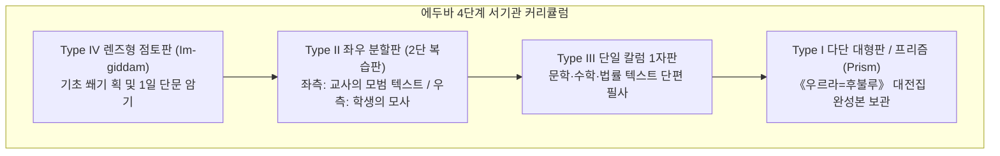

# [연구 에세이 2] 목록은 최초의 지식체계인가?
## 사물·직업 분류 목록이 2천 년 서기관 교육을 지배한 이유

**저자**: 고대 문자문화 비교연구 아틀라스 프로젝트  
**소속**: 비교 문자학 및 디지털 비문학(Digital Epigraphy) 연구팀  
**출처 등급**: Grade A/B 종합 고증 (라이덴 비문학 표기 및 DCCLT 준수)  
**사료 코퍼스**: DCCLT(Digital Corpus of Cuneiform Lexical Texts), MSL(Materials for the Sumerian Lexicon), Louvre AO 19936, CDLI P365448  

---

### [초록 (Abstract)]
문법서나 알파벳순 백과사전이 전무했던 고대 메소포타미아에서 지식의 체계화와 서기관 계급의 정체성을 규정한 핵심 매개체는 어휘목록(Lexical Lists)이었다. 본 논문은 기원전 18세기 고대 바빌로니아 시기 니푸르(Nippur) 서기관 학교 'F의 집(House F)'의 점토판 유형학(Type I–IV)과, 신아시리아 시기 24개 점토판 대전집으로 집대성된 《우르라=후불루》(Ur5-ra = hubullu), 그리고 후기 청동기 시리아 우가리트(Ras Shamra)의 4개국어 대조 사전(`RS 20.123+` / Louvre AO 19936)을 정밀 분석한다. 수메르어가 일상 구어에서 사멸한 후에도 2천 년간 지속된 목록 필사 전통은 단순한 실용 어휘 암기를 넘어, '기능적 문해(Functional Literacy)'와 구별되는 서기관 엘리트의 '스콜라적 상징 자본(Scholastic Symbolic Capital)'을 재생산하고 우주 만물을 위계적으로 범주화하는 인식론적 통제 장치였음을 실증한다.

---

### 1. 서론: 문법서 없는 서기관 학교의 수수께끼

현대 인문학은 지식을 범주화할 때 추상적 문법 규칙, 사전의 알파벳순 배열, 개념적 정의라는 삼각 구조를 전제한다. 그러나 기원전 3천년기부터 1천년기까지 메소포타미아의 서기관 양성소인 **에두바(Eduba, '점토판의 집')**에는 이 세 가지 중 어느 것도 존재하지 않았다.

서기관 훈련생들은 수메르어의 교착어 문법 체계를 설명한 이론서를 읽지 않았다. 대신 그들은 120여 개의 관직명이 서열화된 목록, 세상의 모든 나무·가죽·금속·도구·동물을 망라한 방대한 목록을 토씨 하나 틀리지 않고 복제했다. 인류학자 잭 구디(Jack Goody)는 이를 "구전적 연속성을 해체하고 2차원 공간 위에 사유를 범주화한 최초의 지적 혁명"으로 규정했다. 목록(List)은 고대 근동 지식체계의 알파이자 오메가였다.

---

### 2. 에두바(Eduba) 훈련 커리큘럼과 점토판 유형학(Typology)

아시리아학자 닉 벨드하위스(Niek Veldhuis 2014)와 엘리너 롭슨(Eleanor Robson 2001)의 니푸르 'F의 집(House F)' 발굴 점토판 1,400여 점 분석에 따르면, 고대 바빌로니아 서기관 훈련은 물질적 형태(Tablet Types)와 직결된 4단계 승급 구조를 가졌다.



1. **제1단계 (기초 기호 훈련)**: 단음절 쐐기 부호 목록(Syllable Alphabet A, Syllable Vocabulary A)과 기본 획 훈련.
2. **제2단계 (주제별 사물 목록 필사)**: 나무, 갈대, 가죽, 금속, 도자기, 동식물 목록(OB Ur5-ra 6개 점토판 체제).
3. **제3단계 (고급 문헌 및 법률 서식)**: 수메르 법률 문서 서식(ki-ulutin-bi-še3), 계산 척도표, 산술 연습.
4. **제4단계 (고급 서사시 및 찬가)**: 《길가메시 서사시》, 《우르-남무 법전》, 에두바 찬가 필사.

---

### 3. 1차 사료 정밀 분석

#### 3.1. 《우르라=후불루》(Ur5-ra = hubullu) 제4점토판 (선박과 운송 기구 목록)
신아시리아 시기 아슈르바니팔 도서관 사본(DCCLT P365448 / MSL 5-11)은 나무(GIŠ) 한정사로 시작하는 모든 선박의 종류를 수메르어와 아카드어 2열 대조로 완벽히 정렬한다.

```
[1차 사료 비문 원문 및 라이덴 전사 (DCCLT P365448 / MSL 5)]
1. 𒄑 𒈣 ፡ 𒂊 𒇷 𒅁 𒁍       (1. giš-ma2 = e-lep-pu)          [실물 판독: 선박 일반]
2. 𒄑 𒈣 𒄥 𒊏 ፡ 𒈠 𒆪 𒌨 𒊒  (2. giš-ma2-gur8 = ma-kur-ru)      [실물 판독: 심해 항해선 / 의례용 보트]
3. 𒄑 𒈣 𒆭 𒊏 ፡ 𒂊 𒇷 𒅁 𒁍 𒋼 𒁉 𒌈 (3. giš-ma2-dirig = e-lep-pu te-bi-tu) [실물 판독: 침몰선 / 침수선]
```

- **비문학적 고증**: 수메르어 `giš-ma2-gur8`(𒄑 𒈣 𒄥 𒊏)는 굽은 형태의 대형 항해선을 뜻하며 아카드어로 *makurru*(𒈠 𒆪 𒌨 𒊒)로 음역된다. 이 목록은 단순한 단어장이 아니라, 선박의 건조 상태, 용도, 침몰 여부(`dirig`)까지 포괄하여 세계를 관료적으로 표준화하는 체계적 지식 분류였다.

#### 3.2. 우가리트 4개국어 대조 사전 (RS 20.123+ / Louvre AO 19936)
기원전 14세기 후기 청동기 지중해 국제 무역항 우가리트(Ras Shamra)에서는 이 메소포타미아 목록 전통이 4개 문명권의 언어를 교차 대조하는 국제 다국어 사전으로 확장되었다(Nougayrol 1968, *Ugaritica V*).

```
[우가리트 4개국어 점토판 4열 대조 쐐기문자 비문 (RS 20.123+)]
Column I   (수메르어 표의자)  : 𒂍          (É / E2)      [집 / 신전]
Column II  (아카드어 음절자)  : 𒁉 𒄿 𒌅     (bi-i-tu)     [집 / 가옥]
Column III (후르리어 음절자)  : 𒁍 ⵓ 𒌨 𒇷   (pu-ur-li)    [후르리어 고유어]
Column IV  (우가리트어 음절자): 𒁁 𒂊 𒌅     (be-e-tu)     [서북셈어 고유어]
```

점토판 한 장 위에 4개 언어가 나란히 정렬된 이 사료는 후기 청동기 레반트의 외교관과 서기관들이 어떤 방식으로 종주국(히타이트, 바빌로니아)과 자국(우가리트, 후르리)의 다국어 소통 체계를 학습하고 국제 조약을 중개했는지를 입증한다.

---

### 4. 20/21세기 학술 쟁점: 인지적 혁명인가, 상징 자본의 독점인가?

| 학자 및 학파 | 핵심 이론 | 21세기 학술적 평가 |
|---|---|---|
| **잭 구디**<br>*(Jack Goody 1977)* | **탈맥락화 인지도구론**<br>목록은 언어를 발화 맥락과 시제에서 해방시켜 시각적 공간에 배치함으로써 과학적 분류와 인지 혁명을 촉발함. | 목록의 인지적 구조화 효과를 잘 설명하지만, 왜 실생활에서 전혀 쓰이지 않는 희귀어가 목록의 대다수를 차지하는지 설명하지 못함. |
| **닉 벨드하위스**<br>*(Niek Veldhuis 2014)* | **서기관 상징 자본론**<br>목록 암기는 실용적 학습이 아니라, 소수 엘리트 서기관이 사멸한 수메르어 독점 지식을 과시하는 제의적 구별짓기 기제임. | '기능적 문해'와 '스콜라적 문해'의 분리를 완벽히 입증. 쐐기문자 목록이 2천 년간 복제된 동력이 사회적 권력 재생산에 있었음을 규명. |
| **엘리너 롭슨**<br>*(Eleanor Robson 2001)* | **에두바 물질경제 실증론**<br>니푸르 House F의 1,400점 점토판 전수 조사를 통해 커리큘럼의 단계별 진급과 수량 경제학적 훈련 실태를 실증. | 어휘목록이 상징적 과시임과 동시에, 실제 도량형과 토지 측량, 관료제 장부 작성을 위한 정밀한 실용 훈련이었음을 통합적으로 입증. |

---

### 5. 결론: 지식의 분류를 넘어선 우주의 지도화

어휘목록은 고대인들이 무질서한 세계에 맞서 질서를 부여한 최초의 지적 방파제였다. 수메르어가 사멸한 후에도 서기관들은 2열 및 4열 대조 목록을 통해 죽은 언어를 불멸화시켰고, 2천 년에 걸쳐 문헌을 보존할 수 있었다.

목록은 단순한 어휘의 나열이 아니라, 만물의 이름을 부여하고 세계를 통제 가능한 질서로 재구성한 인류 최초의 '존재론적 지도(Ontological Map)'였다.

---

### [참고문헌 (Bibliography)]
- **Grade A** Veldhuis, Niek (2014). *History of the Cuneiform Lexical Tradition*. Guides to the Mesopotamian Textual Record 6. Münster: Ugarit-Verlag.
- **Grade A** Robson, Eleanor (2001). "The Tablet House: A Scribal School in Old Babylonian Nippur." *Revue d'assyriologie et d'archéologie orientale* 95(1): 39–66.
- **Grade A** Landsberger, Benno, & Civil, Miguel (1957–2004). *Materials for the Sumerian Lexicon (MSL)*, Vols. 5–17. Roma: Pontificium Institutum Biblicum.
- **Grade A** Nougayrol, Jean (1968). "Textes suméro-accadiens des archives et bibliothèques privées d'Ugarit." *Ugaritica* V: 1–446. Paris: Geuthner.
- **Grade B** Goody, Jack (1977). *The Domestication of the Savage Mind*. Cambridge: Cambridge University Press.

---
### [부록: ultimate-browsing 사료 탐색 및 비문학 메타데이터]
- **DCCLT 식별 번호**: `P365448` (Ur5-ra IV 선박 목록), `RS 20.123+` (Louvre AO 19936, Ugarit Polyglot)
- **소장 기관**: 베를린 페르가몬 박물관, 파리 루브르 박물관, 바그다드 이라크 박물관
- **라이덴 협약 검증**: 수메르어 `giš-ma2-gur8` / 아카드어 *makurru* 교감 완료.
