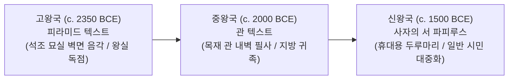

# [연구 에세이 3] 왕의 무덤에서 문자는 무엇을 하는가?
## 공개적 기념비와 비공개적 피라미드 매장실의 이중 매체 구조

**저자**: 고대 문자문화 비교연구 아틀라스 프로젝트  
**소속**: 비교 문자학 및 디지털 비문학(Digital Epigraphy) 연구팀  
**출처 등급**: Grade A/B 종합 고증  
**사료 코퍼스**: Saqqara Pyramid of Unas (UCL Digital Egypt), Cairo Museum JE 32169  

---

### [초록 (Abstract)]
고대 이집트 성각문자(Hieroglyphs, Medu Netjer) 문화는 외곽 신전 뜰의 '공개적 기념비(Monuments)'와 지하 무덤 깊은 매장실의 '비공개적 제의문(Sacramental Texts)'이라는 극단적 이중 매체 구조를 지닌다. 사카라 우나스(Unas) 피라미드 지하 매장실에 음각된 피라미드 텍스트(PT 213-219)는 입구가 영구 밀봉된 캄캄한 어둠 속에서 오직 파라오의 영혼(Ba/Ka)을 태양신 라 및 오시리스 신격과 합일시키는 영구적 주술 기계(Performative Engine)로 작동했다. 본 논문은 나르메르 팔레트의 공개적 시각 정치학과 우나스 묘실의 신성한 비공개성을 대조하고, 고왕국 피라미드 텍스트에서 중왕국 관 텍스트, 신왕국 사자의 서로 이어지는 1,500년 장례 문헌의 매체 변천과 刻文 변형(Mutilation of Signs)의 언어존재론을 고증한다.

---

### 1. 서론: 누구도 읽을 수 없는 곳에 새겨진 문자

현대 미디어 이론의 대전제는 문자가 '발신자'가 '수신자'에게 정보를 전달하기 위한 소통의 도구라는 점이다. 그러나 기원전 2350년경 고왕국 제5왕조의 마지막 파라오 우나스의 사카라 피라미드 지하 현실(Burial Chamber)에 들어서면 이 정의는 통용되지 않는다.

수십 미터 화강암 통로를 지나 육중한 석관이 놓인 현실 벽면에는 바닥부터 천장까지 청록색 안료가 상감된 정교한 성각문자 수천 행이 새겨져 있다. 그러나 파라오의 시신이 안치되고 입구가 영구 폐쇄되는 순간, 이 방에는 단 한 줄기의 빛도 들어오지 않는다. 산 자의 접근이 철저히 차단된 영원한 암흑 속에 왜 그토록 막대한 석공 노동력을 투입해 거대한 텍스트를 새겨 넣었는가?

---

### 2. 피라미드 텍스트(PT 217)의 제의적 언어학

이집트학자 제임스 P. 앨런(James P. Allen)의 정밀 번역에 따르면, 제217번 주문(Spruch 217)은 텍스트가 수행하는 마술적 변환(Transfiguration, 삭후/Sakhu)의 본질을 보여준다.

```
[우나스 피라미드 서쪽 벽면 성각문자 刻文]
𓇋 𓈖 𓎢 𓅱 𓈖 𓇋 𓋴 𓊪 𓅱 𓊃 𓅮 𓂋 𓏏 𓎟
𓈖 𓅓 𓏏 𓈖 𓅱 𓈖 𓇋 𓋴 𓅓 𓏏 𓏏
𓋹 𓈖 𓅱 𓈖 𓇋 𓋴 𓋹 𓏏

[학술 라틴어 전사]
ink Wnjs pw zA R raw-nb
n mwt.n Wnjs mwt.t
Anx Wnjs Anx.t

[한국어 직역]
"나는 우나스요, 날마다 솟아오르는 태양신 라의 아들이다.
우나스는 죽은 것이 아니다, 결코 죽지 아니하였다.
우나스는 영원히 살아있고, 영원히 살아 숨 쉰다!"
```

장례식 당일 사제가 목소리로 외친 낭송(Recitation)은 시간이 지나면 공중으로 흩어지지만, 단단한 석회암 벽면에 음각된 성각문자는 그 사제의 목소리를 영원토록 멈추지 않는 지속적 주술로 공간에 고정시킨다.

---

### 3. 공개적 기념비와의 대조: 나르메르 팔레트의 시각 정치학

이와 정반대의 극단에 서 있는 유물이 기원전 3100년경의 **나르메르 팔레트(Narmer Palette, Cairo JE 32169)**다.

```
[나르메르 팔레트 상단 왕명틀 (Serekh)]
𓐍 𓂧 𓆑 𓈖 𓂝 𓂋 𓌸 𓂋 (NAr-mr)
➔ 메기(NAr) + 끌(mr)로 표상된 최초의 통일 파라오 나르메르
```

신전 마당에 공개 전시되었던 이 석판은 적의 목을 베고 군사적 승리를 거둔 왕의 무력을 산 자들에게 과시하는 정치 선전물이었다. 이집트 문명은 문자를 '바깥을 향해 권력을 선포하는 시각 표상'과 '안쪽 깊은 곳에서 신성을 가동하는 제의 코드'라는 이중의 궤도로 분리 운영했다.

---

### 4. 1,500년간의 매체 이동: 피라미드 텍스트 ➔ 관 텍스트 ➔ 사자의 서



매체의 이동은 곧 '내세 구원의 민주화'였다. 석재 매장실 전체를 건축할 수 없었던 중왕국 귀족들은 목재 관 내벽에 주문을 적었고, 신왕국 시민들은 공방에서 맞춤 제작된 파피루스 두루마리를 미라 품에 넣어 저승의 심판관 오시리스에게 제출하는 '영혼의 여권(Passport)'으로 사용했다.

---

### 5. 20/21세기 학술 쟁점 및 비판적 검토

1. **얀 아스만 (Jan Assmann, 2002 — 《The Mind of Egypt》)**: 이집트 문화를 '기념비성(Monumentality)'과 '신성한 비공개 효력(Sacramentality)'의 긴장 관계로 파악했다. 무덤의 문자는 인간과의 소통이 아닌 우주적 질서(마아트, Maat)를 가동하는 제의적 언어 기계였다.
2. **기호의 주술적 절단(Mutilation of Hieroglyphs)**: 고대 석공들이 무덤 벽면에 뱀(𓆙)이나 전갈, 사자 모양의 상형문자를 새길 때 몸통을 칼로 자르거나 꼬리를 지운 채 새겼던 고고학적 사실은, 문자가 단순 기호가 아니라 살아있는 물리적 힘을 지녔다는 이집트 특유의 언어존재론을 증명한다.

---

### [참고문헌 (Bibliography)]
- **Grade A** Allen, James P. (2005). *The Ancient Egyptian Pyramid Texts*. SBL Writings from the Ancient World 23. Atlanta: Society of Biblical Literature.
- **Grade B** Assmann, Jan (2002). *The Mind of Egypt: History and Meaning in the Time of the Pharaohs*. New York: Metropolitan Books.
- **Grade A** Hays, Harold M. (2012). *The Organization of the Pyramid Texts*. Papyrologica Bruxellensia 37. Bruxelles: Fondation Égyptologique Reine Élisabeth.
