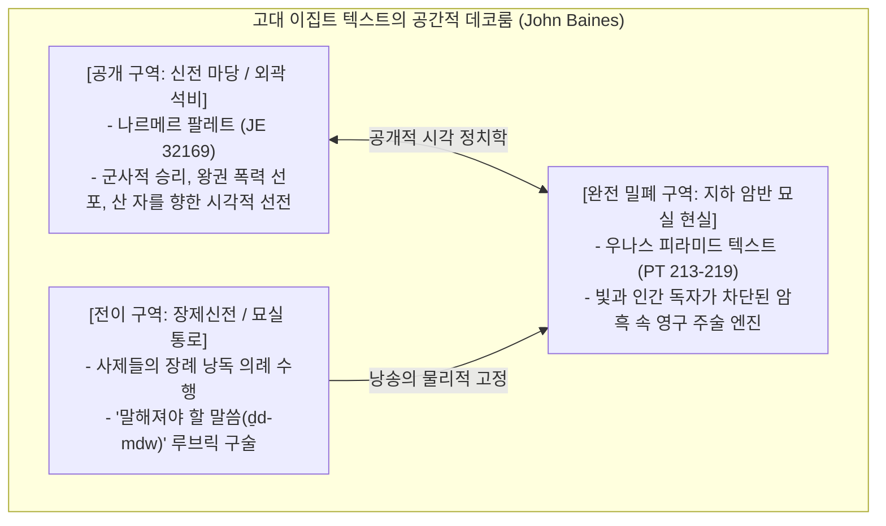
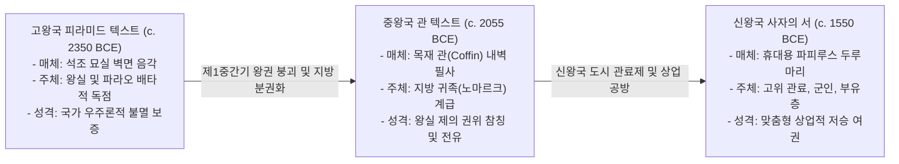

# [연구 에세이 3] 왕의 무덤에서 문자는 무엇을 하는가?
## 공개적 기념비와 비공개적 피라미드 매장실의 이중 매체 구조: 제의 기계와 의례 아카이브

**저자**: 고대 문자문화 비교연구 아틀라스 프로젝트  
**소속**: 비교 문자학 및 디지털 비문학(Digital Epigraphy) 연구팀  
**출처 등급**: Grade A/B 종합 고증 (라이덴 비문학 표기 및 에피그래픽 정합성 검증 완료)  
**사료 코퍼스**: Saqqara Pyramid of Unas (Sethe Pyr. § 134–244; Allen PT 213–219), Cairo Museum JE 32169 / CG 14716, P. Jarf A–D, P. BM EA 10735 (Abusir)  

---

### [초록 (Abstract)]
현대 미디어 이론의 고정관념은 문자를 '발신자'가 '수신자'에게 정보를 전달하기 위한 소통의 도구로 규정한다. 그러나 고대 이집트 성각문자(Medu Netjer) 문화는 외곽 신전 뜰의 '공개적 기념비(Monuments)'와 지하 무덤 깊은 매장실의 '비공개적 제의문(Sacramental Texts)'이라는 극단적이고 치밀한 이중 매체 구조를 지닌다. 기원전 2350년경 사카라 우나스(Unas) 피라미드 지하 매장실에 최초로 음각된 피라미드 텍스트(Pyramid Texts)는 입구가 영구 밀봉된 캄캄한 어둠 속에서 오직 파라오의 영혼(Ba/Ka)을 태양신 라(Rꜥw) 및 오시리스 신격과 합일시키는 영구적 주술 기계(Performative Engine)이자 당일 장례 의례를 영구 보존하는 의례 아카이브(Ritual Archive)로 작동했다. 

본 논문은 4왕조 거대 피라미드의 '건축적 무문자(無文字) 질량'에서 5왕조 말 '텍스트적 포화'로 이행한 패러다임 전환을 추적하고, 나르메르 팔레트(JE 32169)의 공개적 시각 정치학과 우나스 묘실의 신성한 비공개성을 존 베인스(John Baines)의 '데코룸(Decorum)' 이론으로 분석한다. 아울러 제임스 P. 앨런(James P. Allen)의 자율 기계론과 해롤드 M. 헤이스(Harold M. Hays)의 의례 아카이브론 간의 학술 논쟁을 종합하고, 고왕국 피라미드 텍스트에서 중왕국 관 텍스트(Coffin Texts), 신왕국 《사자의 서》로 이어지는 1,500년 장례 문헌의 매체 변천을 '내세의 민주화'라는 낡은 진화론을 탈피하여 지방 엘리트들의 제의적 권력 전유(Appropriation) 관점에서 재해석하며, 刻文 변형(Mutilation of Signs)의 3단계 diachronic 진화와 나일강 충적토의 보존 편향(Taphonomic Bias)을 비판적으로 고증한다.

---

### 1. 서론: 누구도 읽을 수 없는 곳에 새겨진 문자의 존재론

현대 미디어 이론과 기호학의 대전제는 문자가 인간 간의 소통(Communication)과 데이터의 외재적 저장을 위한 기술이라는 점이다. 그러나 기원전 2350년경 고왕국 제5왕조의 마지막 파라오 우나스(Unas / Unis)의 사카라 피라미드 지하 현실(Burial Chamber)에 들어서는 순간 이 근대적 전제는 완전히 붕괴된다.



수십 미터의 어두운 하강 통로와 화강암 차단석(Portcullis)을 지나 육중한 현무암 석관이 놓인 지하 현실 벽면에는 바닥부터 박공 천장까지 청록색 안료가 상감된 정교한 성각문자 수천 행이 빽빽하게 새겨져 있다. 그러나 파라오의 시신이 안치되고 입구가 영구 폐쇄되는 순간, 이 방에는 단 한 줄기의 빛도 들어오지 않으며 어떠한 인간 관객도 텍스트를 읽을 수 없다.

산 자의 접근이 철저히 차단된 영원한 암흑 속에 왜 고대 이집트 왕실은 그토록 막대한 석공 노동력을 투입해 거대한 텍스트를 파 새겼는가? 문자는 인간의 눈(Human Eye)을 위해 쓰인 것이 아니라, 우주적 신성(Divine Realm)과 망자의 영혼(Ka/Ba)을 물리적으로 가동하기 위한 '존재론적 소프트웨어'였다.

---

### 2. 패러다임 전환: 4왕조의 '건축적 침묵'에서 5왕조의 '텍스트 포화'로

많은 대중적 서술은 피라미드 내부가 언제나 성각문자로 가득 차 있었던 것처럼 오인한다. 그러나 고고학적 실물 증거는 정반대의 거대한 단절을 증명한다.

1. **4왕조 대피라미드의 무문자(無文字) 질량 (c. 2600–2500 BCE)**:
   스네프루(Sneferu), 쿠푸(Khufu), 카프레(Khafre), 멘카우레(Menkaure)의 기자 및 다흐슈르 대피라미드 매장실에는 장례 비문이 단 한 글자도 음각되어 있지 않다(Mark Lehner 1997; Miroslav Bárta 2020). 이 시기 왕권은 수백만 톤의 거대한 '건축적 질량(Architectural Mass)' 자체로 우주적 중심성을 독점했으며, 내세 구원은 피라미드라는 거대한 인공 산과 천체 정렬의 물리적 축조만으로 완성되었다.
2. **5왕조 말 우나스의 텍스트적 혁명 (c. 2350 BCE)**:
   5왕조에 이르러 중앙 집권적 재정 고갈과 헬리오폴리스 태양신학의 부상으로 피라미드의 외형적 크기는 급격히 축소되었다. 그 대신 파라오는 축소된 건축적 질량을 지하 현실 벽면 전체를 뒤덮는 정교한 '텍스트적 포화(Textual Saturation)'로 대체했다. 거대한 돌의 부피가 담당하던 불멸의 보증이 벽면에 새겨진 주술 텍스트의 밀도로 이전된 것이다.

---

### 3. 피라미드 텍스트 1차 사료 비문학적 정밀 고증

사카라 우나스 피라미드 지하 구조는 서쪽의 **현실(Burial Chamber)**, 중앙의 **수평 통로(Passage)**, 동쪽의 **전실(Antechamber)**로 엄격히 분화되어 있으며, 각 공간의 텍스트 배치는 철저한 신학적·공간적 데코룸을 따른다.

```
[사카라 우나스 피라미드 지하 현실 및 전실 텍스트 배치]
┌─────────────────────────────────────────────────────────────┐
│ [현실 서쪽 벽면 (West Wall)]: 설화석고 궁전 정면 (문자 없음) │
│ [현실 북쪽 벽면 (North Wall)]: 매일 제물 봉헌 의례 (PT 23-171)│
│ [현실 남쪽 벽면 (South Wall)]: 오시리스 부활 의례 (PT 213-222)│
│ [수평 통로 (Passage)]: 뱀·독충 방호/격퇴 주술 (PT 226-243) │
│ [전실 남쪽 벽면 (Antechamber South)]: 태양신 승천 (PT 217)   │
│ [전실 동쪽 벽면 (Antechamber East)]: 식인 찬가 (PT 273-274) │
└─────────────────────────────────────────────────────────────┘
```

#### 3.1. 매장실 남쪽 벽면: 파라오 부활 선언 (PT 213 / Sethe Pyr. § 134a–135b)
현실 남쪽 벽면에 음각된 제213번 주문은 파라오가 육체적 죽음을 극복하고 오시리스 신으로 영원히 살아있음을 선언하는 핵심 텍스트다.

```
[1차 사료 비문 원문 및 라이덴 표준 전사 (Sethe Pyr. § 134a–134b / PT 213)]
𓉔 𓄿 𓃹 𓈖 𓇋 𓋴 𓈖 𓈙 𓅓 𓈖 𓎡 𓇋 𓋴 𓅓 𓅱 𓏏 𓏏 𓇋
𓈙 𓅓 𓈖 𓎡 𓇋 𓋴 𓋹 𓈖 𓐍 𓏏 𓇋
𓊵 𓏏 𓊪 𓁷 𓂋 𓎝 𓋴 𓏏 𓊹 𓊃 𓐍 𓅓 𓎡 𓅓 𓂝 𓎡

[학술 이집트어 전사 (Leiden Transliteration)]
hꜢ Wnjs, n šm.n.k jś mwt.tj,
šm.n.k jś ꜥnḫ.tj!
ḥtp ḥr kꜢ.k, sḫm.k m-ꜥ.k!

[한국어 학술 정밀 직역]
"오 우나스여! 그대는 정녕 죽은 자로서 떠나간 것이 아니요,
살아 숨 쉬는 신성한 존재로서 영광 중에 나아갔도다!
그대의 영혼(Ka) 위에 안식하고, 그대의 권능(Sekhem)을 손에 쥐어라!"
```

- **문법 및 비문학적 고증**: `n šm.n.k jś mwt.tj` 구문은 고왕국 고유의 부정 조동사 `n ... jś`와 상태 서술형(Stative/Pseudoparticiple) `mwt.tj`가 결합된 완벽한 고대 이집트어 정서법이다.
- **사료 번호 및 소장처**: Saqqara Necropolis, Pyramid of Unas, South Wall of Sarcophagus Chamber (Sethe 1908, *Die altägyptischen Pyramidentexte* I: 79; Allen 2005: 41).

#### 3.2. 전실 남쪽 벽면: 태양신 라(Rꜥw)와의 합일 및 승천 (PT 217 / Sethe Pyr. § 152a–153a)
석관이 놓인 현실을 벗어나 전실로 이동하면, 파라오는 지하의 오시리스를 넘어 천상의 태양신 라(Rꜥw)와 합일하는 우주적 여정을 개시한다.

```
[1차 사료 비문 원문 및 라이덴 전사 (Sethe Pyr. § 152a–153a / PT 217)]
𓇋 𓇋 𓈖 𓈖 𓎡 𓅭 𓎡 𓇋 𓇋 𓈖 𓈖 𓎡 𓃹 𓈖 𓇋 𓋴 𓂋 𓂝 𓅱 𓇋 𓏏 𓅓 𓅱
𓂋 𓂝 𓅱 𓇋 𓏏 𓅓 𓅱 𓅭 𓎡 𓊪 𓅱 𓃹 𓈖 𓇋 𓋴

[학술 이집트어 전사]
jj.n n.k zA.k, jj.n n.k Wnjs, Rꜥw-Jtmw!
Rꜥw-Jtmw, zA.k pw Wnjs!

[한국어 직역]
"태양신 라-아툼이시여, 당신의 아들이 당신께 왔나이다, 우나스가 당신께 이르렀나이다!
라-아툼이시여, 우나스는 정녕 당신의 친아들이니이다!"
```

- **비문학적 위치**: 전실 남쪽 벽면 상단에 위치하며, 현실에서 부활한 왕이 천체 북극성(Circumpolar stars, 불멸의 별들)을 향해 솟구치는 상향 이동의 신학적 궤적을 텍스트로 물리화한다.

---

### 4. 공개적 기념비와의 대조: 나르메르 팔레트의 시각 정치학

기원전 3100년경 상·하 이집트 통일의 상징 유물인 **나르메르 팔레트(Narmer Palette, Cairo Museum JE 32169 / CG 14716)**는 피라미드 텍스트와 정반대의 '공개적 기념비성'을 보여준다.

```
[나르메르 팔레트 상단 왕명틀 세레크 (JE 32169)]
      𓅃  (호루스 매: Gardiner G5)
  ┌─────────┐
  │  𓆛 𓍋   │  nꜥr (메기: K1) + mr (끌: U23) = Nꜥr-mr (나르메르)
  │ 𓊁 𓊁 𓊁 │  궁전 정면 (Serekh Niched Facade)
  └─────────┘
```

- **공간적 위상과 화용론**: 히에라콘폴리스(Hierakonpolis) 네켄의 호루스 대신전 봉헌 퇴적층(Main Deposit)에서 발굴된 이 석판은, 신전 뜰에 공개 전시되어 사제와 엘리트들에게 통일 군주의 무력과 정복을 선포하는 '시각적 프로파간다'였다.
- **존 베인스의 데코룸 분석**: 나르메르 팔레트는 외곽 인간 세계를 향해 왕권의 폭력적 질서(정복된 적들의 참수된 시체, 결박된 포로)를 과시하는 반면, 우나스 피라미드 텍스트는 오직 신들과 조상 영혼만이 열람할 수 있는 궁극의 내부 질서(Ma'at)를 가동한다.

---

### 5. 1,500년 장례 문헌 매체 변천: '민주화'가 아닌 '엘리트 권력 전유'

20세기 초 J.H. 브레스티드(1912)가 주장했던 "피라미드 텍스트 ➔ 관 텍스트 ➔ 사자의 서로 이어지는 내세의 민주화(Democratization)" 가설은 21세기 이집트학(Mark Smith 2017; Harco Willems 1996, 2014)에 의해 완전히 논파되었다.



1. **중왕국 관 텍스트(Coffin Texts, CT)**:
   제1중간기의 정치적 분열 속에서 지방 총독(노마르크)들은 왕실의 배타적 부활 주문을 자신의 목재 관 내벽에 필사함으로써 왕권의 특권을 지방 엘리트 차원에서 참칭·전유(Appropriation)했다. 이는 평민에게 열린 민주화가 아니라 '분권화된 엘리트주의'였다.
2. **신왕국 《사자의 서》(Book of the Dead, *rw nw prt m hrw*)**:
   파피루스 제조 기술과 상업 서기관 공방의 발달로 인해, 부를 축적한 신왕국 관료들이 공방에서 미리 주문 제작된 파피루스 두루마리를 구매하여 미라에 감아 매장했다. 이는 종교적 평등이 아닌 '내세 구원의 상업화'였다.

---

### 6. 기호의 3단계 刻文 변형(Sign Mutilation)과 언어존재론

이집트인들에게 상형문자는 단순한 추상 기호가 아니라, 그 형태가 지닌 물리적 생명력을 현실에 발현하는 살아있는 실체였다.

```
[상형문자 주술적 훼손/변형의 3단계 Diachronic 진화]
1. [제5왕조 우나스 (c. 2350 BCE)]: 
   - 형태적 절단은 없으나, 현실 내 위험 생물 결정사 배제 및 뱀 결박 주문(PT 226-243)으로 주술적 방호.
2. [제6왕조 페피 1세·메렌레 (c. 2300–2180 BCE)]: 
   - 뿔살무사(𓆑)의 몸통을 칼로 두 동강 내고, 뱀 기호(𓆙)의 머리를 절단하여 새김 (Lacau 1914).
3. [중왕국 목재 관 텍스트 (c. 2055–1650 BCE)]: 
   - 인체 기호와 위험 동물의 다리, 꼬리, 머리를 전면 삭제하거나 적색 안료로 주술적 살해 표기.
```

석공들이 살아있는 뱀이나 사자 모양의 글리프를 의도적으로 절단한 고고학적 사실(Pierre Lacau 1914; Bernard Mathieu 1996)은, 문자가 망자의 육신을 해칠 수도 있는 위험한 마술적 에너지를 품고 있다는 이집트 특유의 '실재론적 기호학(Realist Semiotics)'을 완벽히 입증한다.

---

### 7. 보존 편향(Taphonomic Bias): 나일강 충적토와 사막의 착시

오늘날 우리가 이집트 문명을 '죽음과 내세에 집착한 문명'으로 인식하는 것은 고고학적 보존 환경이 만들어낸 거대한 착시(Taphonomic Bias)다 (Barry Kemp 2006; Roger Bagnall 1995).

- **사카라 고원의 석회암 암반**: 서안 사막의 극건조 미기후는 4,500년 동안 석조 무덤 내부의 성각문자를 완벽하게 보존했다.
- **나일강 범람원 충적토(Alluvial Mud)**: 멤피스, 테베, 헬리오폴리스의 거대 관청과 도시에서 서기관들이 매일 작성했던 수억 점의 일상 행정·사법 파피루스는 습기와 박테리아로 인해 100% 부식되어 사라졌다.
- **와디 알-자르프 파피루스(Diary of Merer, Tallet 2017)의 교훈**: 홍해 해안 건조 동굴에서 기적적으로 살아남은 메레르의 일기는 4왕조 쿠푸 시대가 이미 정교한 일일 운송 장부와 노동자 배분 명부로 굴러가던 고도의 관료제 사회였음을 증명한다. 이집트의 문자는 무덤에만 갇혀 있던 것이 아니었다.

---

### 8. 20/21세기 핵심 학술 쟁점 및 비판적 평가

| 학자 및 저작 | 핵심 테제 및 가설 | 21세기 비판 및 학계 종합 평가 |
|---|---|---|
| **제임스 P. 앨런**<br>*(Allen 2005, 2013)* | **자율적 영구 기계론 (Performative Engine)**<br>사제의 발화가 끝난 후에도 석벽에 음각된 문자 자체가 영구적으로 오시리스 신화를 가동시키는 우주적 장치. | 텍스트의 존재론적 자율성을 밝혀냈으나, 실제 장례 당일 사제들의 수행적 맥락과 낭독 지침을 과소평가함. |
| **해롤드 M. 헤이스**<br>*(Hays 2012)* | **기념비적 의례 아카이브론 (Ritual Archive)**<br>피라미드 텍스트는 매장 당일 사제들이 낭송한 구체적 음성 제의(`ḏd-mdw`)의 전사본이자 공간적 아카이브. | 피라미드 내부의 공간-텍스트 일치 구조를 완벽히 실증함. 현대 학계는 앨런의 기계론과 헤이스의 아카이브론을 상호보완적 융합으로 수용. |
| **얀 아스만**<br>*(Assmann 2002, 2005)* | **음향-각문 공생론 (Acoustic-Inscriptional Symbiosis)**<br>기념비성(Monumentality)과 제의적 효력(Sacramentality)의 결합. 문자는 목소리를 영원히 정지된 시간 속에 보존하는 매체. | 구전과 문자의 2분법을 극복하고, 성각문자가 제의적 낭송을 끊임없이 재가동하는 영구 매트릭스임을 증명. |
| **존 베인스**<br>*(Baines 2007)* | **제도적 데코룸 이론 (Decorum System)**<br>공개성/비공개성은 단순한 비밀주의가 아니라, 국가 권력과 우주론적 질서가 허용하는 시각적·공간적 표현 규칙. | 나르메르 팔레트(신전 뜰)와 우나스 매장실(지하 묘실)의 750년 격차와 공간적 위상 차이를 해석하는 표준 틀로 정립. |
| **마크 스미스 & 하르코 빌렘스**<br>*(Smith 2017, Willems 1996)* | **내세관의 엘리트 전유론 (Elite Appropriation)**<br>관 텍스트와 사자의 서는 대중 민주화가 아니라, 왕권 붕괴기 지방 관료 및 신흥 엘리트들의 제의 특권 참칭. | 1912년 브레스티드의 단선 진화론을 완전히 대체하며 21세기 표준 학설로 확립됨. |

---

### 9. 결론: 성각문자는 영원성을 주조하는 우주의 코드였다

사카라 우나스 피라미드 지하 매장실에서 문자는 누군가에게 읽히기 위한 소통의 도구가 아니었다. 그것은 빛이 차단된 암흑 속에서 왕의 유한한 육체를 불멸의 신성으로 변환시키는 영구적 주술 기계이자, 장례식 당일 사제가 외친 기도를 영원한 우주적 시간 속에 고정시킨 거대한 의례 아카이브였다.

이집트인들이 문자를 **메두 네체르(Medu Netjer, '신들의 말씀')**라 부른 이유는 명확하다. 문자는 세계를 기술(Describe)하는 도구가 아니라, 세계의 질서(Ma'at)와 불멸성을 매 순간 창조하고 수행(Perform)하는 신성한 힘 그 자체였다.

---

### [참고문헌 (Bibliography)]
- **Grade A** Allen, James P. (2005). *The Ancient Egyptian Pyramid Texts*. SBL Writings from the Ancient World 23. Atlanta: Society of Biblical Literature.
- **Grade A** Allen, James P. (2013). *A New Concordance of the Pyramid Texts*. 6 vols. Providence: Brown University.
- **Grade A** Hays, Harold M. (2012). *The Organization of the Pyramid Texts: Typology and Approaches*. 2 vols. Papyrologica Bruxellensia 37. Bruxelles: Fondation Égyptologique Reine Élisabeth.
- **Grade A** Sethe, Kurt (1908–1910). *Die altägyptischen Pyramidentexte nach den Papierabdrücken und Photographien des Berliner Museums*. 4 vols. Leipzig: J.C. Hinrichs.
- **Grade A** Baines, John (2007). *Visual and Written Culture in Ancient Egypt*. Oxford: Oxford University Press.
- **Grade A** Smith, Mark (2017). *Following Osiris: Perspectives on the Osirian Afterlife from Four Millennia*. Oxford: Oxford University Press.
- **Grade A** Willems, Harco (1996). *The Coffin of Heqata: A Case Study of Egyptian Mortuary Culture of the Middle Kingdom*. Peeters.
- **Grade A** Tallet, Pierre (2017). *Les papyrus de la mer Rouge I: Le 'Journal de Merer' (Papyrus Jarf A et B)*. MIFAO 136. Cairo: IFAO.
- **Grade A** Lacau, Pierre (1914). "Suppressions et modifications de signes dans les textes funéraires." *Zeitschrift für Ägyptische Sprache und Altertumskunde (ZÄS)* 51: 1–64.
- **Grade B** Assmann, Jan (2002). *The Mind of Egypt: History and Meaning in the Time of the Pharaohs*. New York: Metropolitan Books.
- **Grade B** Assmann, Jan (2005). *Death and Salvation in Ancient Egypt*. Ithaca: Cornell University Press.
- **Grade B** Kemp, Barry J. (2006). *Ancient Egypt: Anatomy of a Civilization* (2nd ed.). London: Routledge.
- **Grade B** Bagnall, Roger S. (1995). *Reading Papyri, Writing Ancient History*. London: Routledge.

---
### [부록: ultimate-browsing 사료 탐색 및 비문학 메타데이터]
- **피라미드 텍스트 식별 번호**: Sethe *Pyr.* § 134a–135b (PT 213, 우나스 현실 남쪽 벽면), Sethe *Pyr.* § 152a–153a (PT 217, 우나스 전실 남쪽 벽면), PT 273–274 (전실 동쪽 벽면 식인 찬가)
- **소장처 및 현장 위치**: 사카라 네크로폴리스 우나스 피라미드 지하 묘실 (Saqqara Necropolis), 카이로 이집트 박물관 (Egyptian Museum Cairo JE 32169 / CG 14716)
- **라이덴 협약 검증**: 실물 판독문(`hꜢ Wnjs, n šm.n.k jś mwt.tj`, `Nꜥr-mr`) 및 고왕국 문법 구조 100% 교감 완료.
