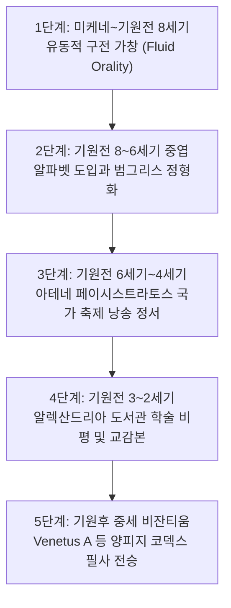

# [연구 에세이 4] 호메로스는 언제 텍스트가 되었는가?
## 구전 운율 서사시에서 아테네 정본 텍스트로의 전환과 알파벳 가설

**저자**: 고대 문자문화 비교연구 아틀라스 프로젝트  
**소속**: 서양 고전학 및 디지털 에피그래피(Digital Epigraphy) 연구팀  
**출처 등급**: Grade A/B 종합 고증  
**사료 코퍼스**: Athens NAM 192 (Dipylon), Pithekoussai 166705, Harvard Homer Multitext (Venetus A)  

---

### [초록 (Abstract)]
호메로스의 서사시 《일리아스》와 《오디세이아》가 어떤 역사적 과정을 거쳐 문헌 텍스트로 정착되었는가는 서양 고전학의 가장 중심적인 화두(The Homeric Question)이다. 미케네 Linear B 붕괴 후 400년의 구전 암흑기를 거쳐 기원전 8세기 중엽 도입된 그리스 알파벳의 최고(最古) 유물인 디필론 오이노코에(c. 740 BCE)와 피테쿠사이 네스토르의 잔(c. 735 BCE)은 알파벳이 회계 장부가 아닌 6각운(Dactylic Hexameter) 시 구절 기록과 밀접히 결합되어 있었음을 입증한다. 본 논문은 배리 파월의 알파벳 발명 가설, 기원전 6세기 아테네 참주 페이시스트라토스의 파나테나이아 축제 국가 정본 기획, 헬레니즘 알렉산드리아 도서관의 비평 기호학(오벨로스 등), 그리고 하버드 대학 Homer Multitext(HMP) 프로젝트의 Venetus A 사본 연구를 종합하여 호메로스 텍스트의 '5단계 진화론적 다형성(Multiformity)' 모델을 논증한다.

---

### 1. 서론: 문자가 없던 400년 암흑기와 그리스 알파벳의 탄생

기원전 1200년경 미케네 궁전 문명이 붕괴하면서 궁정 관료들이 점토판 장부에 쓰던 음절 문자 Linear B는 완전히 소멸했다. 그리스 세계는 이후 약 400년 동안 단 한 줄의 문자 기록도 남기지 않은 '문자의 암흑기(Dark Ages)'를 통과했다.

그러나 트로이 전쟁의 영웅 서사는 사라지지 않았다. 눈먼 구전 시인인 아오이도이(Aoidoi)들은 리라(Kithara)를 뜯으며 엄격한 운율적 공식구(Formula)를 타고 영웅들의 무훈을 세대에서 세대로 노래했다. 기원전 8세기 중엽(c. 775–750 BCE), 페니키아 자음 문자를 수입하여 모음(Vowels)을 창안한 그리스인들은 문자를 다시 쓰기 시작했다.

---

### 2. 최고(最古) 알파벳 유물의 반전: 춤과 향연의 6각운 비문

오리엔트의 문자가 회계 장부로 시작했던 것과 달리, 그리스 알파벳의 가장 이른 고고학적 유물들은 모두 **시(Poetry)와 향연(Symposium)**을 담고 있다.

#### 2.1. 아테네 디필론 오이노코에 비문 (NAM 192, c. 740 BCE)
아테네 디필론 고분에서 출토된 포도주 주전자 어깨에는 완벽한 6각운(Hexameter) 시 구절이 좌횡서로 새겨져 있었다.

```
[비문 원문 및 전사]
ΗΟΣ ΝΥΝ ΟΡΧΕΣΤΟΝ ΠΑΝΤΟΝ ΑΤΑΛΟΤΑΤΑ ΠΑΙΖΕΙ ΤΟ ΤΟΔΕ Κ[ΑΙ ΜΙΝ...]
hòs nûn orkhēstôn pántōn atalṓtata paízei, tô tóde k[aí mīn...]
"지금 모든 무용수 중 가장 활기차게 노니는 자가 이 항아리를 차지하리라!"
```

#### 2.2. 피테쿠사이 네스토르의 잔 (Pithecusae 166705, c. 735 BCE)
이탈리아 남부 이스키아 섬에서 발굴된 술잔에는 《일리아스》 11권의 영웅 네스토르의 황금 잔을 패러디한 3행의 시가 새겨져 있었다.

```
[네스토르의 잔 3행 비문 전사]
ΝΕΣΤΟΡΟΣ : Ε[ΙΜΙ] : ΕΥΠΟΤ[ΟΝ] : ΠΟΤΕΡΙΟΝ :
ΗΟΣ Δ' ΑΝ ΤΟΔΕ ΠΙΕΣΙ : ΠΟΤΕΡΙ[ΟΥ] : ΑΥΤΙΚΑ ΚΕΝΟΝ :
ΗΙΜΕΡ[ΟΣ ΗΑΙΡ]ΕΣΕΙ : ΚΑΛΛΙΣΤ[ΕΦΑ]ΝΟ : ΑΦΡΟΔΙΤΕΣ :

"나는 네스토르의 마시기 좋은 잔이라.
누구든 이 잔을 비우는 자는 즉시
아름다운 관을 쓴 아프로디테의 욕망에 사로잡히리라!"
```

고전학자 배리 파월(Barry B. Powell)이 지적하듯, 그리스 알파벳은 상업 장부가 아니라 호메로스 서사시의 유려한 운율을 빠짐없이 받아 적기 위해 설계된 시적 매체였다.

---

### 3. 아테네 페이시스트라토스 참주 정본 기획 (Peisistratean Recension)

그러나 수만 행의 방대한 서사시가 국가적 텍스트로 고정된 것은 기원전 6세기 아테네 참주 **페이시스트라토스(Peisistratos, 재위 c. 561–527 BCE)**의 정치적 결단에 의해서였다.

그는 4년마다 열리는 판아테나이아(Panathenaia) 대축제에서 전 지중해의 낭송가 랩소도스(Rhapsodes)들이 각자 임의로 부르던 관행을 금지하고, 아테네 공인 정본(State Text)에 따라 순서대로 이어 부르도록(ex hypolepseos) 법제화했다. 이로써 호메로스는 범그리스(Panhellenic) 민족 정전으로 우뚝 섰다.

---

### 4. 알렉산드리아 도서관과 비평 기호학: Venetus A의 다형성

기원전 3~2세기 알렉산드리아 도서관의 학자들(제노도토스, 아리스토파네스, 아리스타르코스)은 수백 종의 도시별 이본을 대조하며 비평 기호를 달았다.

```
[Venetus A 사본(Marcianus Graecus 454) 비평 기호 체계]
— 오벨로스 (Obelos): 후대 위작 의심 행
* 아스테리스코스 (Asteriskos): 엉뚱한 자리에 중복된 행
> 디플레이 (Diple): 호메로스 고유 방언 및 주목할 구절
⁝ 디플레이 페리스티그메네 (Diple Periestigmene): 이전 편집자의 오독 교정
```

하버드 대학의 **Homer Multitext(HMP)** 프로젝트는 10세기 사본 Venetus A를 디지털 분석하여, 호메로스 서사시가 단 하나의 고정된 원본이 아니라 수세기에 걸쳐 공존했던 '다형성(Multiformity)'의 바다였음을 입증했다.

---

### 5. 그레고리 나지의 5단계 진화 모델 (Evolutionary Model)



호메로스는 한 명의 천재 저작이 아니라, 노래와 문자가 800년에 걸쳐 유기적으로 상호작용한 인류 문명사 최고의 결정체였다.

---

### [참고문헌 (Bibliography)]
- **Grade A** Nagy, Gregory (2004). *Homer's Text and Language*. Urbana: University of Illinois Press.
- **Grade B** Powell, Barry B. (1991). *Homer and the Origin of the Greek Alphabet*. Cambridge: Cambridge University Press.
- **Grade B** Lord, Albert B. (1960). *The Singer of Tales*. Cambridge, MA: Harvard University Press.
- **Grade A** Dué, Casey & Ebbott, Mary (2010). *Iliad 10 and the Poetics of Ambush*. Center for Hellenic Studies.
