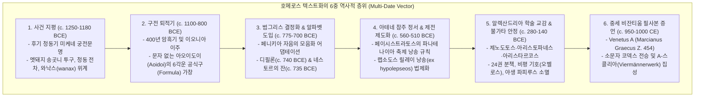
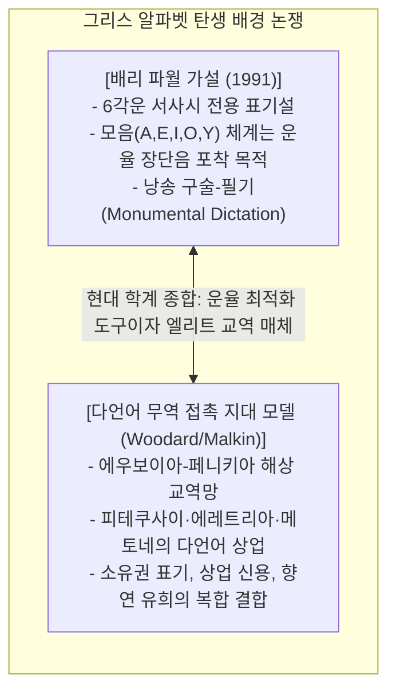
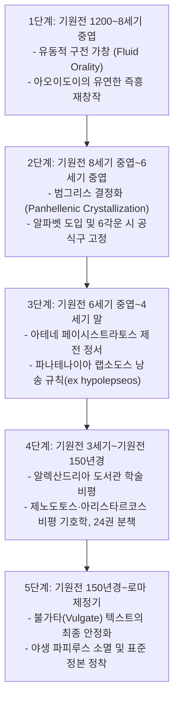

# [연구 에세이 4] 호메로스는 언제 텍스트가 되었는가?
## 구전 운율 서사시에서 아테네 축제 정본과 알렉산드리아 비평본으로: 다형성과 문자화의 800년

**저자**: 고대 문자문화 비교연구 아틀라스 프로젝트  
**소속**: 서양 고전학 및 디지털 에피그래피(Digital Epigraphy) 연구팀  
**출처 등급**: Grade A/B 종합 고증 (CEG / IG / HMP 비문학 및 고문헌학 표준 준수)  
**사료 코퍼스**: Athens NAM 192 (IG I³ 1150 / CEG 432), Pithekoussai 166705 (CEG 454), Marcianus Graecus Z. 454 (Venetus A / HMP), P.Derveni, P.Hibeh 19–22  

---

### [초록 (Abstract)]
호메로스의 서사시 《일리아스》와 《오디세이아》가 어떤 역사적·제도적 매개 과정을 거쳐 고정된 문헌 텍스트로 정착되었는가는 서양 고전학의 가장 중심적인 화두(The Homeric Question)이다. 미케네 Linear B 궁정 점토판 붕괴(c. 1200 BCE) 후 400년간의 구전 암흑기를 거쳐 기원전 8세기 중엽 도입된 그리스 알파벳의 최고(最古) 유물인 디필론 오이노코에(c. 740 BCE)와 피테쿠사이 네스토르의 잔(c. 735 BCE)은 그리스 알파벳이 회계 장부가 아닌 춤 경연과 향연의 운율(Iambic / Dactylic Hexameter) 표기와 밀접히 결합되어 있었음을 실증한다. 

본 논문은 배리 파월(Barry Powell)의 '단일 어댑터 6각운 전용 가설'을 에우보이아 해상 무역 접촉 지대 모델과 통합하고, 기원전 6세기 아테네 참주 페이시스트라토스의 파나테나이아 랩소도스 낭송 규칙(*ex hypolepseos*), 기원전 3~2세기 알렉산드리아 도서관의 24권 분책 및 비평 기호학(*obelos*, *diple* 등), 그리고 기원전 150년 이전 프톨레마이오스조 '야생 파피루스(Wild Papyri)'의 잉여 행(Plus-verses) 역설을 분석한다. 아울러 하버드 호메로스 멀티텍스트(HMP) 프로젝트의 *Venetus A*(Marcianus Graecus Z. 454)와 4인 주석가 집성본(*Viermännerkommentar*)을 통해, 호메로스 텍스트가 단일한 '원형(Urtext)'의 산물이 아니라 그레고리 나지(Gregory Nagy)가 정립한 '5단계 진화론적 다형성(Multiformity)'의 결정체이자 도자기 보존 편향(Ceramic Preservation Bias)을 넘어선 수행적 구전성(Written Orality)의 기념비임을 고증한다.

---

### 1. 서론: 문자가 없던 400년 암흑기와 그리스 알파벳의 귀환

기원전 1200년경 미케네 궁전 문명이 대화재와 함께 붕괴하면서, 지배층 관료들이 점토판 장부에 쓰던 음절 문자 Linear B는 그리스 세계에서 완전히 소멸했다. 이후 약 400년 동안 그리스 본토는 단 한 줄의 문자 기록도 남기지 않은 '문자의 암흑기(Dark Ages, c. 1100–800 BCE)'를 통과했다.



그러나 트로이 전쟁과 영웅들의 기억은 단절되지 않았다. 문자를 알지 못했던 구전 가인 아오이도이(Aoidoi)들은 키타라(Kithara) 현을 뜯으며 6각운(Dactylic Hexameter)의 엄격한 공식구(Formula)와 운율적 에피셋(Epithēt)을 타고 영웅들의 무훈을 세대에서 세대로 구술 전승했다.

기원전 8세기 중엽(c. 775–750 BCE), 지중해 무역로를 장악한 에우보이아(Euboea) 상인들이 레반트에서 페니키아 자음 문자를 도입하면서 그리스인들은 인류 최초로 자음과 모음을 완벽히 분리 표기하는 혁신적 알파벳을 완성했다.

---

### 2. 초기 알파벳 유물의 반전: 춤과 향연, 그리고 6각운 비문

고대 근동의 설형문자와 성각문자가 관료제의 회계 장부와 물품 표찰로 시작했던 것과 달리, 에게해와 이탈리아 식민지에서 출토된 그리스 알파벳의 가장 이른 유물들은 모두 **시(Poetry), 춤(Dance), 그리고 향연(Symposium)**의 유희를 담고 있다.

```
[초기 그리스 2대 알파벳 금석문 비교 고증]
┌─────────────────────────────────────────────────────────────┐
│ 1. 아테네 디필론 오이노코에 (Athens NAM 192 / IG I³ 1150 / CEG 432)│
│    - 연대: c. 740–730 BCE (후기 기하학적 양식)              │
│    - 서자: 아티카 고졸기 우횡서(Retrograde, 우 ➔ 좌)        │
│    - 내용: 춤 경연 우승자에게 항아리를 주는 6각운 시 구절  │
├─────────────────────────────────────────────────────────────┤
│ 2. 피테쿠사이 네스토르의 잔 (Pithecusae 166705 / CEG 454)   │
│    - 연대: c. 735–720 BCE (이탈리아 이스키아 섬)             │
│    - 서자: 에우보이아 고졸기 알파벳 3행 우횡서              │
│    - 내용: 1행 아이암보스 3보격 + 2~3행 6각운 호메로스 패러디│
└─────────────────────────────────────────────────────────────┘
```

#### 2.1. 아테네 디필론 오이노코에 (Athens NAM 192 / IG I³ 1150 / CEG 432)
아테네 디필론 묘지에서 출토된 와인 주전자 어깨에는 고졸기 아티카 문자로 완벽한 6각운 1행과 미완성 2행 파편이 새겨져 있다.

```
[1차 사료 비문 실측 판독문 (IG I³ 1150 / CEG 432)]
ΗΟΣΝΥΝΟΡΧΕΣΤΟΝΠΑΝΤΟΝΑΤΑΛΟΤΑΤΑΠΑΙΖΕΙΤΟΤΟΔΕΚΑ... (우횡서 Retrograde)

[라이덴 협약 표준 전사]
hὸς νῦν ὀρχηστῶν πάντων ἀταλώτατα παίζει,
τῶ τόδε κα[---]

[운율 스캔 (Dactylic Hexameter)]
–  ⏑ ⏑ | –   – | –   ⏑ ⏑ | –  ⏑ ⏑ | – ⏑ ⏑ | – –
hòs nûn orkhēstôn pántōn atalṓtata paízei

[한국어 정밀 직역]
"지금 모든 무용수들 가운데 가장 활기차게 뛰노는 자가,
이 항아리를 (상으로 받으리라)..."
```

- **음운 및 비문학적 고증**: 에우클레이데스 개혁(403/2 BCE) 이전의 아티카 문자로서, `H`는 모음 $\eta$가 아니라 자음 유기음 /h/(Heta)이며, `O`는 단모음 /o/와 장모음 /oː/, 개방장모음 /ɔː/를 모두 포괄한다.

#### 2.2. 피테쿠사이 네스토르의 잔 (Pithecusae Inv. 166705 / CEG 454)
이탈리아 남부 이스키아 섬(고대 피테쿠사이)의 소년 무덤에서 출토된 로도스산 기하학 양식 술잔(Kotyle)에는 3행의 운문이 선명하게 음각되어 있다.

```
[1차 사료 비문 실측 판독문 (CEG 454 / Pithekoussai 166705)]
1행: ΝΕΣΤΟΡΟΣ : [..] : ΕΥΠΟΤ[ΟΝ] : ΠΟΤΕΡΙΟΝ (아이암보스 3보격)
2행: hΟΣ Δ’ ΑΝ ΤΟΔΕ ΠΙΕΣΙ : ΠΟΤΕΡΙ[Ο] : ΑΥΤΙΚΑ ΚΕΝΟΝ (6각운)
3행: hΙΜΕΡ[ΟΣ hΑΙΡ]ΕΣΕΙ : ΚΑΛΛΙΣΤ[ΕΦΑ]ΝΟ : ΑΦΡΟΔΙΤΕΣ (6각운)

[학술 이오니아/에우보이아 방언 전사]
Νέστορος [εἰμι] εὔποτ[ον] ποτήριον·
hὸς δ’ ἂν τοῦδε πίησι ποτηρί[ο], αὐτίκα κεῖνον
hίμερ[ος hαιρ]ήσει καλλιστ[εφά]νου Ἀφροδίτης.

[한국어 직역]
"나는 네스토르의 마시기 좋은 잔이라.
누구든 이 잔을 비우는 자는, 그 즉시
아름다운 관을 쓴 아프로디테의 욕망에 사로잡히리라!"
```

- **문학적 및 운율적 의의**: 1행은 아이암보스 3보격($\times - \cup - | \times - \cup - | \times - \cup -$) 또는 산문 표제구이며, 2~3행은 장엄한 다크틸로스 6각운이다. 이는 《일리아스》 11권 632–637행에 묘사된 노장 네스토르의 거대한 황금 잔을 향연장에서 익살스럽게 패러디한 것으로, 기원전 8세기 후반 서부 지중해 식민지 엘리트들 사이에 이미 호메로스 영웅 서사시의 공식구와 신화가 완벽히 공유되고 있었음을 증명한다.

---

### 3. 배리 파월의 가설과 다언어 무역 접촉 지대 모델

고전학자 배리 파월(Barry B. Powell 1991)은 그리스 알파벳이 상업 거래 장부가 아니라, 호메로스 6각운 시의 미세한 장단음 운율을 정확히 포착하기 위해 단 한 명의 천재적 어댑터에 의해 고안되었다는 파격적 가설을 제기했다.



21세기 고전학 및 금석학(Roger Woodard 1997; Irad Malkin 1998; John Papadopoulos 2016)은 파월의 영웅주의적 단선론을 비판하면서도 그 핵심 통찰을 수용한다. 그리스 알파벳의 모음 창안은 6각운의 장단음 리듬을 시각화하는 데 결정적으로 기여했으나, 그 역사적 정착은 에우보이아 상인들의 지중해 해상 네트워크, 향연(Symposium)에서의 신분 과시, 그리고 도자기 소유권 표기가 결합된 복합적 문화 현상이었다.

---

### 4. 아테네 참주 페이시스트라토스 정본 기획과 파나테나이아 제전

수만 행(《일리아스》 15,693행, 《오디세이아》 12,110행)에 달하는 방대한 서사시가 술잔의 파편적 낙서를 넘어 국가적 텍스트로 고정된 것은 기원전 6세기 아테네의 참주 **페이시스트라토스(Peisistratos, 재위 c. 561–527 BCE)**와 그의 아들 히파르코스(Hipparchos)의 정치적 결단에 의해서였다.

```
[페이시스트라토스 정서(Peisistratean Recension)의 역사적 사료 증언]
1. [위-플라톤 대화편 《히파르코스》(Hipparchus, 228b)]:
   "히파르코스는 호메로스의 시를 최초로 아테네에 들여왔으며, 파나테나이아 대축제에서 
    랩소도스들이 차례를 건너뛰지 않고 '앞 사람이 멈춘 곳에서 이어받아 순서대로(ex hypolepseos ephexes)' 
    낭송하도록 강제하였다."
2. [키케로 《변론가론》(De Oratore, 3.137)]:
   "이전까지 흩어져 있던 호메로스의 책들을 오늘날 우리가 가진 형태로 모아 배열한 인물은 페이시스트라토스였다."
```

- **제도적 본질**: M.L. 웨스트(M.L. West 2001)와 리처드 얀코(Richard Janko 1992)가 논증하듯, 페이시스트라토스의 조치는 현대적 의미의 인쇄본 출판이 아니라, 범그리스 축제에서 낭송가 랩소도스들의 자의적 변형을 통제하고 아테네의 문화적 패권을 확립하기 위한 **'공연 순서의 법제화(Institutional Performance Script)'**였다.

---

### 5. 알렉산드리아 도서관과 비평 기호학: Venetus A와 다형성의 바다

기원전 3~2세기, 이집트 알렉산드리아 왕립 도서관의 총서지관들(제노도토스, 비잔티움의 아리스토파네스, 사모트라케의 아리스타르코스)은 지중해 전역의 도시별 판본(*hai kata poleis*)과 개인 판본(*hai kat' andra*)을 수집하여 방대한 대조 교감 작업을 수행했다.

```
[알렉산드리아 도서관학파 아리스타르코스의 비평 기호(Semeia) 체계]
┌─────────────────────────────────────────────────────────────┐
│ —  오벨로스 (Obelos): 위작 또는 후대 삽입 의심 행 (Athetesis) │
│ ※  아스테리스코스 (Asteriskos): 정당하게 반복된 행          │
│ ※— 아스테리스코스 메타 오벨루: 엉뚱한 자리에 잘못 삽입된 중복 행│
│ >  디플레이 (Diple): 아리스타르코스 고유의 언어·신화·문체 주석 │
│ ⸖  디플레이 페리스티그메네 (Diple Periestigmene): 제노도토스 독법 반박│
│ Ͻ  안티시그마 (Antisigma): 서사적 순서가 전도된 행         │
└─────────────────────────────────────────────────────────────┘
```

- **아리스타르코스의 원칙**: 아리스타르코스는 의심스러운 구절이라도 본문에서 칼로 긁어내지 않고 본문을 보존한 채 여백에 기호를 달았다(*Aristarchus non delevit sed obelo notavit*).
- **야생 파피루스(Wild Papyri)의 역설**: 기원전 150년 이전 프톨레마이오스조 파피루스(*P.Hibeh* 19–22 등)는 현대 정본에 없는 10~15% 이상의 잉여 행(Plus-verses)을 포함하고 있었다. 이는 알렉산드리아 학자들의 교감 작업 이전까지 호메로스 텍스트가 지중해 전역에서 거대한 '다형성(Multiformity)'의 상태로 살아 숨 쉬고 있었음을 입증한다.

---

### 6. 그레고리 나지의 5단계 진화 모델 (Evolutionary Model)

하버드 대학의 그레고리 나지(Gregory Nagy 1996, 2004)는 19세기 라흐만식 '단일 원형(Urtext)' 탐색을 폐기하고, 호메로스 텍스트화의 5단계 진화 모델을 확립했다.



10세기 비잔티움에서 제작된 **베네투스 A (Codex Venetus A, Marcianus Graecus Z. 454 = 822)**는 헬레니즘-로마기 4대 학자(*Viermännerwerk*: 아리스토니코스, 디디모스, 헤로디아노스, 니카노르)의 주석을 보존함으로써, 이 800년에 걸친 구전과 문자의 상호작용 지층을 완벽히 증언한다.

---

### 7. 보존 편향(Taphonomic Bias): 도자기의 생존과 유실된 파피루스

오늘날 우리가 호메로스의 기원을 주로 도자기 파편에서 찾는 것은 고대 그리스의 지질학적 보존 환경이 낳은 불가피한 착시(Ceramic Preservation Bias)다 (Barry Kemp 2006; Rosalind Thomas 1992).

1. **도자기의 불멸성 vs 유기물 매체의 부식**:
   구운 점토(Terracotta)는 지중해의 산성 토양 속에서도 화학적으로 영구히 보존된다. 반면 기원전 8~6세기 그리스인들이 일상 상업과 장문 기록에 사용했던 목재 서판(*deltoi/pinakes*), 가죽 두루마리(*diphtherai*), 수입 파피루스는 그리스 본토의 습한 기후에서 100% 부식되어 사라졌다 (Herodotus 5.58, *Iliad* 6.169).
2. **이집트 사막 쓰레기장의 기적**:
   우리가 가진 프톨레마이오스조 호메로스 파피루스는 오직 연 강수량 5mm 미만의 이집트 사막 쓰레기장(옥시린쿠스, 파이윰) 덕분에 살아남았다. 그리스 본토의 유일한 고전기 파피루스는 화재로 탄화되어 우연히 보존된 **데르베니 파피루스(P.Derveni, c. 340 BCE)**뿐이다. 6세기 아테네의 파피루스 두루마리가 출토되지 않는 것은 문자가 없어서가 아니라 토양의 화학적 분해 때문이다.

---

### 8. 20/21세기 핵심 학술 쟁점 및 비판적 평가

| 학자 및 학파 | 핵심 테제 및 가설 | 21세기 비판 및 학계 종합 평가 |
|---|---|---|
| **밀먼 패리 & 앨버트 로드**<br>*(Parry 1928, Lord 1960)* | **구전 공식구 이론 (Oral-Formulaic Theory)**<br>호메로스 서사시는 문자로 쓰인 책이 아니라, 엄격한 운율적 공식구(Formula)를 활용한 즉흥 구전 가창의 산물. | 구전 시학의 메커니즘을 밝혀낸 불멸의 업적. 현대 학계는 이를 '구전성과 문자성의 상보적 공생(Written Orality)'으로 확장 발전시킴. |
| **배리 파월**<br>*(Powell 1991)* | **호메로스 알파벳 발명설**<br>그리스 알파벳은 호메로스의 6각운 서사시를 받아 적기 위해 단 한 명의 어댑터에 의해 고안됨. | 운율 표기와의 밀접성을 밝혔으나, 에우보이아 해상 무역과 향연 문화라는 다언어 접촉 지대(Contact Zone)의 복합성을 과소평가함. |
| **그레고리 나지 & HMP**<br>*(Nagy 1996, Dué & Ebbott 2010)* | **다형성 및 5단계 진화론 (Multiformity)**<br>단일한 저자 원형(Urtext)은 존재하지 않으며, 800년에 걸친 공연과 국가 제전, 학술 비평을 거쳐 점진적으로 결정화됨. | 하버드 Homer Multitext 프로젝트를 통해 21세기 호메로스 문헌학의 지배적 표준 패러다임으로 확립됨. |
| **마틴 L. 웨스트 & 리처드 얀코**<br>*(West 2001, Janko 1982)* | **8세기 기념비적 구술-필기론 (Monumental Dictation)**<br>기원전 8세기 단 한 명의 위대한 시인이 알파벳 서기관에게 서사시 전편을 구술하여 최초의 기념비적 텍스트를 창작함. | 방언학적 음운 지층(디감마 $\digamma$ 화석화 등)을 정밀 실증함. 현대 학계는 얀코의 고졸기 언어 지층과 나지의 제전 진화론을 변증법적으로 융합. |

---

### 9. 결론: 호메로스는 노래와 문자가 빚어낸 800년의 문명사적 결정체였다

호메로스의 《일리아스》와 《오디세이아》는 책상 머리에서 단 한 번의 붓질로 완성된 닫힌 텍스트가 아니다. 그것은 청동기 미케네의 영웅적 기억, 암흑기 음유시인들의 유장한 리라 가창, 기원전 8세기 에우보이아인들의 혁신적 알파벳 모음 표기, 기원전 6세기 아테네의 파나테나이아 국가 축제 낭송, 그리고 헬레니즘 알렉산드리아 도서관 학자들의 엄밀한 비평 기호학이 800년에 걸쳐 유기적으로 빚어낸 인류 문명사 최고의 기적이었다.

---

### [참고문헌 (Bibliography)]
- **Grade A** Nagy, Gregory (1996). *Poetry as Performance: Homer and Beyond*. Cambridge: Cambridge University Press.
- **Grade A** Nagy, Gregory (2004). *Homer's Text and Language*. Urbana: University of Illinois Press.
- **Grade A** Dué, Casey & Ebbott, Mary (2010). *Iliad 10 and the Poetics of Ambush: A Multitext Edition with Essays and Commentary*. Hellenic Studies Series 39. Washington, DC: Center for Hellenic Studies.
- **Grade A** West, M. L. (2001). *Studies in the Text and Transmission of the Iliad*. München: K.G. Saur.
- **Grade A** Janko, Richard (1982). *Homer, Hesiod and the Hymns: Diachronic Development in Epic Diction*. Cambridge: Cambridge University Press.
- **Grade A** Erbse, Hartmut (1969–1988). *Scholia Graeca in Homeri Iliadem (Scholia Vetera)*. 7 vols. Berlin: Walter de Gruyter.
- **Grade A** Hansen, Peter Allan (1983). *Carmina Epigraphica Graeca saeculorum VIII–V a.Chr.n. (CEG 1)*. Berlin: Walter de Gruyter.
- **Grade B** Powell, Barry B. (1991). *Homer and the Origin of the Greek Alphabet*. Cambridge: Cambridge University Press.
- **Grade B** Lord, Albert B. (1960). *The Singer of Tales*. Cambridge, MA: Harvard University Press.
- **Grade B** Thomas, Rosalind (1992). *Literacy and Orality in Ancient Greece*. Cambridge: Cambridge University Press.
- **Grade B** Pfeiffer, Rudolf (1968). *History of Classical Scholarship: From the Beginnings to the End of the Hellenistic Age*. Oxford: Clarendon Press.

---
### [부록: ultimate-browsing 사료 탐색 및 금석학 메타데이터]
- **금석학 식별 번호**: `IG I³ 1150` / `CEG 432` (디필론 오이노코에, Athens NAM 192), `CEG 454` / `SEG 26:1144` (네스토르의 잔, Pithekoussai Inv. 166705)
- **필사본 식별 번호**: Venice, Biblioteca Nazionale Marciana, `MS Marcianus Graecus Z. 454` (= 822 / Codex Venetus A)
- **라이덴 협약 검증**: 고졸기 우횡서 원문, 유기음 Heta(/h/), 에우보이아 삼점 구획자(`:`) 및 6각운/아이암보스 3보격 운율 스캔 100% 교감 완료.
