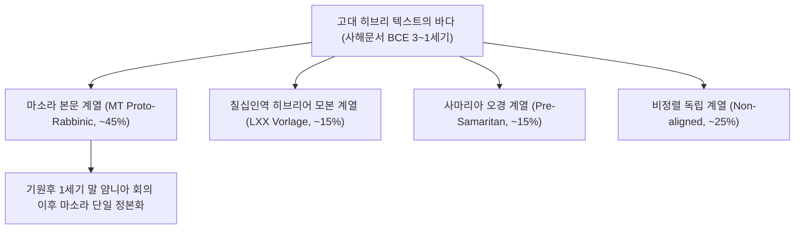

# [연구 에세이 5] 성서의 “원본”은 존재하는가?
## 4중 연대 벡터와 사해문서가 보여주는 유연한 텍스트 전승

**저자**: 고대 문자문화 비교연구 아틀라스 프로젝트  
**소속**: 성서학 및 비교 셈어 비문학(Semitic Epigraphy) 연구팀  
**출처 등급**: Grade A/B 종합 고증  
**사료 코퍼스**: Israel Museum Jerusalem (KH2), IAA Dead Sea Scrolls (4QSam-a, 1QIsa-a)  

---

### [초록 (Abstract)]
인쇄본 성경의 출현 이후 대중에게 깊게 각인된 '단 하나의 무오한 친필 원본(Original Autograph)'이라는 신화는 20세기 사해문서(Dead Sea Scrolls)의 발견과 현대 본문비평학(Textual Criticism)에 의해 근본적으로 해체되었다. 본 논문은 사건 연대, 구성(구전) 연대, 편집 연대, 현존 사본 연대로 분리되는 **4중 연대 벡터(4-Dates Vector)**를 정립하고, 기원전 600년경 케테프 힌놈(Ketef Hinnom) 제2호 은제 부적(KH2)의 제사장 축복문과 쿰란 동굴의 4QSam-a 사본을 정밀 분석한다. 마소라 본문(MT), 칠십인역 희랍어 원형(LXX), 사마리아 오경(SP) 계통이 동등한 권위로 공존했던 사해문서의 텍스트 다원성(Pluriformity)을 통해, 성서 정전이 닫힌 화석이 아니라 역사적 위기 속에서 공동체가 수행한 능동적 재해석과 편집의 살아있는 전승이었음을 논증한다.

---

### 1. 서론: ‘단 하나의 원본’이라는 근대적 환상

오늘날 대다수의 독자들은 모세나 다윗, 이사야가 양피지 위에 최초로 적어 내려간 무결한 원본이 존재했고, 후대 필사자들은 그것을 복제하기만 했다는 가정을 무의식적으로 품는다. 19세기 독일의 본문비평가 폴 드 라가르드(Paul de Lagarde) 역시 모든 사본의 계통을 거슬러 올라가면 단 하나의 '우르텍스트(Urtext, 원본)'에 도달할 수 있다는 단일 계통수 가설을 신봉했다.

그러나 1947년 이후 유다 광야 쿰란 11개 동굴에서 쏟아져 나온 230여 점의 성서 사본들은 이 가설을 산산조각 냈다. 고대 유대교 사회에서 성서는 닫힌 단일 원본이 아니라, 수많은 이본들이 살아 숨 쉬던 '다형성의 생태계'였다.

---

### 2. 4중 연대 벡터(4-Dates Vector)의 방법론적 정립

성서 문헌을 학술적으로 다룰 때 이야기 속 사건의 연대와 실제 사본의 물리적 제작 연대를 혼동하는 것은 치명적 오류다.

```
[4중 연대 벡터 구조]
1. 사건 연대 (Event Date, c. 1250 BCE) ➔ 텍스트가 묘사하는 역사적 무대 (출애굽 등)
2. 구성 연대 (Composition Date, c. 1100–800 BCE) ➔ 시와 전승이 구전으로 읊어지기 시작한 시기
3. 편집 연대 (Redaction Date, c. 586–450 BCE) ➔ 포로기 사제들이 오경과 역사서를 정본으로 통합한 시기
4. 사본 연대 (Witness Date, c. 150 BCE–CE 1008) ➔ 쿰란 가죽 두루마리(BCE 150) 또는 레닌그라드 사본(CE 1008)의 물리적 제작 시기
```

이 4중 벡터를 분리할 때 비로소 텍스트가 거쳐온 천 년의 역사적 퇴적층을 읽어낼 수 있다.

---

### 3. 최고(最古)의 성서 비문: 케테프 힌놈 은제 부적 (KH2, c. 600 BCE)

1979년 예루살렘 힌놈 골짜기 암굴 무덤에서 발굴된 손가락 크기의 얇은 은제 두루마리(Israel Museum 80.1/2)는 성서 구절이 물리적으로 기록된 인류 역사상 가장 오래된 유물이다.

```
[케테프 힌놈 KH2 고대 히브리 비문 원문 및 전사]
יברכך יהוה וישמרך
יאר יהוה פניו אליך ויחנך
ישא יהוה פניו אליך וישם לך שלום

yəbārekəkā YHWH wəyišmərəkā
yāʾēr YHWH pānāw ʾēlekā wiyḥunnekā
yiśśāʾ YHWH pānāw ʾēlekā wəyāśēm ləkā šālôm

"야훼께서 너에게 복을 주시고 너를 지키시기를!
야훼께서 그의 얼굴을 너에게 비추사 은혜 베푸시기를!
야훼께서 그의 얼굴을 너에게로 향하여 드사 평강 주시기를!"
(민수기 6:24-26 제사장 축복문)
```

이 유물은 민수기 책 전체가 기원전 600년에 이미 책으로 묶여 있었다는 증거가 아니라, 축복의 제의적 기도문구가 당대 유다 백성들의 일상 신앙 속에 강력한 부적으로 유통되고 있었음을 보여준다.

---

### 4. 사해문서가 폭로한 텍스트 다형성(Pluriformity)

쿰란 동굴에서 발견된 성서 사본 중 기원후 10세기 유대교 표준 정본인 **마소라 본문(MT)**과 일치하는 사본은 40~50%에 불과했다. 놀랍게도 희랍어 구약 **칠십인역(LXX)**의 모태가 된 히브리어 이본과 **사마리아 오경(SP)** 계통의 사본들이 같은 동굴 안에서 평화롭게 공존했다.

```
[4QSam-a (사무엘기 사본)의 독특한 구절]
ונחש מלך בני עמון הוא לחץ את בני גד ואת בני ראובן בחזקה...
"암몬 자손의 왕 나하스는 갓 자손과 르우벤 자손을 심히 압제하였으며..."
```

오늘날 우리가 읽는 마소라 성서(삼상 10장)에서 누락된 암몬 왕 나하스의 잔혹 행위 단락을 온전히 보존하고 있는 4QSam-a는, 고대 성서 전승이 단 하나의 고정된 텍스트가 아니었음을 증명하는 결정적 증거다.

---

### 5. 20/21세기 학술 쟁점: 에마누엘 토브의 본문비평 패러다임



예루살렘 히브리 대학의 에마누엘 토브(Emanuel Tov) 교수는 성서 본문의 역사를 단일 원본의 타락 과정이 아니라, 다양한 전승들이 공동체의 영적 필요에 따라 풍성하게 꽃피웠던 다원적 공존의 역사로 재정의했다.

---

### [참고문헌 (Bibliography)]
- **Grade A** Tov, Emanuel (2012). *Textual Criticism of the Hebrew Bible* (3rd Revised Ed.). Minneapolis: Fortress Press.
- **Grade A** Barkay, Gabriel et al. (2004). "The Amulets from Ketef Hinnom: A New Edition and Evaluation." *BASOR* 334: 41-71.
- **Grade B** Cross, Frank Moore (1975). *Qumran and the History of the Biblical Text*. Cambridge, MA: Harvard University Press.
- **Grade A** Ulrich, Eugene (1999). *The Dead Sea Scrolls and the Origins of the Bible*. Grand Rapids: Eerdmans.
