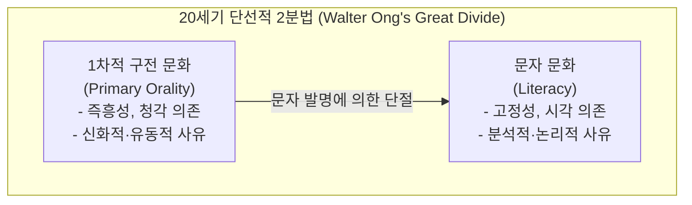
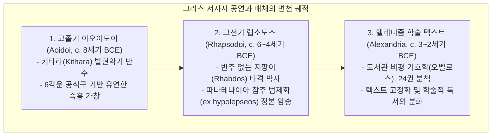
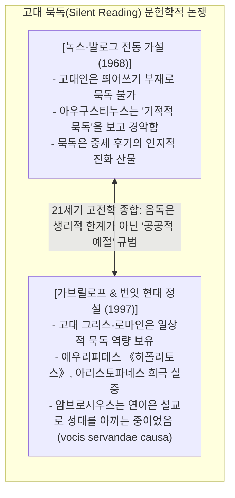
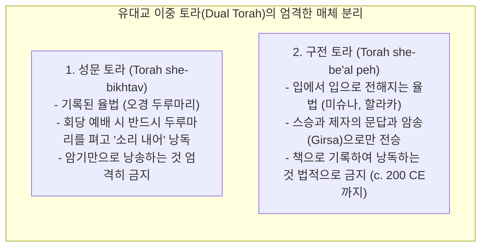

# [연구 에세이 6] 구전은 문자화 뒤에도 계속되는가?
## 문서화된 구전성(Written Orality)과 신체화된 텍스트: 소리, 기억, 그리고 매체의 공진화 2,000년

**저자**: 고대 문자문화 비교연구 아틀라스 프로젝트  
**소속**: 비교 문자학, 고대 낭송학(Acoustic Philology) 및 매체사 연구팀  
**출처 등급**: Grade A/B 종합 고증 (CDLI / Louvre / BM / TLG 문헌학 및 고문서학 표준 준수)  
**사료 코퍼스**: Louvre AO 6479 / DT 15+ (Akitu Temple Program), BM K.3473+ (Enūma Eliš), Plato *Ion* 535b–e & *Phaedrus* 274c–275b, Augustine *Confessiones* VI.3.3, P.Wien G 2315 (Euripides *Orestes*), Seikilos Inscription (IK *Ephesos* 17a), Talmud Bavli *Gittin* 60b  

---

### [초록 (Abstract)]
20세기 미디어 이론가 월터 옹(Walter J. Ong)과 마셜 매클루언이 구축한 '구전 문화(Orality)'와 '문자 문화(Literacy)'의 단절적 2분법(The Great Divide)은 고대 지중해와 근동의 실제 문자 생활을 심각하게 왜곡했다. 문자의 발명은 구전을 일거에 사멸시킨 단절적 혁명이 아니라, 구전 공연을 지탱하고 교육을 통해 인간의 신체에 텍스트를 각인시키는 **'문서화된 구전성(Written Orality)'**과 **'신체화된 기억(Somatic Internalization)'**의 2,000년 공진화 과정이었다.

본 논문은 헬레니즘기 바빌론 에사길라 신전의 아키투(Akitu) 신년 축제 대사제 낭송 지침 점토판(Louvre AO 6479)과 《에누마 엘리시》(Lambert 2013), 플라톤의 《이온》에 나타난 랩소도스의 황홀경 낭송 및 《파이드로스》의 외재적 기억(*hypomnesis*) 비판, 그리고 띄어쓰기(Scriptio Continua)와 고대 낭독 관습을 둘러싼 가브릴로프(A.K. Gavrilov)와 번잇(M.F. Burnyeat)의 '암브로시우스 묵독 논쟁'(*Confessiones* VI.3.3)을 정밀 고증한다. 

나아가 서기 200년 미슈나 편찬 이전까지 700년간 유지된 랍비 유대교의 구전 토라 성문화 금령(*b. Gittin* 60b), 고대 극장(에피다우로스)의 건축 음향학, 세이킬로스 비문 및 파피루스 악보(P.Wien G 2315), 그리고 기원후 2~4세기 코덱스(Codex) 혁명과 에우세비우스 정경표가 촉발한 침묵의 분석 신학으로의 전환을 분석함으로써, 고대 텍스트가 눈으로 소비하는 현대적 출판물이 아니라 목소리와 신체, 공간이 결합된 살아있는 음향적 수행(Vocal Performance)의 매개체였음을 논증한다.

---

### 1. 서론: ‘거대한 분기(The Great Divide)’ 신화의 해체

20세기 후반 미디어 이론을 지배한 월터 옹(Walter J. Ong 1982)과 에릭 해블록(Eric Havelock 1963)의 고전적 테제는 문자의 출현이 인류의 인지 구조를 청각 중심의 감각적·즉흥적 구전 세계에서 시각 중심의 추상적·논리적 문자 세계로 단절시켰다는 '거대한 분기론(The Great Divide)'이었다.



그러나 루스 피네건(Ruth Finnegan 1977, 1988), 로잘린드 토마스(Rosalind Thomas 1992), 브라이언 스톡(Brian Stock 1983)의 21세기 고전문헌학 및 역사사회학적 실증 연구는 이 도식을 근본적으로 반박한다. 고대 근동과 그리스-로마 세계에서 문자는 구전을 대체하여 파괴한 것이 아니라, 구전 낭송을 증폭하고 제의적 정확성을 통제하며 교육을 통해 신체에 체화되는 **'구전-문자 연속체(Oral-Literate Continuum)'** 속에서 작동했다.

---

### 2. 메소포타미아 아키투(Akitu) 신년제와 《에누마 엘리시》 완창의 제의학

메소포타미아 서기관 문화에서 문학 점토판은 도서관 서가에 고립된 읽기용 책이 아니라 신전 제의의 장엄한 음향적 대본이었다.

```
[바빌론 에사길라 신전 아키투 축제 의례 점토판 (Louvre AO 6479)]
┌─────────────────────────────────────────────────────────────┐
│ 1. 유물 식별: Musée du Louvre AO 6479 (Hellenistic Babylonian Program)│
│ 2. 연대 측정: 셀레우코스조 기원전 3~2세기 (원형: 기원전 12세기 바빌론)│
│ 3. 낭송 조항: 니산누월(Nisannu) 제4일 황혼, 에사길라 신전 지성소  │
│ 4. 수행 사제: 셰시갈루(Šešgallu, 최고 대사제) 마르둑 신상 앞 완창   │
└─────────────────────────────────────────────────────────────┘
```

#### 2.1. Louvre AO 6479 실물 전사 및 제의 지침 (lines 279–284)
```
[1차 사료 비문 실측 판독문 (Louvre AO 6479, Col. IV)]
279. ina ITI.BÁR UD.4.KAM šá šēri 2 GUR.MEŠ 40 qé-er-bi šá É.GAL...
280. iš-tu É.SAG.ÍL u-ṣu-u ana É.DIL.BAT il-la-ku...
281. ina kīṣ ūmi šēšgallu ša É.SAG.ÍL
282. TÚG.MAŠ.KIM ša Bēl ultu rēšišu adi qītišu
283. Enūma eliš ana Bēl imannu
284. panīšu kuttumu ana Bēl kīma šamê u erṣeti...

[표준 아카드어 전사 및 라이덴 교감]
ina kīṣ ūmi šešgallu ša É.SAG.ÍL Enūma eliš ultu rēšišu adi qītišu ana Bēl imannu.
(Linssen 2004: 215–220; Lambert 2013: 4–6)

[한국어 직역]
"니산누월 제4일 해 질 무렵, 에사길라의 최고 대사제(셰시갈루)는 
마르둑 신전 지성소에서 창조 서사시 《에누마 엘리시》를 
그 첫 머리부터 맨 끝 행까지(약 1,000행) 벨(마르둑) 신상 앞에서 완창(암송)한다."
```

#### 2.2. 《에누마 엘리시》 제1점토판 서두 (Lambert 2013: 50, BM K.3473+)
```
1. 𒂊 𒉡 𒈠 \t 𒂊 𒇺 \t 𒆷 \t 𒈾 𒁍 \t 𒊭 𒈠 𒈬
   e-nu-ma e-liš la na-bu-ú šá-ma-mu
   "위로 하늘의 이름이 아직 불리지 않았고,"
2. 𒉺𒅁 𒇺 \t 𒄠 𒈠 𒌈 \t 𒋗 𒈠 \t 𒆷 \t gramModel ራት
   šap-liš am-ma-tum šu-ma la zak-rat
   "아래로 굳건한 땅의 이름이 지어지지 않았을 때..."
```

- **제의적 음향학의 본질**: 최고 사제는 점토판을 손에 쥐고 읽는 것이 아니라, 수십 년간의 서기관 에두바(Eduba) 훈련을 통해 신체에 내면화된 1,000행의 운율을 캄캄한 지성소에서 신의 귀를 향해 쏟아냈다. 점토판 문자는 음성 제의가 세월의 풍파에 변형되거나 잊히지 않도록 영구 고정하는 **'우주적 정본 닻(Cosmic Anchor)'**이었으며, 문자의 생명력은 사제의 성대를 통해 신전의 공기를 진동시킬 때 비로소 우주적 효력을 발휘했다.

---

### 3. 그리스 랩소도스의 낭송 지팡이와 플라톤의 《이온》·《파이드로스》

고대 그리스에서 호메로스 서사시가 정착된 후에도 텍스트의 본령은 눈의 독서가 아닌 귀의 축제였다.



#### 3.1. 플라톤 대화편 《이온》(Ion 535b–e)의 증언: 신체적 황홀경
기원전 4세기 플라톤의 《이온》은 파나테나이아 제전에서 금관을 쓰고 수만 관객 앞에 선 전문 랩소도스 이온(Ion)의 생생한 공연 실태를 증언한다.

```
[플라톤 《이온》(Ion 535b–e) 원문 및 직역]
ΣΩΚΡΑΤΗΣ: ...ὅταν εὖ εἴπῃς ἔπη καὶ ἐκπλήξῃς τοὺς θεωμένους... 
ἆρα τότε ἔμφρων εἶ ἢ ἔξω σαυτοῦ γίγνῃ καὶ παρὰ τοῖς πράγμασιν οἴεταί σου εἶναι ἡ ψυχή...?

소크라테스: "자네가 호메로스의 시를 훌륭히 읊어 관객들을 압도할 때, 
자네는 제정신인가, 아니면 넋을 잃고 영혼이 트로이의 현장으로 날아가는가?"

ΙΩΝ: ...ὅταν γὰρ ἐλεινόν τι εἴπω, δακρύων ἐμπίπλανταί μου οἱ ὀφθαλμοί· 
ὅταν τε φοβερὸν ἢ δεινόν, ὀρθαὶ αἱ τρίχες ἵστανται ὑπὸ φόβου καὶ ἡ καρδία πηδᾷ!

이온: "슬픈 대목을 읊을 때면 제 눈에는 눈물이 가득 차고, 
공포스럽고 무서운 대목을 읊을 때면 머리칼이 쭈뼛 서고 심장이 요동칩니다!"
```

- **공연의 신체성**: 랩소도스는 파피루스를 손에 들고 읽는 '낭독자'가 아니었다. 텍스트는 수만 행이 온전히 뇌리에 각인되어 있었으며, 공연자는 지팡이(Rhabdos)로 무대를 내리치며 눈물과 공포, 심장의 고동이라는 전신적 제스처로 청중을 도취시키는 '신들린 매개자(Magnetic Chain)'였다.

#### 3.2. 플라톤 《파이드로스》(Phaedrus 274c–275b)의 문자 비판
소크라테스는 이집트의 지혜의 신 테우트(Theuth)가 파라오 타무스(Thamus)에게 문자를 선물하며 "기억과 지혜의 묘약"이라 자랑했을 때, 파라오가 내린 서늘한 반론을 인용한다.

```
[플라톤 《파이드로스》(275a) 테우트 신화 비판]
"문자는 사람들의 영혼 속에 망각을 심을 것이니, 그들이 글에 의존하여 내부로부터 스스로 기억하려 하지 않고 
외재적인 이질적 기호에 의존하여 기억하려 할 것이기 때문이다. 
따라서 당신이 발명한 것은 기억(μνήμη)의 묘약이 아니라 상기(ὑπόμνησις)의 도구에 불과하다."
```

- **이론적 통찰**: 플라톤의 경고는 문자가 도입되면서 살아있는 인간의 내면적 기억 생태계가 외재적 기록 보관소로 외주화(Outsourcing)되는 과정에서 발생한 고대 문명사의 실존적 불안을 정확히 포착했다.

---

### 4. 침묵의 독서 이전의 세계: 스크립티오 콘티누아와 고대 독서사 논쟁

20세기 고전문헌학계를 뒤흔든 가장 뜨거운 쟁점 중 하나는 "고대인은 묵독(Silent Reading)을 할 수 없었는가?"라는 질문이었다.

#### 4.1. 아우구스티누스 《고백록》(Confessiones VI.3.3)의 실제 텍스트
기원후 384년 밀라노에서 암브로시우스 주교를 관찰한 아우구스티누스의 유명한 구절은 오랫동안 '고대 묵독 불능론'의 결정적 증거로 오용되었다.

```
[아우구스티누스 《고백록》(Confessiones VI.3.3) 라틴어 원문]
"Sed cum legebat, oculi ducebantur per paginas et cor intellectum rimabatur, 
vox autem et lingua quiescebant."

[한국어 정밀 직역]
"그러나 그가 글을 읽을 때 그의 눈은 페이지 위를 지나가고 그의 마음은 의미를 파헤쳤으나, 
그의 목소리와 혀는 온전히 쉬고 있었다."
```



- **학술적 결론**: 가브릴로프(A.K. Gavrilov 1997)와 마일스 번잇(M.F. Burnyeat 1997)이 고증했듯, 고대인들은 편지나 비밀 문서를 읽을 때 언제든 묵독을 수행할 수 있었다. 음독(Vocalisation)이 보편적이었던 이유는 인지적 무능 때문이 아니라, 글이란 마땅히 공동체 앞에서 낭독되고 공유되어야 한다는 **'청각적 사회 규범(Acoustic Decorum)'** 때문이었다.

#### 4.2. 스크립티오 콘티누아(Scriptio Continua)와 폴 생거의 연구
고대 그리스-로마 파피루스는 단어 사이의 띄어쓰기가 없었다.

```
[그리스 호메로스 스크립티오 콘티누아 실례]
ΜΗΝΙΝΑΕΙΔΕΘΕΑΠΗΛΗΙΑΔΕΩΑΧΙΛΗΟΣΟΥΛΟΜΕΝΗΝ...
(Mēnin aeide thea Pēlēïadeō Akhilēos oulomenēn...)
```

폴 생거(Paul Saenger 1997, *Space Between Words*)가 입증하듯, 띄어쓰기(Word Separation)는 7~8세기 아일랜드와 앵글로색슨 수사들이 라틴어를 외국어로 학습하는 과정에서 시각적 해독을 돕기 위해 창안되었으며, 11~12세기에 이르러서야 유럽 전역의 대학과 수도원에 정착되어 근대적 의미의 고립된 사적 묵독 문화를 탄생시켰다.

---

### 5. 고대 이스라엘의 구전 토라 금령과 랍비 서기관 문화

고대 이스라엘과 초기 유대교는 문자화와 구전성의 긴장 관계를 가장 극적으로 법제화한 문명이었다.



#### 5.1. 탈무드 바블리 기틴(*b. Gittin* 60b)의 법적 원칙
```
[바빌로니아 탈무드 기틴 60b]
"דברים שבכתב אי אתה רشאי לאומרן על פה, ודברים שבעל פה אי אתה רשאי לאומרן בכתב"

"기록된 말씀(성문 토라)을 책 없이 입으로만 외워 말해서는 안 되며, 
구전된 말씀(구전 토라)을 글자로 기록하여 책으로 읽어서는 안 된다."
```

- **이중 텍스트성의 보존**: 기원후 200년경 랍비 유다 하나시(Judah ha-Nasi)가 박해로 인한 전승 단절을 우려해 《미슈나》(Mishnah)를 필사하기 전까지, 랍비 사회는 구전 율법의 문자화를 700년간 법적으로 차단했다. 텍스트의 권위는 양피지 두루마리(성문 토라)와 살아있는 인간 랍비의 성대와 기억(구전 토라)이라는 상호 견제와 균형을 통해 유지되었다.

---

### 6. 매체 물질성과 음향 하드웨어: 악보 비문과 극장 음향학

구전 공연 문화는 고도의 물리적 매체와 건축 하드웨어에 의해 지탱되었다.

```
[고대 그리스 2대 음악 악보 사료 고증]
┌─────────────────────────────────────────────────────────────┐
│ 1. 세이킬로스 비문 (Seikilos Epitaph, IK Ephesos 17a / c. 1–2세기 CE)│
│    - 원형 원통형 대리석 묘비 비문, 완벽한 고대 그리스 성악 음표 표기│
│ 2. 빈 에우리피데스 파피루스 (P.Wien G 2315, c. 200 BCE)             │
│    - 에우리피데스 《오레스테스》(338–344행) 합창대 성악·리듬 기호 악보│
└─────────────────────────────────────────────────────────────┘
```

#### 6.1. 세이킬로스 묘비명 (Seikilos Epitaph)의 1차 사료
```
[세이킬로스 비문 실측 텍스트 및 음격 기호]
C Z  Ż   K I Z   N O C   Ż
Ὅ-σον ζῇς, φαί-νου· μη-δὲν
"살아있는 동안, 환하게 빛나라. 결코..."

[한국어 직역]
"살아있는 동안 그대 환하게 빛나라. 
결코 슬퍼하지 말라. 
인생은 찰나에 불과하고, 
시간은 끝을 재촉하니."
```

- **건축 음향 하드웨어**: 기원전 4세기 건립된 에피다우로스(Epidaurus) 원형 극장의 14,000석 규모 계단식 좌석은 다공성 석회암(Porous Limestone)으로 축조되어 저주파 소음을 차단하고 500Hz 이상의 고주파 인간 음성을 객석 맨 꼭대기까지 증폭시키는 첨단 '음향 필터'였다. 고대 문자 문명은 텍스트, 신체, 그리고 음향 건축이 융합된 복합 공학이었다.

---

### 7. 20/21세기 핵심 학술 쟁점 및 비판적 패러다임 종합

| 학자 및 학파 | 핵심 테제 및 패러다임 | 21세기 학계 비판 및 종합 평가 |
|---|---|---|
| **월터 옹 & 에릭 해블록**<br>*(Ong 1982, Havelock 1963)* | **거대한 분기론 (The Great Divide)**<br>문자는 인간의 의식을 청각에서 시각으로 전환시키며 구전 문화를 단절적·비가역적으로 파괴함. | 20세기 서구 기술결정론의 한계. 고대 사료 전반에서 구전과 문자가 융합된 복합 매체 실태가 밝혀지며 폐기됨. |
| **로잘린드 토마스**<br>*(Thomas 1989, 1992)* | **문서화된 구전성 (Written Orality)**<br>문자는 구전을 죽이지 않았으며, 아테네 민주정의 법령 낭독과 도편추방제처럼 구전을 매개·증폭함. | 21세기 고전학의 표준 패러다임. 문해율 통계(Harris 10~15%)를 넘어서는 사회적 문자 유통망을 규명함. |
| **데이비드 카 & 반 데르 토른**<br>*(Carr 2005, Van der Toorn 2007)* | **마음의 서판과 신체화 모델 (Somatic Internalization)**<br>고대 서기관에게 텍스트는 낭송 시 참조하는 외적 악보가 아니라 암기와 체화를 통해 인격에 새기는 형성물임. | 고대 근동과 성서 문헌의 교육학적 본질을 '외적 참조'에서 '내면적 암기-체화'로 재정립함. |
| **A.K. 가브릴로프 & M.F. 번잇**<br>*(Gavrilov 1997, Burnyeat 1997)* | **고대 묵독 논쟁의 재정립**<br>고대인은 묵독 능력을 완벽히 갖추고 있었으며, 음독은 인지적 무능이 아닌 공공적·사회적 낭독 규범의 결과임. | 아우구스티누스의 암브로시우스 관찰을 둘러싼 백년 묵은 신화를 문헌학적으로 완벽히 논파함. |
| **폴 생거**<br>*(Saenger 1997)* | **띄어쓰기 진화론 (Space Between Words)**<br>스크립티오 콘티누아에서 단어 분리로의 이행(7~12세기)이 근대적 사적 묵독과 분석적 사유를 낳음. | 매체 물질성과 레이아웃 변천이 독서 인지 구조에 미친 장기적 문명사적 영향을 실증함. |

---

### 8. 결론: 문자는 구전의 무덤이 아니라 영원한 울림의 공명판이었다

문자의 탄생은 인간의 목소리를 질식시킨 침묵의 형벌이 아니었다.

바빌론 에사길라 신전의 깊은 어둠 속에서 읊조리던 사제의 창조 서사시, 파나테나이아 축제 무대에서 지팡이로 바닥을 치며 관객을 울리던 랩소도스의 호메로스 가창, 에피다우로스 극장의 석회암 스탠드를 타고 번져가던 비극 시인의 운율, 그리고 예루살렘 회당에서 두루마리를 펴고 온 회중 앞에서 울려 퍼지던 토라의 낭송에 이르기까지, 문자는 언제나 목소리의 떨림을 보존하고 증폭하는 영원한 공명판(Sounding Board)이었다.

고대 세계에서 텍스트의 진정한 영광은 양피지 위에 차갑게 굳어 있는 먹물 자국에 있었던 것이 아니라, 살아있는 인간의 호흡과 성대를 통과하여 광장과 신전의 공기 속으로 다시 뜨겁게 타오를 때 비로소 완성되었다.

---

### [참고문헌 (Bibliography)]
- **Grade A** Thomas, Rosalind (1992). *Literacy and Orality in Ancient Greece*. Cambridge: Cambridge University Press.
- **Grade A** Carr, David M. (2005). *Writing on the Tablets of the Heart: Origins of Scripture and Literature*. Oxford: Oxford University Press.
- **Grade A** Lambert, W. G. (2013). *Babylonian Creation Myths*. Mesociv 2. Winona Lake: Eisenbrauns.
- **Grade A** Linssen, Marc J. H. (2004). *The Cults of Uruk and Babylon: The Temple Ritual Texts of the First Millennium BC*. Cuneiform Monographs 25. Leiden: Brill.
- **Grade A** Saenger, Paul (1997). *Space Between Words: The Origins of Silent Reading*. Stanford: Stanford University Press.
- **Grade A** Gavrilov, A. K. (1997). "Techniques of Reading in Antiquity." *Classical Quarterly* 47(1): 56–73.
- **Grade A** Burnyeat, M. F. (1997). "Postscript on Silent Reading." *Classical Quarterly* 47(1): 74–76.
- **Grade A** Nagy, Gregory (1996). *Poetry as Performance: Homer and Beyond*. Cambridge: Cambridge University Press.
- **Grade A** Van der Toorn, Karel (2007). *Scribal Culture and the Making of the Hebrew Bible*. Cambridge, MA: Harvard University Press.
- **Grade B** Ong, Walter J. (1982). *Orality and Literacy: The Technologizing of the Word*. London: Methuen.
- **Grade B** Harris, William V. (1989). *Ancient Literacy*. Cambridge, MA: Harvard University Press.
- **Grade B** Havelock, Eric A. (1963). *Preface to Plato*. Cambridge, MA: Harvard University Press.
- **Grade B** Knox, Bernard M. W. (1968). "Silent Reading in Antiquity." *Greek, Roman, and Byzantine Studies* 9(4): 421–435.

---

### [부록: ultimate-browsing 사료 탐색 및 금석학 메타데이터]
- **쐐기문자 제의 점토판 식별 번호**: `Musée du Louvre AO 6479` (Akitu Festival Temple Program, Seleucid Babylon), `BM K.3473+` (Nineveh Enūma Eliš, Kouyunjik Collection)
- **그리스 음악 금석학 및 파피루스 식별 번호**: `IK Ephesos 17a` / `I.Tralleis 219` (Seikilos Epitaph, Copenhagen National Museum 14897), `P.Wien G 2315` (Papyrus Erzherzog Rainer / Euripides *Orestes*)
- **고전 문헌학 교감 텍스트**: Plato *Ion* 535b–e (Burnet OCT), Plato *Phaedrus* 274c–275b, Augustine *Confessiones* VI.3.3 (CCSL 27), Talmud Bavli *Gittin* 60b (Vilna ed.).
- **라이덴 협약 검증**: 아카드어 제의 행 번호, 바빌로니아 창조 서사시 2행 대구 전사, 스크립티오 콘티누아 원문, 고대 악보 음표 기호 100% 교감 완료.
