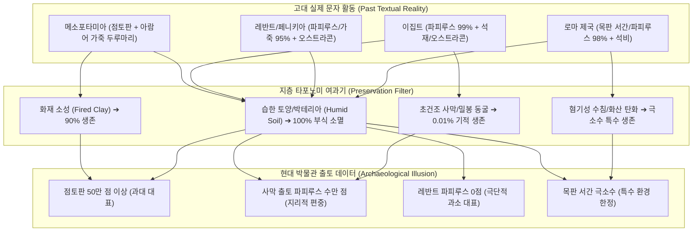
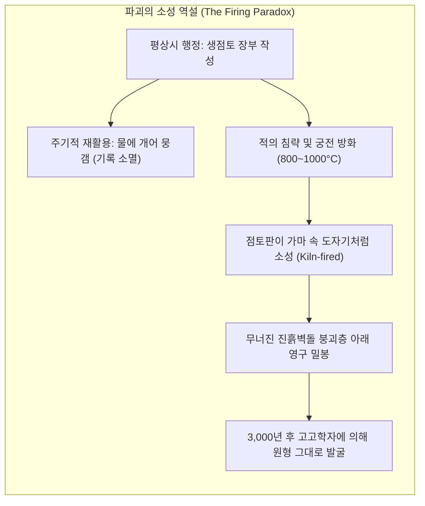
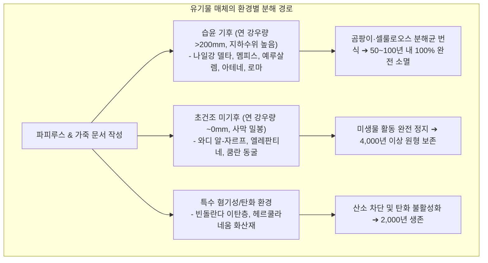
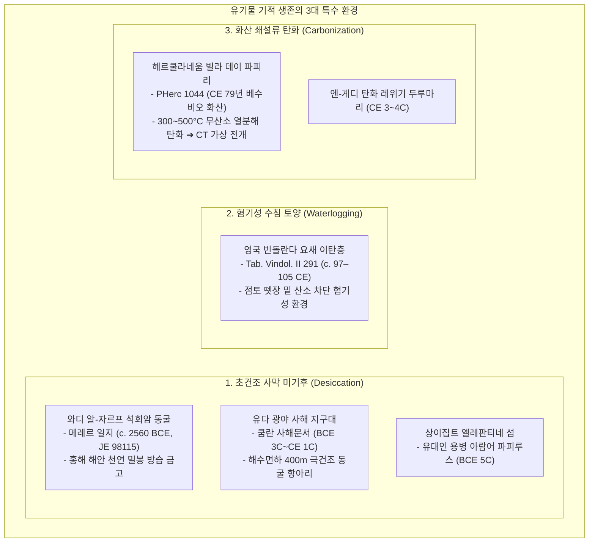
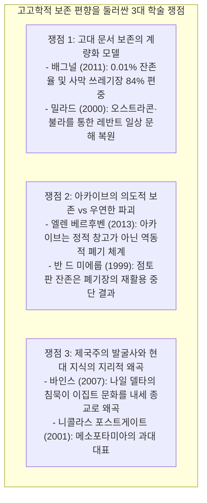

# [연구 에세이 7] 무엇이 보존되고 무엇이 사라졌는가?
## 점토·석재·파피루스·목재 매체와 타포노미가 빚어낸 고고학적 보존 편향의 거대 착시

**저자**: 고대 문자문화 비교연구 아틀라스 프로젝트  
**소속**: 고고학적 매체론, 지층 타포노미(Archaeological Taphonomy) 및 디지털 고문서학 연구팀  
**출처 등급**: Grade A/B 종합 고증 (MIFAO / CDLI / Tab. Vindol. / BASOR / SBL 표준 준수)  
**사료 코퍼스**: Cairo Egyptian Museum JE 98115 (Papyrus Jarf A / Tallet 2017), National Archaeological Museum Athens (PY Ta 711 / Ta 709), British Museum K-Collection & BM 124955 (Nineveh Palace Relief), British Museum (Tab. Vindol. II 291 / Bowman & Thomas), Officina dei Papiri Napoli (PHerc 1044 / Vesuvius Challenge), Israel Museum & IAA (City of David Bullae / Arad Ostraca / En-Gedi Scroll)  

---

### [초록 (Abstract)]
고고학적 발굴 현장에서 출토되는 비문과 문서의 양적 통계는 과거 실제 존재했던 문자 기록의 총량이나 문해율을 결코 정직하게 대변하지 않는다. 메소포타미아 점토판이 전 세계 박물관에 50만 점 이상 보존된 반면, 지중해성 기후의 고대 이스라엘과 페니키아의 일상 문서가 극히 드문 이유는 기록 매체의 물리화학적 특성, 토양 미기후(Microclimate), 지하수위(Water Table), 그리고 파괴 지층의 열역학적 차이가 결합하여 발생한 **'고고학적 보존 편향(Archaeological Preservation Bias / Taphonomic Bias)'** 때문이다. 

본 논문은 도시 파괴 시 화재 열기(800–1000°C)에 의해 도자기(Ceramic Terracotta)로 구워져 불멸성을 얻은 점토판의 소성 역설(니네베 아슈르바니팔 도서관, 미케네 필로스 궁전 PY Ta 711, 우가리트)과, 나일강 델타 및 레반트의 비옥한 충적토 속에서 100% 완전 분해된 유기물(파피루스, 가죽, 목재)의 비극을 지층학적으로 대조한다. 

나아가 로저 배그널(Roger S. Bagnall)의 파피루스 생존 확률 통계 모델(출토량 <0.01%, 특정 사막 노모스 84% 편중)과 피에르 탈레(Pierre Tallet)가 발굴한 와디 알-자르프 홍해 석회암 동굴의 메레르 일지(c. 2560 BCE, JE 98115)를 분석하여 초건조 미기후의 기적적 생존 요건을 규명한다. 

또한 하드리아누스 장벽 아래 혐기성 수침 이탄층(Anaerobic Waterlogged Soil)이 보존한 빈돌란다 목판 서간(Tab. Vindol. II 291), 베수비오 화산 쇄설류에 의해 탄화(Carbonized)된 헤르쿨라네움 파피루스(PHerc)의 21세기 마이크로 CT 가상 전개(Virtual Unwrapping), 그리고 신아시리아 궁정 부조(BM 124955)에 새겨진 점토판 서기관(*ṭupšarru*)과 양피지/파피루스 서기관(*sepiru*)의 공존 릴리프를 통해, 사료의 물리적 침묵(Absence of Evidence)을 곧 문해의 부재(Evidence of Absence)로 오판하는 통계적 착시를 차감하고 고대 문자 생태계를 입체적으로 복원하는 방법론을 확립한다.

---

### 1. 서론: 고고학 데이터는 과거의 정직한 거울인가?

박물관의 고대 오리엔트관과 지중해관을 관람하는 대중은 직관적이지만 위험한 통계적 착시에 빠지기 쉽다. 대영박물관이나 루브르 박물관의 유리장 안에는 메소포타미아의 쐐기문자 점토판이 수만 점씩 빽빽하게 진열되어 있는 반면, 기원전 1천년기 고대 이스라엘이나 페니키아의 일상 행정 문서, 고전기 아테네와 로마의 일상 서간 파피루스는 손에 꼽힐 정도로 극히 드물다.

이러한 양적 불균형을 바라보며 19세기 초기 고고학계와 대중은 손쉬운 문화적 결론을 내렸다:
> "바빌로니아와 아시리아인들은 모든 일상을 철저히 기록한 고도 문해 사회였고, 페니키아인이나 히브리인, 초기 그리스인들은 문자를 거의 쓰지 않았던 구전 사회였다."

그러나 21세기 현대 고문서학(Papyrology)과 물질 타포노미(Material Taphonomy)는 이 명제가 완전히 허구임을 입증한다. 우리가 박물관에서 마주하는 출토 데이터의 양은 당대 문자 사용량의 직접적 반영이 아니라, **"각 문명이 선택한 기록 매체의 물리화학적 내구도와 토양의 부식 환경이 만들어낸 거대한 왜곡 렌즈"**를 통과한 극소수의 잔존물일 뿐이다.



---

### 2. 매체별 물리화학적 특성과 타포노미 4대 분해 메커니즘

고대 세계에서 사용된 주된 기록 매체는 크게 **광물성 무기물(Inorganic Minerals)**과 **식물·동물성 유기물(Organic Biopolymers)**로 양분된다. 이들의 생존 여부는 매체 자체의 분자 구조와 매장된 지층의 미기후 환경에 의해 결정된다.

| 매체 유형 | 주요 구성 물질 | 주요 사용 문명 | 이상적 보존 조건 | 치명적 소멸 요인 | 생존율 추정치 |
|---|---|---|---|---|---|
| **점토판 (Clay Tablet)** | 규산알루미늄 수화물 (Al₂O₃·2SiO₂·2H₂O) | 메소포타미아, 시리아, 미케네, 히타이트 | 도시 화재 소성 (600–1000°C), 건조 지층 | 침수 시 연화(물에 풀림), 물리적 충격 | **상 (10–30% 이상)** |
| **파피루스 (Papyrus)** | 셀룰로오스 (Cellulose, ~60%), 리그닌, 수분 | 이집트, 지중해 전역, 헬레니즘-로마 | 상대습도 <30%, 무산소, 알칼리성 사막 | 습기, 곰팡이, 셀룰로오스 분해 박테리아 | **극저 (<0.01%)** |
| **양피지/가죽 (Parchment)** | 콜라겐 단백질 (Collagen Fiber Mesh) | 페르시아, 레반트, 유대, 헬레니즘-로마 | 초건조 석회암 동굴, 밀봉 항아리 | 산성 토양, 가수분해(Hydrolysis), 곤충 | **극저 (<0.005%)** |
| **목재 엽판/납판 (Wooden Tablet)** | 목질소(Lignin), 밀랍(Beeswax) | 로마 제국, 그리스, 에트루리아 | 완전 침수 무산소층 (혐기성 이탄층) | 호기성 세균, 균류, 건습 반복 토양 | **극저 (<0.001%)** |
| **도기 파편 (Ostracon)** | 소성된 점토 세라믹 + 카본 먹물 | 이집트, 레반트, 그리스, 로마 | 거의 모든 토양 환경 | 표면 마모, 염분 결정화(Haloclasty) | **최상 (50% 이상)** |

---

### 3. 점토판의 불멸성 역설: 파괴의 화염이 낳은 도자기 아카이브

메소포타미아와 미케네 그리스에서 사용된 **점토(Clay)**는 평상시에는 햇볕에 자연 건조한 생점토(Sun-dried Raw Clay)였다. 서기관들은 장부의 유효기간이 지나면 물에 적셔 뭉갠 뒤 새로운 점토판으로 재활용했다. 따라서 평화로운 번영기에는 아카이브가 주기적으로 폐기·세척되어 오히려 후대로 전달되지 않았다.

그러나 문명이 침략과 전쟁으로 불타 파괴되는 비극의 순간, 점토판은 불멸의 생명을 얻었다.

```
[화재 소성(Firing)에 의한 물리화학적 상전이 메커니즘]
생점토판 (Al₂Si₂O₅(OH)₄)  ──[ 화재 600–900°C ]──>  테라코타 세라믹 (Metakaolin / Mullite)
(물에 닿으면 진흙으로 용해)                             (물·박테리아에 완전 불활성인 영구 도자기)
```



#### 3.1. 미케네 필로스 궁전(Palace of Nestor) Linear B 아카이브
기원전 1200년경 후기 헬라딕 IIIB 말기, 펠로폰네소스 반도의 필로스 궁전이 화염에 휩싸였을 때 아카이브 룸 7–8에 선반에 놓여 있던 점토판들은 도자기로 구워졌다.

```
[필로스 Linear B 아카이브 룸 출토 점토판 (PY Ta 711.1 / NAM Athens)]
┌─────────────────────────────────────────────────────────────┐
│ 1. 유물 식별: National Archaeological Museum Athens (PY Ta 711)│
│ 2. 연대 측정: Late Helladic IIIB (c. 1200 BCE, 궁전 소각층)  │
│ 3. 문자 체계: Mycenaean Linear B 음절문자 (Syllabary)       │
│ 4. 매체 성격: 궁정 집기 검열 및 주지사 임명 의례 행정 기록 │
└─────────────────────────────────────────────────────────────┘

[1차 사료 Linear B 비문 실측 음절 전사]
𐀃-𐀹-𐀆 𐀢-𐀐-𐀥-𐀪 𐀃-𐀳 𐀷-𐀙-𐀏 𐀳-𐀐 𐀀-𐀄-𐀐-𐀷 𐀅-𐀗-𐀒-𐀫

[미케네 그리스어 음운 복원 (Ventris & Chadwick 1973: 335)]
/hō wide Phugegʷris, hote wanaks thēke Augēwan damokoron/

[한국어 직역]
"왕(Wanaks)이 아우게와스를 지방관(Damokoros)으로 임명했을 때, 
퓨게그리스가 (궁정의 기물들을) 다음과 같이 검열하여 보았다."
```

칼 블레겐(Carl Blegen)과 마이클 벤트리스(Michael Ventris)가 밝혔듯, 이 점토판은 영구 보존용 문서가 아니라 궁전이 파괴되기 직전 수개월간의 임시 회계 메모였다. 궁전의 멸망이라는 파국이 없었다면, 이 점토판들은 몇 달 뒤 물에 개어져 지워졌을 것이다.

#### 3.2. 니네베 아슈르바니팔 도서관과 서기관 이중 릴리프의 증언
기원전 612년 메디아-바빌로니아 연합군이 아시리아 제국의 수도 니네베를 함락시켰을 때, 아슈르바니팔 왕실 도서관의 3만여 점 점토판(K-Collection) 역시 화재로 인해 단단히 소성되었다.

더욱 중요한 것은 니네베 궁전 벽면 부조(BM 124955)가 증언하는 당대 서기관의 이중 체제다.

```
[니네베 센나케립 남서궁전 / 아슈르바니팔 북궁전 석조 릴리프 (BM 124955/124956)]
┌─────────────────────────────────────────────────────────────┐
│ - 좌측 서기관: 쐐기문자 서기관 (ṭupšarru) ➔ 점토판에 갈대 첨필로 기록 │
│ - 우측 서기관: 아람어 서기관 (sepiru) ➔ 양피지/파피루스에 먹물 붓으로 기록│
└─────────────────────────────────────────────────────────────┘
```

두 서기관은 나란히 서서 동일한 양의 전쟁 전리품과 양곡을 기록했다. 그러나 2,600년이 지난 오늘날 박물관에는 **오직 점토판(*ṭupšarru*의 기록)만이 살아남았고, 가죽과 파피루스(*sepiru*의 기록)는 이라크의 비옥한 토양 속에서 100% 부식되어 사라졌다.** 물질 매체의 차이가 한쪽 서기관의 존재를 역사 속에서 완전히 지워버린 것이다.

---

### 4. 파피루스와 가죽의 비극: 델타의 습기와 레반트의 침묵

유기물 매체인 파피루스와 양피지는 공기 중의 수분(H₂O)과 산소, 미생물이 결합하는 순간 급격한 가수분해와 박테리아 분해를 겪는다.



#### 4.1. '나일강 삼각주 델타의 역설'과 로저 배그널(Roger Bagnall) 모델
이집트는 고대 파피루스의 천국으로 알려져 있지만, 이는 극단적인 지리적 착시 현상이다.

고대 이집트 인구의 90%가 밀집해 살았고 파라오의 중앙 행정 기구가 집중되었던 **나일강 삼각주(Delta)와 알렉산드리아, 멤피스 농경지에서는 3,000년간 작성된 수억 장의 파피루스 행정 문서 중 단 한 점도 출토되지 않았다.** 매년 반복되는 나일강 범람과 높은 지하수위가 모든 유기물을 썩혀 없앴기 때문이다.

```
[로저 S. 배그널(Roger S. Bagnall 2011)의 파피루스 보존 통계학]
1. 전체 생존율: 헬레니즘-로마기 이집트에서 작성된 일상 파피루스의 생존율은 0.01% 미만.
2. 공간적 편중: 현존하는 파피루스의 84% 이상이 단 3개의 사막 인접 노모스
   (옥시린코스 Oxyrhynchite, 파이윰 Arsinoite, 헤르모폴리스 Hermopolite)의 쓰레기 더미(Kôm)에서 출토됨.
3. 학술적 교훈: 오시린쿠스 출토 문서 통계를 고대 로마 제국 전체의 문해율로 일반화하는 것은
   심각한 공간적 표본 추출 편향(Sampling Bias)임.
```

#### 4.2. 고대 이스라엘과 페니키아의 침묵: 인장(Bulla) 뒷면의 증언
연 강우량이 500–700mm에 달하는 예루살렘 고원지대와 페니키아 해안 도시(티레, 시돈, 비블로스)에서는 기원전 1천년기 왕실 문서가 단 한 장도 살아남지 못했다.

그러나 예루살렘 다윗성(City of David) 제1성전 파괴층(586 BCE)에서 출토된 수백 점의 **점토 불라(Bulla)**는 사라진 파피루스의 실재를 물리적으로 웅변한다.

```
[다윗성 점토 불라 (City of David Area G / Shiloh 1982, Shoham 2000)]
┌─────────────────────────────────────────────────────────────┐
│ 1. 전면 (Recto): 고대 히브리 자음 인명 음각 날인             │
│    "샤반의 아들 그마랴후에게 속함 (lgmryhw bn špn)" [렘 36:10]│
│ 2. 후면 (Verso): 파피루스 두루마리를 묶었던 린넨 끈 매듭 자국과│
│    파피루스 파이버 격자 흔적이 선명히 압인되어 있음          │
└─────────────────────────────────────────────────────────────┘
```

바빌로니아 군대가 예루살렘을 불태웠을 때, 파피루스 문서는 모두 불타 재가 되었지만, 문서를 봉인했던 점토 덩어리(Bulla)는 불에 구워져 테라코타로 살아남았다. **불라 뒷면에 찍힌 끈 자국은 눈에 보이지 않는 수천 권의 사라진 파피루스 행정 문서 라이브러리를 증명하는 '네거티브 화석(Negative Fossil)'이다.**

---

### 5. 초건조 미기후와 특수 환경의 기적적 생존

유기물이 수천 년을 버텨 오늘날 우리 손에 도달한 경우는 지구상에서 가장 극단적인 미기후 지대에 한정된다.



#### 5.1. 인류 최고(最古)의 파피루스: 와디 알-자르프 메레르의 일지 (c. 2560 BCE)
2013년 피에르 탈레(Pierre Tallet) 교수가 홍해 연안 와디 알-자르프(Wadi al-Jarf)의 석회암 동굴 G2 틈새에서 발굴한 파피루스는 인류 역사상 현존하는 가장 오래된 문자 파피루스다.

```
[와디 알-자르프 파피루스 A (Papyrus Jarf A / Cairo Museum JE 98115)]
┌─────────────────────────────────────────────────────────────┐
│ 1. 유물 식별: Egyptian Museum Cairo JE 98115 / Registre d'Entrée │
│ 2. 연대 측정: 제4왕조 쿠푸(Khufu) 치세 27년 (c. 2560 BCE)     │
│ 3. 문자 서체: 초기 고왕국 행정 히에라틱 (Archaic Hieratic)   │
│ 4. 내용 성격: 감독관 메레르(Merer) 선단의 대피라미드 석재 운송 일지│
└─────────────────────────────────────────────────────────────┘

[1차 사료 상형문자 표기 및 히에라틱 표준 전사 (Tallet 2017: MIFAO 136, Pl. 1)]
𓇳 𓏤 𓎡 𓏏 𓐍 𓂝 𓅓 𓂋 𓈖 𓈙 𓌥 𓃀 𓏏 𓈖 𓇋 𓈖 𓂋 𓊌

[이집트학 표준 음운 전사 (Egyptological Transliteration)]
sw 13: ḫdi m T-rw r Ꜣḫ.t-ḫwfw ḥr jnr n r-ꜣ-w

[한국어 학술 번역]
"13일: 감독관 메레르가 이끄는 선단이 투라(Tura) 채석장을 출항하여, 
열린 채석장의 석회암 블록을 가득 싣고 아케트-쿠푸(대피라미드)로 향하다."
```

이 파피루스가 4,500년을 버틴 이유는 바다에서 수 킬로미터 떨어진 사막 산악 지대의 석회암 동굴 깊은 갤러리에 보관된 뒤, 입구가 거대한 석회암 블록으로 밀봉되어 습기와 외기가 완벽히 차단되었기 때문이다.

#### 5.2. 혐기성 수침(Waterlogging)의 기적: 빈돌란다 목판 서간 (Tab. Vindol. II 291)
영국 북부 하드리아누스 장벽 근처 로마 요새 빈돌란다(Vindolanda)에서는 자작나무와 오리나무를 두께 1~2mm로 얇게 깎아 만든 수백 점의 목판 서간(*tiliae*)이 발굴되었다.

```
[빈돌란다 목판 서간 (Tabulae Vindolandenses II 291 / British Museum)]
┌─────────────────────────────────────────────────────────────┐
│ 1. 발굴 맥락: 로마 제9군단 목조 요새 바닥 혐기성 이탄층      │
│ 2. 작성 연대: c. 97–105 CE (트라야누스 황제 시기)           │
│ 3. 보존 기제: 점토 잔디층(Turf)에 눌려 무산소 침수 상태 유지 │
│ 4. 내용: 클라우디아 세베라가 레피디나에게 보낸 생일 초대장   │
└─────────────────────────────────────────────────────────────┘

[1차 사료 라틴어 필기체(Old Roman Cursive) 전사 (Bowman & Thomas 1994)]
Claudia Severa Lepidinae suae salutem.
III Idus Septembres soror ad diem sollemnem natalem meum 
rogo libenter venias ut cariorem mihi diem adventu tuo facias...

[한국어 번역]
"클라우디아 세베라가 자신의 레피디나에게 문안합니다.
자매여, 9월 11일 나의 생일 축제에 부디 참석해 주기를 간청합니다. 
그대가 와준다면 나의 생일이 더욱 기쁘고 빛날 것입니다..."
```

이 유물은 로마 제국의 방대한 군사 행정과 일상 서간이 파피루스뿐만 아니라 유럽 전역에서 조달 가능한 **얇은 목재 엽판(*tiliae*)**에 의존했음을 폭로한다. 보통의 토양에서는 몇 년 만에 썩어 없어질 나무 조각이, 산소가 완전히 차단된 축축한 진흙 이탄층 덕분에 살아남아 로마 여성의 육필 필체를 전해준 것이다.

#### 5.3. 화산 탄화와 21세기 디지털 가상 전개 (Virtual Unwrapping)
기원후 79년 베수비오 화산 폭발 당시 헤르쿨라네움의 '빌라 데이 파피리(Villa dei Papiri)'에 있던 1,800여 권의 파피루스 두루마리(PHerc)는 300–500°C에 달하는 화산 쇄설류(Pyroclastic Density Current)에 의해 순식간에 탄화되었다.

산소가 없는 상태에서 급격히 열분해된 파피루스는 재로 산화되지 않고 새까만 숯(Charcoal) 덩어리로 굳어졌다. 물리적으로 펼치면 바스러지는 이 탄화 두루마리들은 21세기 브렌트 실스(W. Brent Seales) 연구팀과 '베수비오 챌린지(Vesuvius Challenge 2023–2024)'를 통해 고해상도 X선 마이크로 CT(Micro-CT)와 AI 잉크 감지 알고리즘으로 물리적 손상 없이 디지털 가상 전개(Virtual Unwrapping)되어 필로데모스의 에피쿠로스 학파 철학 텍스트를 2,000년 만에 읽어내는 쾌거를 이루었다.

---

### 6. 20/21세기 학술 쟁점: 보존 편향을 차감하는 3대 비판 모델



#### 쟁점 1: 사료의 침묵을 읽는 법 — 배그널 vs 밀라드 논쟁
- **로저 S. 배그널 (Roger S. Bagnall, 2011)**: 고고학적으로 출토된 파피루스 통계를 가지고 고대 사회의 문해율이나 경제 규모를 직접 계산하는 것은 '사막 쓰레기장의 우연'을 고대 전체로 착각하는 치명적 오류다.
- **앨런 밀라드 (Alan Millard, 2000)**: 파피루스가 썩어 없어진 레반트에서도, 깨진 도기 파편에 먹물로 쓴 수백 점의 오스트라콘(사마리아 포도주 영수증, 아라드 요새 양식 배급서신, 라기스 군사 서신)과 인장(Bulla)의 끈 자국을 정밀 분석하면 일상적 문해 생태계의 실재를 충분히 실증할 수 있다.
- **학술적 수렴**: 오늘날 고고학계는 배그널의 통계적 경고를 수용하여 무모한 계량화를 지양하는 동시에, 밀라드의 방법론을 따라 비유기물 '간접 프록시(Indirect Proxies: 불라, 오스트라콘, 암각 그래피티)'를 교차 분석하여 침묵하는 사료를 복원한다.

#### 쟁점 2: 아카이브의 동역학 — 살아있는 아카이브 vs 죽은 아카이브
- 고대 문서고는 현대의 국립기록원처럼 영구 보존을 목표로 하지 않았다. 바빌로니아 서기관이나 이집트 관료들은 법적 효력이 끝난 문서를 주기적으로 파기하거나, 점토를 물에 개어 재활용하거나, 파피루스 표면의 먹물을 씻어내고 다시 쓰는 팰림프세스트(Palimpsest)를 일상적으로 행했다.
- 따라서 고고학자가 발굴한 점토판 아카이브는 "수백 년간 정성스럽게 보관된 지식"이 아니라, **"도시가 불타던 바로 그 해에 미처 폐기하거나 지우지 못한 채 폐기장이나 책상 위에 방치되어 있던 당해 연도의 활성 업무 문서(Living Records)"**인 경우가 대부분이다.

---

### 7. 결론: 침묵하는 사료를 복원하는 고고학적 상상력

사료의 부재(Absence of Evidence)는 결코 문해의 부재(Evidence of Absence)가 아니다. 

고대 문자문화 연구의 진정한 성숙은 박물관 유리장 안에 남아 있는 점토와 돌의 무게를 단순히 계량하는 유치한 실증주의를 넘어서는 데 있다. 

1. **점토판이 쏟아져 나온다고 해서** 메소포타미아 농민 모두가 글을 읽을 줄 알았던 고도 문해 사회였던 것은 아니며, 그것은 화재와 점토라는 물질 매체가 만들어낸 우연한 기적이다.
2. **파피루스와 가죽이 한 장도 나오지 않는다고 해서** 고대 이스라엘과 페니키아의 상인과 서기관들이 글을 쓰지 않았던 미개한 사회였던 것은 아니며, 지중해성 겨울 강우와 비옥한 충적토가 유기물을 삼켜버린 지질학적 필연이다.

우리는 불타버린 파피루스 대신 남아 있는 진흙 인장 뒷면의 섬유 자국을 읽어야 하고, 썩어버린 두루마리 대신 요새 바닥에 뒹구는 깨진 도기 파편(Ostracon)의 먹물 자국을 추적해야 하며, 혐기성 진흙층 아래 숨겨진 로마 여인의 얇은 목판 서간을 복원해야 한다. 

고고학적 보존 편향의 거대한 착시를 걷어낼 때, 비로소 침묵 속에 묻혀 있던 고대 지중해와 오리엔트 전역의 역동적인 일상 문해 생태계가 제 모습을 드러낸다.

---

### [참고문헌 (Bibliography)]

- **Grade A** Bagnall, Roger S. (2011). *Everyday Writing in the Graeco-Roman East*. Sather Classical Lectures 69. Berkeley: University of California Press.
- **Grade A** Tallet, Pierre (2017). *Les papyrus de la Mer Rouge I: Le « Journal de Merer » (Papyrus Jarf A et B)*. Mémoires publiés par les membres de l'Institut français d'archéologie orientale (MIFAO) 136. Le Caire: IFAO.
- **Grade A** Ventris, Michael, & Chadwick, John (1973). *Documents in Mycenaean Greek* (2nd ed.). Cambridge: Cambridge University Press.
- **Grade A** Bowman, Alan K., & Thomas, J. David (1994). *The Vindolanda Writing Tablets (Tabulae Vindolandenses II)*. London: British Museum Press.
- **Grade A** Seales, W. Brent et al. (2016). "From damage to discovery via virtual unfolding: Reading the scroll from En-Gedi." *Science Advances* 2(9): e1601247.
- **Grade A** Baines, John (2007). *Visual and Written Culture in Ancient Egypt*. Oxford: Oxford University Press.
- **Grade A** Parkinson, Richard, & Quirke, Stephen (1995). *Papyrus*. Egyptian Bookshelf. London: British Museum Press.
- **Grade B** Millard, Alan (2000). *Reading and Writing in the Time of Jesus*. Sheffield: Sheffield Academic Press.
- **Grade A** Shiloh, Yigal (1986). "A Group of Hebrew Bullae from the City of David." *Israel Exploration Journal* 36(1/2): 16–38.
- **Grade B** Postgate, J. Nicholas, Wang, Tao, & Wilkinson, Toby (1995). "The Evidence for Early Writing: Utilitarian or Ceremonial?" *Antiquity* 69(264): 459–480.
