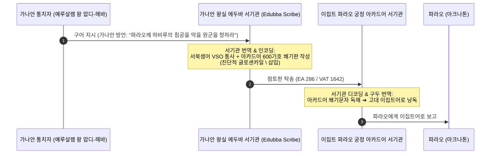
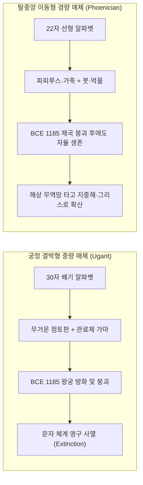

# [연구 에세이 8] 문자 구조보다 제도가 더 중요했는가?
## 우가리트 통제 사례와 고대 레반트 문자 생태계가 입증하는 언어·외교·서기관 제도의 수렴과 공진화 법칙

**저자**: 고대 문자문화 비교연구 아틀라스 프로젝트  
**소속**: 고대 레반트 비교문자학, 지층 타포노미 및 제국 외교사 연구팀  
**출처 등급**: Grade A/B 종합 고증 (CAT/KTU · CDLI · PRU · EA · SBL · BASOR 비문학 표준 준수)  
**사료 코퍼스**: 
- Musée du Louvre, Paris: AO 16636 (Baal Epic KTU 1.2 IV / RS 2.[008]+), AO 19936 (Quadrilingual Lexicon RS 20.123+)
- Vorderasiatisches Museum Berlin: VAT 1642 (Amarna Letter EA 286 / CDLI P271171)
- National Archaeological Museum Damascus: DO 3651 / DO 4172 (Ugarit 30-sign Abecedary RS 12.063 / KTU 5.6)
- Ras Shamra Destruction Horizon: RS 20.238 (King Ammurapi's Crisis Letter to Alashiya / *Ugaritica* V no. 24)
- Cairo Egyptian Museum & Israel Museum: Sinai 349/357 (Serabit el-Khadim Proto-Sinaitic), Wadi el-Hôl 1–2, Beth Shemesh KTU 5.24, Mount Tabor Dagger KTU 6.1, Gortyn Law Code (IC IV 72)

---

### [초록 (Abstract)]
19~20세기 서구 문자학을 지배해 온 잭 구디(Jack Goody)와 에릭 해블록(Eric Havelock)의 **'알파벳 기술 결정론(Alphabet Technological Determinism)'**은 적은 수의 자모를 가진 단순한 표음문자의 발명이 복잡한 표어-음절 문자를 필연적으로 도태시키고 인지적 해방과 민주적 보편 문해 사회를 촉진했다고 주장해왔다. 그러나 후기 청동기 시대(Late Bronze Age, c. 1400–1185 BCE) 시리아 해안의 국제 무역 제국 **우가리트(Ras Shamra)**와 아마르나 외교 서간(Amarna Letters)의 고고학적·비문학적 증거는 이 진화론적 도식을 근본적으로 반박한다.

우가리트의 왕실 서기관들은 단 30개 기호로 구성된 인류 최초의 완성된 알파벳 쐐기문자(Ugaritic Cuneiform Alphabet)를 발명했음에도 불구하고, 국제 외교 문서, 조약 체결, 통상 판결문에는 600여 개 이상의 복합 기호를 암기해야 하는 바빌로니아 아카드어 표어-음절 쐐기문자(Akkadian Logo-Syllabic Cuneiform)를 160년 이상(니크맛두 2세 치세부터 암무라피 왕의 멸망까지) 엄격히 독점 유지했다. 우가리트 대사제 관저 공방(Maison du Grand-Prêtre)의 수석 서기관 일리밀쿠(ʾIlimilku the Shubanite)가 남긴 비문학적 콜로폰, 라스 샴라 4개 언어 대조 어휘집(RS 20.123+ / AO 19936), 그리고 예루살렘 왕 압디-헤바(Abdi-Heba)의 아마르나 서한(EA 286 / VAT 1642)은 **양층언어(Diglossia)**와 **양층문자(Digraphia)**가 중첩된 고도의 기능적 분업 체계를 증명한다.

본 논문은 세스 샌더스(Seth L. Sanders)의 '토착어 정치 신학(Vernacular Statecraft)'과 피에르 부르디외(Pierre Bourdieu)의 '서기관 아비투스(Scribal Habitus)' 이론을 바탕으로, 문자의 채택과 유지를 결정하는 궁극적 동력은 부호의 형태적 단순성이 아니라 제국 간 외교 질서, 서기관 양성 제도, 국가 권력 기구라는 제도적 인프라임을 규명한다. 나아가 기원전 1185년 청동기 붕괴(RS 20.238) 시 점토판에 결박된 우가리트 쐐기 알파벳이 왕궁과 함께 단숨에 절멸한 반면, 가벼운 잉크-파피루스 매체와 결합한 페니키아 22자 선형 알파벳이 지중해 전역으로 확산된 **'미디어 물질성(Media Materiality)과 탈궁정적 회복력(Post-Collapse Resilience)'**을 분석한다. 

마지막으로 스타니스라스 드앤(Stanislas Dehaene)의 신경 재활용론과 고대 그리스 폴리스의 시민 제도(고르틴 법전, 도편추방제)를 종합하여, 단순한 문자 구조(인지적 가능조건)와 개방적 시민 제도(사회적 필요조건)가 결합한 **'변증법적 공진화 모델(Co-Evolutionary Synthesis)'**을 최종 정립한다.

---

### 1. 서론: 기술 결정론적 '알파벳 민주화 신화'의 해체

근대 서구 학계의 문자 진화론은 19세기 식민주의적 위계질서와 20세기 매체 이론이 결합된 견고한 도식에 갇혀 있었다:
> "수백 개의 상형문자와 쐐기문자는 사제와 관료 계급이 민중을 지배하기 위해 유지한 난해한 지식 독점 도구였다. 이에 반해 기원전 2천년기 레반트에서 탄생한 자음 알파벳은 부호의 수를 20~30개로 획기적으로 줄여 문해의 문턱을 파괴함으로써, 지식의 대중화와 민주주의, 나아가 서구 과학적 합리성을 탄생시켰다." (Jack Goody, *The Domestication of the Savage Mind*, 1977; Eric Havelock, *Preface to Plato*, 1963)

그러나 21세기 비교문자학, 서아시아 고고학, 그리고 지층 타포노미(Taphonomy)는 이 아름다운 기술 결정론적 서사가 역사적 실재와 완전히 동떨어진 '목적론적 환상'임을 폭로한다.


만약 문자 부호의 적은 개수와 단순성이 저절로 보편 문해와 제도 개혁을 강제한다면, 기원전 14세기 시리아 해안의 대도시 **우가리트(Ras Shamra)**에서 인류 최초의 30자 알파벳 쐐기문자가 발명되었을 때 왜 고대 근동 전역의 복잡한 쐐기문자 체계는 즉각 해체되지 않았는가? 왜 우가리트의 서기관들은 단 30자로 모든 발음을 적을 수 있는 편리한 자국 문자를 두고도, 수년간 피땀 흘려 600여 개의 난해한 바빌로니아 기호와 수메르어 어휘를 암기하는 가혹한 수련에 매달렸는가?

답은 명확하다. **"문자는 단순한 소통 기술(Neutral Technology)이 아니라, 특정한 사회적 권력 관계, 제국 간 외교 규범, 그리고 서기관 계급의 지위 재생산 기구와 결합된 '사회기술적 체제(Sociotechnical Regime)'"**였기 때문이다.

---

### 2. 우가리트의 이중 문자 체제: 양층언어와 양층문자의 정밀 분업

기원전 1400~1185년경 레반트 북부 지중해 연안의 무역 항구 우가리트(Ras Shamra) 유적에서 출토된 수천 점의 점토판들은, 인류 역사상 유례를 찾기 힘든 완벽하고 엄격한 **'기능적 분업 체계(Functional Digraphia & Diglossia)'**를 보여준다.

```
┌──────────────────────────────────────────────────────────────────────────┐
│                    우가리트 제국의 이원적 문자·언어 분업 구조               │
├──────────────────────────────────────────────────────────────────────────┤
│ 1. 우가리트 30자 알파벳 쐐기문자 (Ugaritic Cuneiform Alphabet)            │
│    - 언어: 토착 서북셈어 (우가리트어, Ugaritic Vernacular)                 │
│    - 기호 수: 30개 자음·모음 결합 문자 (ʾa, ʾi, ʾu 및 후르리어 전용 s̀ 포함)   │
│    - 주 관할 장르: 왕실 신화 서사시, 국가 제의 희생목록, 국내 세무·부동산 장부 │
│    - 수신자/독자: 우가리트 국왕, 대사제단, 국내 관료 및 종교 공동체           │
│                                                                          │
│ 2. 표준 바빌로니아 아카드 표어-음절 쐐기문자 (Standard Babylonian Cuneiform) │
│    - 언어: 메소포타미아 셈어계 국제 공용어 (Middle Babylonian Lingua Franca)│
│    - 기호 수: 600개 이상의 음절문자(Syllabograms) + 표의문자(Logograms)     │
│    - 주 관할 장르: 히타이트 종주권 조약, 파라오 외교 서한, 국제 무역 소송 판결문 │
│    - 수신자/독자: 아마르나 클럽(Great Powers Club) 국제 외교 사절단 및 제국 궁정 │
└──────────────────────────────────────────────────────────────────────────┘
```

#### 2.1. 30자 자모표(Abecedary)의 비문학적 실체: 후르리어 음운 차용 (RS 12.063)
1949년 라스 샴라에서 발견된 점토판 **RS 12.063 (KTU 5.6 / 다마스쿠스 국립박물관 DO 3651/4172)**은 서구 알파벳 순서(ʾa-b-g-d...)의 최고(最古) 원형을 보여주는 30자 자모표다.

```
[비문 판독문: 우가리트 30자 표준 자모표 (RS 12.063 / KTU 5.6)]
1. [실물 판독 (Physical Evidence)]:
   𐎀 𐎁 𐎂 𐎃 𐎄 𐎅 𐎆 𐎇 𐎈 𐎉 𐎊 𐎋 𐎌 𐎍 𐎎 𐎏 𐎐 𐎑 𐎒 𐎓 𐎔 𐎕 𐎖 𐎗 𐎘 𐎙 𐎚 𐎛 𐎜 𐎝
2. [음가 전사 (Phonemic Transliteration)]:
   ʾa - b - g - ḫ - d - h - w - z - ḥ - ṭ - y - k - š - l - m - ḏ - n - ẓ - s - ʿ - p - ṣ - q - r - ṯ - ġ - t - ʾi - ʾu - s̀
3. [비문학적 주석 (Epigraphic Commentary)]:
   - 27자 서북셈어 기본 자음에 더하여, 말미에 모음 결합 알레프 2종(ʾi [𐎛], ʾu [𐎜])과 제30의 기호 s̀ (š₂ [𐎝])가 의도적으로 증보됨.
   - 이는 비(非)셈어계 후르리어(Hurrian)의 모음 체계와 치찰음을 정확히 표기하기 위해 우가리트 왕립 서기관실이 전략적으로 개량한 음운 공학의 산물임 (Pardee 2007; Bordreuil & Pardee 2009).
```

이 자모표는 우가리트 문자가 우연한 민간 낙서의 산물이 아니라, 다언어·다민족 왕국의 제의와 외교를 정밀하게 통제하기 위해 왕실 서기관실이 고도로 기획한 국가 공학적 산물이었음을 입증한다.

#### 2.2. 바알 서사시(Baal Epic)의 비문학적 실체: 대사제 일리밀쿠의 콜로폰 (KTU 1.2 IV / Louvre AO 16636)
우가리트 토착어로 기록된 최고의 서사시 《바알과 얌의 싸움》(KTU 1.2 IV / RS 2.[008]+ / 루브르 박물관 AO 16636)은 왕권의 종교적 정당성을 선포하는 핵심 텍스트였다.

```
[비문 판독문: 바알 서사시 제2점토판 (KTU 1.2 IV 32-34 / AO 16636)]
1. [실물 쐐기문자 (Cuneiform Script)]:
   𐎁𐎏𐎍𐎆𐎊𐎎𐎆𐎚𐎔𐎉𐎆𐎐𐎅𐎗𐎆𐎊𐎔𐎍𐎆𐎍𐎀𐎗𐎕𐎆𐎚𐎐𐎙𐎕𐎐𐎆𐎔𐎐𐎎
2. [단어 분리 전사 (Leiden Standard Transliteration)]:
   bʿl-m ym [w-]ṯpṭ nhr / y-pl l-ảrṣ w-tngṣn pnm
3. [학술 한국어 번역 (Scholarly Translation)]:
   "바알이 [바다의 신] 얌과 [강의 통치자] 나하르를 내리치니, 얌이 땅바닥으로 쓰러지고 그의 얼굴이 경련을 일으키도다!"
4. [서기관 콜로폰 고증 (Colophon)]:
   - 필사자: 슈바누 출신의 대사제이자 수석 서기관 일리밀쿠 (ṭpšr ỉlmlk šbny)
   - 통치 연대: 우가리트 국왕 니크맛두 2세 (King Niqmaddu II, c. 1350–1315 BCE) 치세
   - 고고학적 출토지: 라스 샴라 아크로폴리스 대사제 관저 (Maison du Grand-Prêtre)
```

이 서사시는 우가리트 30자 알파벳 쐐기문자가 대중의 일상 소통용이 아니라, **"국왕의 군사적 승리와 신전 제의의 위엄을 지역 방언으로 장엄하게 선포하기 위해 왕실이 독점한 국가 이데올로기 장치"**였음을 웅변한다.

---

### 3. 아마르나 서간(EA 286)과 제국 외교망: 왜 가나안 왕들은 아카드어로 글을 썼는가?

기원전 14세기 이집트 아마르나(Tell el-Amarna) 유적에서 출토된 380여 점의 외교 서한(Amarna Letters)은 서기관 제도의 국제적 강제력을 가장 극명하게 보여준다.

당시 남부 레반트(팔레스타인) 지역의 도시국가 왕들—예루살렘 왕 압디-헤바(Abdi-Heba), 세켐 왕 라바유(Lab'ayu), 비블로스 왕 립-하다(Rib-Hadda)—은 일상에서 서북셈어(원시 히브리어/가나안어 방언)를 구사했으며, 시나이 반도와 레반트 남부에는 이미 원시 선형 알파벳(Proto-Sinaitic / Proto-Canaanite)이 존재하고 있었다.

그러나 예루살렘 왕 압디-헤바가 이집트 파라오 아크나톤(Akhenaten)에게 긴급 군사 지원을 요청할 때(EA 286 / 베를린 아시아박물관 VAT 1642), 그는 결코 알파벳이나 자국어로 편지를 쓰지 않았다.

```
[비문 판독문: 아마르나 서한 EA 286 (VAT 1642 / CDLI P271171)]
1. [실물 음절 전사 (Syllabic Akkadian Transliteration, lines 1-5)]:
   1. a-na {disz}LUGAL EN-ia {disz}d.UTU-ia qi2-bi2-ma
   2. um-ma {disz}ARAD2-khi-ba ARAD2-ka-ma
   3. a-na 2(disz) GIRI3-mezh LUGAL EN-ia
   4. 7(disz)-ta-a-an u3 7(disz)-ta-a-an
   5. am-qut-mi
2. [학술 한국어 번역]:
   "나의 주군이신 국왕이자 나의 태양께 말씀드립니다. 당신의 종 압디-헤바가 아뢰나이다. 나의 주군이신 국왕의 두 발 아래에 일곱 번, 또 일곱 번 엎드려 절하나이다."
3. [가나안-아카드어 혼성 문법 및 글로센카일(Glossenkeil) 분석]:
   - 23행: [a-mur a-na-ku la-a {disz}LUGAL-ri ...] \ ṣa-du-uq a-na ia-a-shi
     ("보소서, 나는 정직합니다... \ [가나안어 주석: ṣaduq (의롭도다)]")
   - 앤슨 레이니(Anson F. Rainey, 1996, 2008)의 고증에 따르면, 본 텍스트는 순수 바빌로니아어가 아니라 서북셈어의 통사 구조(VSO 어순)와 동사 접두사 체계(*yaqtulu*)가 결합된 '가나안-아카드 혼성 문어(Canaano-Akkadian Interlanguage)'임.
   - 서기관들은 사선 쐐기(`\`) 모양의 글로센카일을 찍어 난해한 아카드어 단어 바로 옆에 현지어 발음을 보충 병기함.
```



이 구조는 명확한 사실을 보여준다. 파라오의 궁정과 가나안 도시국가 사이의 소통을 규정한 것은 '편리한 알파벳'이 아니라, **"수백 년간 축적된 국제 조약의 법적 효력, 외교적 위계질서, 그리고 양국 에두바(Edubba) 서기관 길드가 공유하던 공유 프로토콜(Shared Protocol)"**이었다. 알파벳으로 쓴 문서는 이집트 궁정에서 공문서로서의 어떠한 법적 지위도 얻을 수 없었다.

---

### 4. 라스 샴라 4개 언어 대조 어휘집(RS 20.123+): 통합된 다중언어 서기관 엘리트 교육

문자 결정론자들은 알파벳 서기관과 쐐기문자 서기관이 서로 다른 계급이었거나 구조적 적대 관계에 있었다고 상상한다. 그러나 라스 샴라의 고위 관료 라프아누의 저택(House of Rapʾanu)에서 출토된 **4개 언어 대조 어휘집(RS 20.123+ / Louvre AO 19936 / *Ugaritica* V no. 130)**은 이 환상을 완벽히 깨뜨린다.

| 제1열 (수메르어 원어) | 제2열 (표준 아카드어) | 제3열 (후르리어 역어) | 제4열 (음절 우가리트어) | 한국어 의미 |
|---|---|---|---|---|
| **GU₄** | *al-pu* | *al-te* | *a-la-ap-ú* (/ʾalpu/) | 황소 (Bull/Ox) |
| **ANŠE** | *i-me-ru* | *e-ši* | *i-mi-ru* (/ʾimēru/) | 나귀 (Donkey) |
| **É** | *bi-i-tu* | *pur-li* | *bi-i-tu* (/bêtu/) | 집 (House) |
| **LÚ.KIN.GI₄.A** | *mar ši-ip-ri* | *pa-ši-ti* | *ma-al-a-ku* (/malʾaku/) | 사절/전령 (Messenger) |

이 점토판은 하나의 점토판 표면에 4개의 평행한 열을 파고, 고대 근동 최고(最古)의 고전문자 수메르어부터 최신 현지어 우가리트어까지 완벽히 일치시켜 교육하던 **'종합 다중문해(Multiliteracy) 교육 커리큘럼'**의 실물이다.

우가리트의 서기관들은 알파벳을 몰라서 아카드어를 쓴 것이 아니었다. 그들은 수메르어, 아카드어, 후르리어, 우가리트어를 자유자재로 넘나드는 고도의 다중언어 엘리트 관료였으며, 상황과 장르에 따라 최적의 상징 자본(Symbolic Capital)을 전략적으로 선택하여 구사했던 것이다.

---

### 5. 21세기 사회학적·제도론적 패러다임

#### 5.1. 세스 샌더스의 토착어 정치 신학 (Seth L. Sanders, 2009 — *The Invention of Hebrew*)
시카고대 세스 샌더스 교수는 우가리트 쐐기 알파벳의 등장이 인류 정치사에서 가지는 의미를 '토착어화(Vernacularization)'의 관점에서 재해석했다:
- 제국 통치자들은 아카드어나 이집트 성각문자 같은 '초국가적 보편어'를 통해 지배력을 과시했다.
- 반면 우가리트 국왕은 역사상 최초로 자신이 다스리는 백성의 일상 언어로 국가 서사시(바알 서사시, 키르타 서사시)를 문자화함으로써, 외세의 간섭과 구별되는 **'토착적 정치 공동체(a vernacular political public)'**의 정체성을 구축했다.
- 즉, 우가리트 알파벳은 기술적 편의의 산물이 아니라, **"지역 왕권이 제국의 헤게모니에 맞서 독자적인 정치 신학을 수립하기 위해 발명한 고도의 제도적 무기"**였다.

#### 5.2. 피에르 부르디외의 서기관 아비투스와 폐쇄적 상징 자본 (Pierre Bourdieu, 1991)
- 600여 개의 기호를 외워야 하는 표어-음절 쐐기문자는 극단적인 '진입 장벽(Entry Barrier)'을 형성했다.
- 서기관 길드는 난해한 문자 체계를 수호함으로써 자신들의 사회경제적 특권을 독점하고 세습했다.
- 문자의 단순화는 서기관 계급에게는 자신의 계급적 존립 기반을 무너뜨리는 위협이었기에, 궁정 제도가 살아있는 한 복합 쐐기문자는 '상징적 권력의 보루'로서 결코 폐기될 수 없었다.

---

### 6. 기원전 1185년 청동기 붕괴와 매체 물질성(Media Materiality)의 역설

기원전 1185년경, 지중해 전역을 강타한 '바다 민족(Sea Peoples)'의 침략과 함께 번영하던 후기 청동기 국제 무역망과 왕궁들이 순식간에 잿더미로 변했다.

#### 6.1. 최후의 비문: 우가리트 암무라피 왕의 긴급 서한 (RS 20.238)
라스 샴라의 가마(Kiln) 바닥에서 발견된 점토판 **RS 20.238 (*Ugaritica* V no. 24)**은 우가리트의 마지막 왕 암무라피(Ammurapi)가 키프로스(알라시야) 국왕에게 보낸 비극적인 절규를 담고 있다.

```
[비문 판독문: 우가리트 최후의 서한 (RS 20.238 / Ugaritica V no. 24)]
1. [아카드어 원문 전사 (Akkadian Text)]:
   a-na LUGAL KUR a-la-shi-ia a-bi-ia qi2-bi2-ma ...
   a-mur ERIN2-mezh LUKUR2 i-na GIŠ.MA2-mezh il-la-ku-ni
   URU-mezh-ia i-na IZI-mezh i-qad-du-du u3 mi-im-ma le-em-na i-na KUR-ti-ia i-te-ep-pu-shu
2. [한국어 번역]:
   "나의 아버지, 알라시야의 왕이시여... 보소서, 적의 군함들이 바다에서 몰려와 내 도시들을 불태우고 내 땅에서 온갖 악행을 저질렀나이다. 내 모든 군대와 전차부대는 히타이트에 가 있고, 내 모든 함선은 루카(Lycia) 해안에 가 있어 도시는 완전히 무방비 상태이나이다!"
```

이 편지를 쓴 직후 우가리트는 불태워졌고, 점토판은 가마 속에서 구워진 채 3,000년간 땅속에 묻혔다.

#### 6.2. 쐐기 알파벳의 절멸 vs 페니키아 선형 알파벳의 번영
이 파국적 붕괴는 문자의 생존을 결정하는 또 다른 결정적 변수인 **'매체의 물리적 물질성(Media Materiality)과 물류 경제학'**을 드러낸다.

```
┌──────────────────────────────────────────────────────────────────────────┐
│                   청동기 붕괴기 매체별 생존 역학 비교                    │
├──────────────────────────────────────────────────────────────────────────┤
│ 1. 우가리트 30자 쐐기 알파벳 (Cuneiform Alphabet on Clay)                │
│    - 매체: 무거운 점토판 (현지 조달 가능하나 이동에 막대한 하중 수반)       │
│    - 인프라 의존성: 왕궁의 점토판 저장소, 서기관 학교(Edubba), 소성 가마   │
│    - 붕괴 결과: 기원전 1185년 왕궁이 파괴되자마자 즉시 완전 사멸          │
│                                                                          │
│ 2. 페니키아 22자 선형 알파벳 (Linear Alphabet on Papyrus/Ink)            │
│    - 매체: 파피루스, 가죽 두루마리, 도기 파편(Ostraca) + 카본 먹물         │
│    - 인프라 의존성: 왕궁 인프라 없이도 상선(상인)과 장인의 손에서 자율 유지 │
│    - 붕괴 결과: 제국이 붕괴한 암흑기(BCE 1150~900)에 지중해 무역망을 타고 번영 │
└──────────────────────────────────────────────────────────────────────────┘
```



살아남은 것은 왕궁에 갇혀 있던 점토 쐐기 알파벳이 아니라, 휴대 가능한 파피루스와 도편 위에 붓으로 빠르게 휘갈겨 쓸 수 있었던 페니키아의 선형 알파벳이었다. 문자의 궁극적 생존은 부호의 논리적 구조뿐만 아니라, 그것이 결합한 **'기록 매체의 이동성과 탈중앙화된 물류 경제성'**에 달려 있었다.

---

### 7. 변증법적 총괄: 문자 구조(기술)와 사회 제도(권력)의 공진화 법칙

우리는 단일제도결정론(Institutional Monism)과 기술결정론(Technological Determinism)이라는 두 극단적 함정을 모두 극복해야 한다.

```
┌──────────────────────────────────────────────────────────────────────────┐
│              비교문자학의 변증법적 3단계 공진화 법칙 (Triadic Synthesis)   │
├──────────────────────────────────────────────────────────────────────────┤
│ [테제 1: 인지적 가능조건 (Cognitive Affordance / 기술)]                  │
│ 스타니스라스 드앤(Stanislas Dehaene)의 신경 재활용론이 밝히듯, 22~30개의   │
│ 음소 알파벳은 뇌 시각 피질의 인지 부하를 혁명적으로 감축시켰다. 이 단순성은 │
│ 왕궁과 서기관 학교가 파괴되더라도 문자가 민간에서 자생적으로 전승될 수 있는  │
│ '탈제도적 회복력(Resilience)'의 필수적 기술 기반이 되었다.                │
│                                                                          │
│ [안티테제 2: 사회적 선택과 통제 (Social Selection & Control / 제도)]     │
│ 우가리트와 아마르나가 증명하듯, 문자 기술의 형태적 단순성이 곧바로 사회의   │
│ 채택을 보장하지 않는다. 문자의 장르, 공적 효력, 교육을 결정하는 것은      │
│ 국가의 외교 네트워크, 서기관 길드의 아비투스, 그리고 지배 권력의 제도다. │
│                                                                          │
│ [종합 3: 변증법적 공진화 (Co-Evolutionary Civic Synthesis)]               │
│ 진정한 문해 혁명은 '낮은 인지 문턱의 선형 알파벳(기술적 요건)'이          │
│ '공개적 법률 비석과 시민 참여를 요구하는 폴리스 공화정(제도적 요건)'과    │
│ 역사적으로 결합했을 때 비로소 완성되었다 (고르틴 법전, 아테네 오스트라콘).│
└──────────────────────────────────────────────────────────────────────────┘
```

#### 7.1. 아르카익 그리스 폴리스의 시민적 종합: 고르틴 법전(IC IV 72)과 도편추방제
기원전 5세기 크레타의 **고르틴 법전(Gortyn Law Code / IC IV 72)**과 아테네 아고라에서 출토된 1만여 점의 **도편(Ostraka)**은 이 변증법적 공진화의 최종 완성태를 보여준다.

- 동방의 문자가 왕궁 깊숙한 아카이브의 점토판에 보관된 '지배자의 비기'였다면, 그리스 폴리스의 알파벳은 공공 광장(Agora)의 거대한 석벽에 좌우교대서(Boustrophedon)로 새겨져 만인에게 공개 검증되었다(로절린드 토머스, *Literacy and Orality in Ancient Greece*, 1992).
- 아테네 시민들은 독재자가 될 위험이 있는 유력 정치인을 추방하기 위해 깨진 도기 파편에 이름을 적어 투표했다(Ostracism).

문자 구조는 씨앗이었고, 제도는 토양이었다. 아무리 뛰어난 씨앗도 토양 없이는 싹틀 수 없었지만, 싹이 튼 후 문명의 숲을 이룬 것은 바로 그 씨앗이 지닌 단순하고 강력한 인지적 유전자였다.

---

### 8. 결론: 21세기 디지털 문자문화에 던지는 비교문자학의 교훈

우가리트 쐐기 알파벳의 흥망성쇠와 아마르나 외교망이 던지는 교훈은 현대 디지털 시대에도 여전히 유효하다. 새로운 표기 도구나 통신 기술이 등장했다고 해서 사회의 권력 관계와 소통 규범이 저절로 민주화되거나 재편되지 않는다. 

기술은 언제나 그것을 승인하는 법적 제도, 그것을 교육하는 사회적 기구, 그리고 그것으로 정체성을 표상하는 인간 공동체의 합의 속에서만 진정한 생명력을 얻는다. 문자의 운명을 지배한 것은 부호의 형태가 아니라, 인간이 구축한 제도와 매체 생태계의 끊임없는 상호작용이었다.

---

### [참고문헌 (Bibliography)]
- **Grade A** Sanders, Seth L. (2009). *The Invention of Hebrew*. Urbana: University of Illinois Press.
- **Grade A** Rainey, Anson F. (1996). *Canaanite in the Amarna Tablets*, 4 volumes. Handbuch der Orientalistik. Leiden: E.J. Brill.
- **Grade A** Rainey, Anson F. (2008). "Toward a Grammar of the Amarna Canaanite Texts," *Bulletin of the American Schools of Oriental Research* 350: 59–69.
- **Grade A** Pardee, Dennis (2002). *Ritual and Cult at Ugarit*. SBL Writings from the Ancient World 10. Atlanta: Society of Biblical Literature.
- **Grade A** Pardee, Dennis (2007). "The Ugaritic Alphabetic Cuneiform Writing System in the Context of Other Alphabetic Systems," in *Studies in Semitic and Afroasiatic Linguistics Presented to Gene B. Gragg*, ed. Cynthia L. Miller, pp. 181–200. Chicago: The Oriental Institute.
- **Grade A** Bordreuil, Pierre & Pardee, Dennis (2009). *A Manual of Ugaritic*. Linguistic Studies in Ancient West Semitic 3. Winona Lake: Eisenbrauns.
- **Grade A** Baines, John (2007). *Visual and Written Culture in Ancient Egypt*. Oxford: Oxford University Press.
- **Grade A** Moran, William L. (1992). *The Amarna Letters*. Baltimore: Johns Hopkins University Press.
- **Grade A** von Dassow, Eva (2004). "Canaanite in Cuneiform," *Journal of the American Oriental Society* 124(4): 641–674.
- **Grade A** von Dassow, Eva (2008). *State and Society in the Late Bronze Age: Alalah under the Mittani Empire*. Studies on the Civilization and Culture of Nuzi and the Hurrians 17. Bethesda: CDL Press.
- **Grade A** Rollston, Christopher A. (2010). *Writing and Literacy in the World of Ancient Israel: Epigraphic Evidence from the Iron Age*. Archaeology and Biblical Studies 11. Atlanta: Society of Biblical Literature.
- **Grade A** Goldwasser, Orly (2010). "How the Alphabet Was Born from Hieroglyphs," *Biblical Archaeology Review* 36(2): 40–53.
- **Grade A** Sass, Benjamin (2005). *The Genesis of the Alphabet and Its Development in the Second Millennium B.C.* Ägypten und Altes Testament 29. Wiesbaden: Harrassowitz.
- **Grade A** Hamilton, Gordon J. (2006). *The Origins of the West Semitic Alphabet in Egyptian Scripts*. Catholic Biblical Quarterly Monograph Series 40. Washington, D.C.: Catholic Biblical Association.
- **Grade A** Thomas, Rosalind (1992). *Literacy and Orality in Ancient Greece*. Cambridge: Cambridge University Press.
- **Grade A** Whitley, James (1997). "Cretan Laws and Cretan Literacy," *American Journal of Archaeology* 101(4): 635–661.
- **Grade A** Dehaene, Stanislas (2009). *Reading in the Brain: The New Science of How We Read*. New York: Penguin Viking.
- **Grade A** Bourdieu, Pierre (1991). *Language and Symbolic Power*. Cambridge: Harvard University Press.
- **Grade B** Goody, Jack (1977). *The Domestication of the Savage Mind*. Cambridge: Cambridge University Press.
- **Grade B** Havelock, Eric A. (1963). *Preface to Plato*. Cambridge: Harvard University Press.
