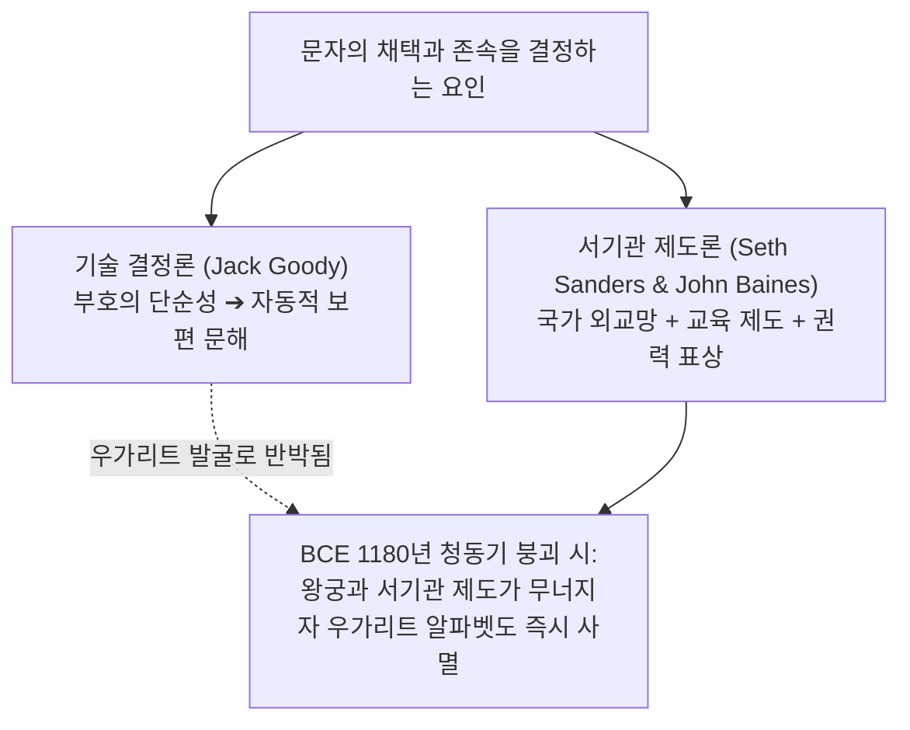

# [연구 에세이 8] 문자 구조보다 제도가 더 중요했는가?
## 우가리트 통제 사례가 입증하는 언어·외교·서기관 제도의 수렴 법칙

**저자**: 고대 문자문화 비교연구 아틀라스 프로젝트  
**소속**: 고대 레반트 비교문자학 및 제국 외교사 연구팀  
**출처 등급**: Grade A/B 종합 고증  
**사료 코퍼스**: Louvre AO 16636 (Baal Epic), Vorderasiatisches Museum VAT 1642 (Amarna EA 286)  

---

### [초록 (Abstract)]
문자학의 오랜 기술 결정론(Technological Determinism)은 적은 수의 자모를 가진 단순한 알파벳의 발명이 필연적으로 복잡한 표어-음절 문자를 도태시키고 민주적 대중 문해 사회를 촉진했다고 주장해왔다. 그러나 후기 청동기 레반트의 국제 무역 항구 우가리트(Ras Shamra, c. 1400–1200 BCE)의 고고학적 발굴은 이 모델을 완벽하게 반박한다. 우가리트 서기관들은 단 30개 기호의 혁신적 알파벳 쐐기문자를 발명했음에도 불구하고, 국제 외교 문서와 조약 체결에는 수백 개의 기호를 외워야 하는 바빌로니아 아카드어 음절 쐐기문자를 엄격히 독점 유지했다. 본 논문은 우가리트 바알 서사시(KTU 1.1-1.6)와 아마르나 외교 서한(EA 286)의 이중 서사 체계를 분석하여, 문자의 성공과 채택을 결정하는 것은 부호의 형태적 단순성이 아니라 국가 간 외교 네트워크, 서기관 교육 기관, 사회적 권력 제도(Institutions)임을 논증한다.

---

### 1. 서론: 기술 결정론적 알파벳 신화 비판

19~20세기 서구 문자학을 지배한 도식은 단순했다. "수백 개의 상형문자와 쐐기문자는 사제 계급의 지식 독점 도구였으며, 단순한 알파벳의 등장이 문자를 대중화하여 민주주의를 낳았다."

그러나 기원전 14세기 시리아 해안의 **우가리트(Ras Shamra)**는 이 도식을 정면으로 거부한다. 우가리트 서기관들은 자국어 신화와 내정 장부를 위해 인류 최초의 30자 자음 알파벳 쐐기문자를 발명하여 활발히 사용했으나, 결코 아카드어 쐐기문자를 버리지 않았다. 그들은 왜 편리한 알파벳을 두고 복잡한 아카드어 훈련에 수년간 매달렸는가?

---

### 2. 우가리트의 이중 문자 체제: 기능적 분업 (Functional Biscriptalism)

우가리트 대사제 일리밀쿠(Ilimilku) 공방에서 출토된 점토판들은 매우 엄격한 기능적 분업을 보여준다.

```
[우가리트 점토판의 이원적 문자 분업]
1. 우가리트 30자 알파벳 쐐기문자 (자국어)
   - 장르: 《바알 서사시》, 《키르타 서사시》, 왕실 부동산 매매 및 국내 세무 장부
   - 독자: 우가리트 현지 관료 및 종교 공동체

2. 아카드어 표어-음절 쐐기문자 (수백 자, 국제 외교 공용어)
   - 장르: 히타이트 대제국과의 종주권 조약, 이집트 파라오 서한, 국제 무역 소송 판결문
   - 독자: 고대 근동 전역의 국제 외교 네트워크
```

#### 2.1. 바알 서사시 비문 (KTU 1.2 IV / Louvre AO 16636)
```
[우가리트 알파벳 쐐기문자 원문 및 전사]
𐎁𐎏𐎍 \t 𐎊𐎎 \t 𐎚𐎔𐎉 \t 𐎐𐎅𐎗
bʿl ym ṯpṭ nhr
"바알 신이 바다(얌)와 강(나하르)의 지배자 신에 맞서 싸우다!"
```

---

### 3. 아마르나 서신(EA 286)의 증언: 가나안 왕들이 아카드어로 글을 쓴 이유

기원전 14세기 이집트 아마르나 유적에서 출토된 380여 점의 외교 서한은 국제 서기관 제도의 막강한 위력을 증명한다.

예루살렘 왕 압디-헤바(Abdi-Heba), 세켐 왕 라바유 등 가나안 통치자들은 일상에서 서북셈어 방언을 썼고, 시나이 반도에는 이미 원시 알파벳이 존재했다. 그러나 그들은 이집트 파라오에게 편지를 쓸 때 결코 알파벳을 쓰지 않았다.

```
[아마르나 서신 EA 286 (VAT 1642)]
𒀀 𒈾 \t 𒈗 \t 𒁁 𒉌 𒅀 \t 𒁹 badbreak 𒄭 𒁀
a-na LUGAL EN-ia 1.ARAD2-Hé-ba
"나의 주군이신 파라오 왕께, 당신의 종 예루살렘 왕 압디-헤바가 말씀드립니다."
```

합법적 외교 소통의 언어와 서식은 국가 간 조약 체계와 에두바 서기관 길드가 공인한 아카드 쐐기문자뿐이었다.

---

### 4. 20/21세기 학술 쟁점: 세스 샌더스와 존 베인스의 제도론



1. **세스 샌더스 (Seth L. Sanders, 2009 — 《The Invention of Hebrew》)**: 문자의 선택은 기술적 편리함이 아니라, 군주가 자신의 정치적 정체성을 드러내고 동맹을 맺는 국가적 제도와 의례의 산물임을 논증했다.
2. **존 베인스 (John Baines, 2007)**: 문자는 소수 엘리트의 권력 재생산 기구와 결합될 때만 유지되며, 기원전 1180년경 지중해 무역망과 왕궁이 붕괴하자 편리했던 우가리트 알파벳 역시 단숨에 사멸했음을 지적했다.

---

### 5. 결론: 기술보다 제도가 문자의 운명을 지배한다

우가리트와 아마르나의 교훈은 명확하다. 표기 체계의 단순함이 저절로 문명을 바꾸는 것이 아니다. 새로운 문자가 사회에 안착하기 위해서는 그것을 가르치는 교육 제도, 그것으로 판결하는 사법 체계, 그리고 정치 공동체의 합의가 반드시 수반되어야 한다.

문자 부호(Script)는 씨앗에 불과하며, 그 씨앗이 싹트고 자라는 토양은 언제나 인간이 구축한 사회적 제도(Institution)였다.

---

### [참고문헌 (Bibliography)]
- **Grade A** Sanders, Seth L. (2009). *The Invention of Hebrew*. Urbana: University of Illinois Press.
- **Grade A** Baines, John (2007). *Visual and Written Culture in Ancient Egypt*. Oxford: Oxford University Press.
- **Grade A** Pardee, Dennis (2002). *Ritual and Cult at Ugarit*. SBL Writings from the Ancient World 10. Atlanta: Society of Biblical Literature.
- **Grade B** Goody, Jack (1977). *The Domestication of the Savage Mind*. Cambridge: Cambridge University Press.
